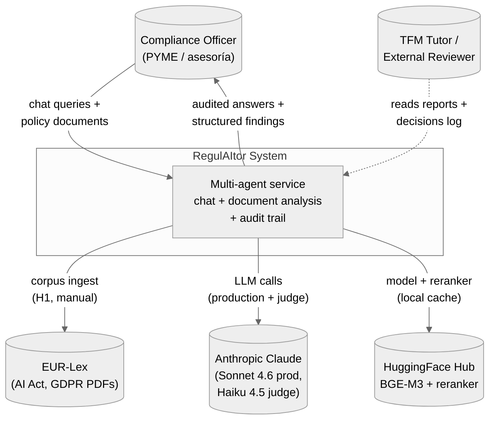
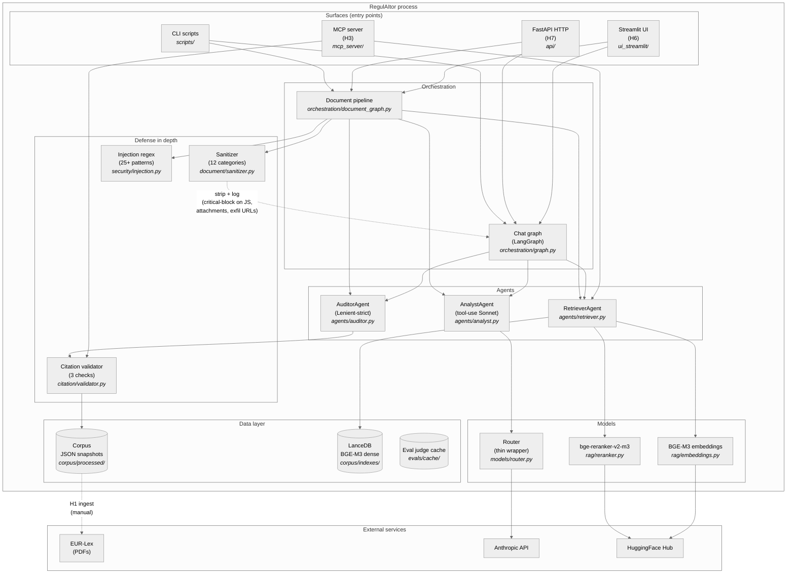
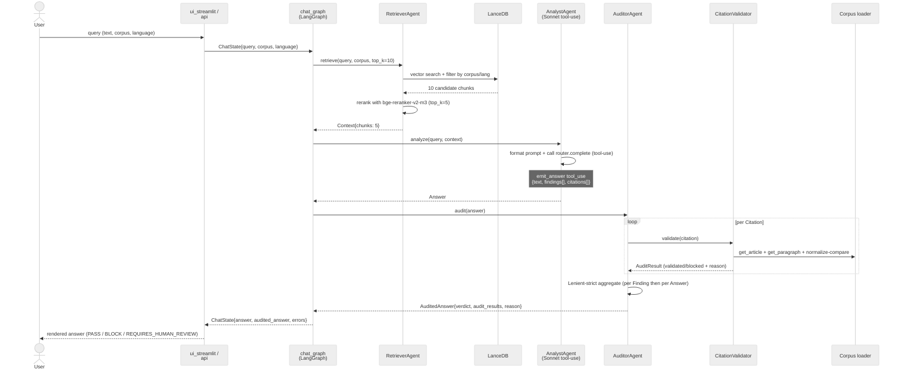
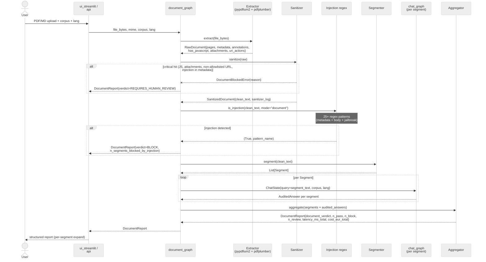
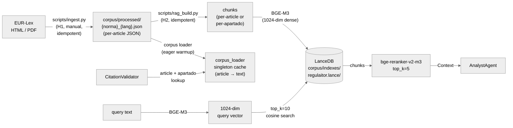

# RegulAItor — Architecture

Architecture overview of RegulAItor (MVP closure state at `v0.1.0-mvp`).
Diagrams follow the [C4 model](https://c4model.com/) (Context, Containers,
Components) rendered in Mermaid.

> Source of truth for design decisions: `CLAUDE.md` §8 (agents), §10 (stack),
> [ADR 0001-0011](adr/). Each diagram below references the ADR that justifies
> its structural choices.

---

## L1 — System Context

External actors and bounded contexts.



**Boundaries**:
- **User-facing**: Streamlit UI (H6) on `localhost:8501` and FastAPI HTTP (H7) on
  `localhost:8000`. Both wrap the same backend pipelines.
- **External services**: Anthropic API (production + judge model calls;
  read-only HTTP). HuggingFace Hub (one-time model download per host).
- **Trust boundary**: user-uploaded documents pass through the sanitizer +
  injection regex defenses before reaching the LLM. See §6 + §18 of
  `CLAUDE.md`.

---

## L2 — Containers

The deployable units inside the system boundary.



**Container responsibilities**:

| Container | Inbound | Outbound | Owns |
|---|---|---|---|
| `ui_streamlit/` | user HTTP | chat_graph / doc_graph | rendering + token-level redaction |
| `api/` | user HTTP (Bearer auth, rate-limited) | chat_graph / doc_graph | DTO schemas + global error handlers |
| `mcp_server/` | MCP stdio | retriever + validator + corpus loader | tool contracts for editor-side use |
| `scripts/` | CLI | full pipelines (incl. evals, redteam) | reproducibility commands |
| `orchestration/graph.py` | surfaces | retriever → analyst → auditor | chat E2E state |
| `orchestration/document_graph.py` | surfaces (PDF/MD bytes) | extractor → sanitizer → injection → segmenter → (loop chat_graph per segment) → aggregator | document E2E state |
| `models/router.py` | agents | Anthropic SDK | model selection (Sonnet default, H12 will route Sonnet/GPT-4o/Llama/fallback) |

ADR references: [0004](adr/0004-rag-architecture.md) (RAG stack), [0005](adr/0005-mcp-server-architecture.md) (MCP), [0006](adr/0006-chat-e2e-architecture.md) (chat orchestration), [0007](adr/0007-document-pipeline-architecture.md) (document pipeline), [0008](adr/0008-streamlit-ui-architecture.md) (Streamlit), [0009](adr/0009-fastapi-architecture.md) (FastAPI), [0010](adr/0010-evaluation-harness.md) (eval), [0011](adr/0011-redteam-runner.md) (red team).

---

## L3 — Components: agent chat flow

How a chat query flows from UI/API entry to audited answer.



**Key invariants**:
- AnalystAgent never produces text directly to the user. Output passes through
  AuditorAgent.
- A single invalid Citation can demote the Answer verdict from `PASS` to
  `REQUIRES_HUMAN_REVIEW`; if all Findings have all citations invalid, verdict
  escalates to `BLOCK`.
- The H4 retry-once mechanism (commit `0d0409a`) catches cases where Sonnet
  omits the `findings` field in tool_use response; one retry with a
  `tool_result` error recovers ~80% of such cases.

---

## L3 — Components: document analysis flow

How a corporate policy PDF flows from upload to per-segment audit.



**Defense layer order**: sanitizer (1) → injection regex (2) → per-segment
chat_graph (3, includes validator + auditor as L3 components above) →
aggregator (4). A single critical sanitizer hit short-circuits the entire
pipeline; chat-graph per-segment hits demote only that segment.

---

## Data flow: corpus → retrieval



ADR references: [0003](adr/0003-corpus-pipeline.md) (PDF pivot from HTML),
[0004](adr/0004-rag-architecture.md) (BGE-M3 + LanceDB + reranker choice).

---

## Tech stack

Per `CLAUDE.md` §10. MVP-active components in **bold**.

| Layer | Tech | Status |
|---|---|---|
| Language / package mgr | **Python 3.11 · uv** | active |
| Schemas | **Pydantic v2 (frozen + extra="forbid")** | active |
| Surfaces | **Streamlit · FastAPI · MCP** | active (UI H6, API H7, MCP H3) |
| Orchestration | **LangGraph** | active |
| Vector store | **LanceDB local** | active |
| Embeddings | **BGE-M3 (multilingual, 1024-dim)** | active |
| Reranker | **bge-reranker-v2-m3** | active |
| LLM (production) | **Claude Sonnet 4.6** (via `models/router.py`) | active |
| LLM (judge) | **Claude Haiku 4.5** | active (H8 evals) |
| Evaluation | **Ragas + custom Python harness** | active (H8) |
| Red team | **redteam.runner standalone** | active (H9) |
| CI/CD | **GitHub Actions** (5 jobs) | active |
| Document extraction | **pypdfium2 + pdfplumber + pikepdf** | active |
| Document generation (fixtures) | **ReportLab** | active (H5, H9) |
| Lint / format / types | **ruff · black · mypy** | active |
| Security static | **bandit · pip-audit · gitleaks** | active |
| Observability | LangFuse | **deferred to H11** |
| Multi-LLM router | GPT-4o · Llama-3.1-70B Groq | **deferred to H12** |
| Council of Judges | 3-judge voting | **deferred to H13** |
| NIS2 + DORA corpus | parsers + manifests | **deferred to H14** |
| Auditor calibration | A/B + threshold tuning | **deferred to H15** |
| Public deploy | Hugging Face Spaces (Docker) | **deferred to H16** |
| LoRA severity classifier | fine-tune | **optional HX1** |

---

## Repository layout (MVP)

```
regulaitor/
├── src/regulaitor/           # production code (~13k LOC)
│   ├── agents/               # Retriever + Analyst + Auditor + prompts versionados
│   ├── api/                  # FastAPI surface (H7)
│   ├── citation/             # schemas + validator
│   ├── corpus/               # fetch + parse + loader
│   ├── document/             # extractor + sanitizer + segmenter (H5)
│   ├── mcp_server/           # 5 tools (H3)
│   ├── models/               # router + config
│   ├── observability/        # logging (LangFuse deferred H11)
│   ├── orchestration/        # LangGraph chat + document graphs
│   ├── rag/                  # chunking + embeddings + reranker + store
│   ├── security/             # allowlist + injection regex + rate_limit
│   └── ui_streamlit/         # MVP UI (H6)
├── corpus/                   # raw + processed (Git-LFS) + indexes (gitignored)
├── evals/                    # H8 harness + gold set + judge prompt + cache (gitignored)
├── redteam/                  # H9 attacks + runner + reports + PDFs
├── tests/                    # unit + integration + contract (538+ tests)
├── docs/                     # this folder
│   ├── adr/                  # 0001-0011
│   ├── architecture.md       # this file
│   ├── technical_decisions_log.md  # TFM defense memoria backbone
│   ├── security_report.md    # H9 deliverable
│   └── evidence_matrix.md    # H10 deliverable (TFM modules M1-M5)
└── .claude/                  # operational skills (rag-ingest, prompt-versioning,
                              # document-analysis, evals-runner, redteam-runner,
                              # secure-coding-checklist, citation-validator)
```

---

## References

- **Charter + roadmap**: `CLAUDE.md` (single source of truth for project scope, agents, stack, milestones, gates §16.2, metrics §17, security §18).
- **TFM defense memoria backbone**: `docs/technical_decisions_log.md` (every approved technical decision since H0).
- **ADRs**: `docs/adr/0001-0011` (architectural records, one per non-trivial design choice).
- **Specs + plans**: `docs/superpowers/specs/`, `docs/superpowers/plans/` (one pair per non-trivial milestone).
- **Security**: `docs/security_report.md` (defense-in-depth + red team results).
- **Evidence matrix**: `docs/evidence_matrix.md` (Máster modules M1-M5 → artifacts).
