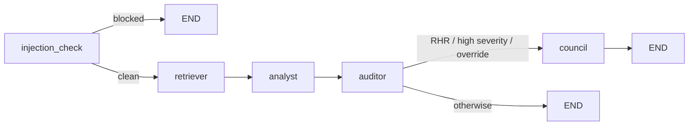
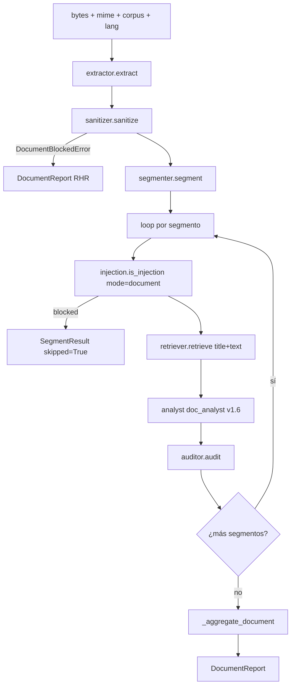

# RegulAItor — Memoria TFM

**Máster en IA Generativa**

- **Autor:** [Pendiente]
- **Fecha:** Mayo 2026
- **Tag:** `v1.0.0`
- **Licencia:** Proprietary (uso académico)
- **Demo público vivo:** <https://huggingface.co/spaces/enriro00/regulaitor>
- **Repositorio:** RegulAItor (rama `main`, tag de cierre académico `v1.0.0`)
- **Tribunal:** [Pendiente]

---

## Tabla de contenidos

1. [Resumen ejecutivo y contribución del TFM](#1-resumen-ejecutivo-y-contribución-del-tfm)
2. [Problema, motivación y usuarios](#2-problema-motivación-y-usuarios)
3. [Producto: tres superficies (chat + documental + API + MCP)](#3-producto-tres-superficies-chat--documental--api--mcp)
4. [Arquitectura del sistema](#4-arquitectura-del-sistema)
5. [Corpus normativo](#5-corpus-normativo)
6. [Pipeline RAG](#6-pipeline-rag)
7. [Sistema multi-agente (Retriever + Analyst + Auditor + Council)](#7-sistema-multi-agente-retriever--analyst--auditor--council)
8. [Citation validator y arquitectura §6 de cuatro capas](#8-citation-validator-y-arquitectura-6-de-cuatro-capas)
9. [Pipeline documental (extractor + sanitizer + segmenter)](#9-pipeline-documental-extractor--sanitizer--segmenter)
10. [Router multi-LLM + modelos](#10-router-multi-llm--modelos)
11. [Observabilidad + análisis de costes](#11-observabilidad--análisis-de-costes)
12. [Seguridad (SSDLC: sanitizer + injection + auth + rate-limit + PII + secrets)](#12-seguridad-ssdlc-sanitizer--injection--auth--rate-limit--pii--secrets)
13. [Evaluación: gold set, harness, métricas y umbrales duales](#13-evaluación-gold-set-harness-métricas-y-umbrales-duales)
14. [Red team (H9 — 50 ataques, 10 escenarios, smoke 0.92)](#14-red-team-h9--50-ataques-10-escenarios-smoke-092)
15. [Metodología — §22.22 honest framing + ciclo científico](#15-metodología--2222-honest-framing--ciclo-científico)
16. [Despliegue en Hugging Face Spaces (H16)](#16-despliegue-en-hugging-face-spaces-h16)
17. [Gestión del proyecto](#17-gestión-del-proyecto)
18. [Limitaciones conocidas (§22.22 honest framing)](#18-limitaciones-conocidas-2222-honest-framing)
19. [Conclusiones, entregables y matriz de evidencias](#19-conclusiones-entregables-y-matriz-de-evidencias)
20. [Roadmap post-TFM — el producto real en mercado](#20-roadmap-post-tfm--el-producto-real-en-mercado)

**Apéndices**

- [Apéndice A — Lista de ADRs (35)](#apéndice-a--lista-de-adrs-35)
- [Apéndice B — Reproducibilidad: quickstart](#apéndice-b--reproducibilidad-quickstart)
- [Apéndice C — Documentos de soporte](#apéndice-c--documentos-de-soporte)

---

## 1. Resumen ejecutivo y contribución del TFM

### 1.1 Qué es RegulAItor

RegulAItor es un servicio multi-agente de cumplimiento normativo europeo construido como Trabajo Fin de Máster (Máster en IA Generativa). Convierte consultas normativas y revisiones de documentos corporativos (políticas de IA, contratos, evaluaciones de impacto, registros de sistemas de IA) en respuestas e informes auditables sobre cuatro corpus oficiales — Reglamento de IA (AI Act), RGPD, NIS2 y DORA — ingestados desde EUR-Lex y versionados localmente (`corpus/indexes/regulaitor.lance`, 1569 chunks; ver `src/regulaitor/rag/store.py`).

No es un chatbot legal genérico ni sustituye a un asesor jurídico. Es una herramienta de primera línea para análisis, preparación de borradores y generación de evidencias verificables, con dos superficies: modo chat (`/ask`) y modo análisis documental (`/analyze`), expuestas vía FastAPI + Streamlit y desplegadas en Hugging Face Spaces (demo público vivo: <https://huggingface.co/spaces/enriro00/regulaitor>).

### 1.2 Problema que resuelve

Cuatro problemas concretos del compliance europeo en PYME 50-500 empleados (CLAUDE.md §3): alto coste de la consulta jurídica, lentitud de la revisión documental interna, riesgo de alucinación de LLM generalistas y falta de trazabilidad para auditoría. RegulAItor responde con la narrativa ancla del proyecto (CLAUDE.md §2, línea 19):

> "RegulAItor no responde sin cita verificable: convierte la consulta normativa rutinaria y la revisión documental en un acto auditable, en minutos y por céntimos."

### 1.3 Regla central — "no citation, no answer"

El invariante §6 es la columna vertebral del sistema. Toda salida del Analyst-Agent pasa por el Auditor-Agent (`src/regulaitor/agents/auditor.py:54`), que valida cada cita contra el corpus mediante tres comprobaciones estrictas en `src/regulaitor/citation/validator.py:36-144` (article exists, apartado exists, text normalized match) con fail-fast y campo `failed_check: Literal[1,2,3] | None` para observabilidad aditiva (ADR-0031). Si falla cualquier validación crítica, la salida se bloquea o se marca como "requiere revisión humana". No hay atajos.

A lo largo del proyecto, el invariante se ha refinado en una **arquitectura de cuatro capas** (CLAUDE.md §6.1) — todas preservan el enforcement boundary por construcción:

- **Capa (a)** per-citation validator: byte-equivalent desde H4; instrumentación aditiva en v0.1.24 (ADR-0031).
- **Capa (b)** Finding-Lenient aggregation (`auditor.py:65`): byte-unchanged desde v0.1.21.
- **Capa (c)** Turn-level aggregation policy: modificada en v0.1.21 (quorum, ADR-0027), v0.1.25 (partial routing, ADR-0032) y v0.1.29 (all-blocked mirror, ADR-0034) vía el helper compartido `_all_blocked_findings_paraphrase_only` (`auditor.py:20-48`). Cualquier Check 1 ó 2 retorna `False` → fabricación nunca es PASS por construcción.
- **Capa (d)** prompt-level explicit forbid: Analyst v1.5 (chat) y document_analyst v1.6 (doc, ADR-0033).

### 1.4 La contribución del TFM es la metodología

El núcleo de la contribución académica no es un componente aislado sino el **ciclo científico aplicado a un sistema multi-agente con invariante de seguridad**: *diagnose → intervene → measure → refute → revert → document*. Se materializa en trece hitos consecutivos con framing honesto §22.22 (v0.1.19 → v0.1.32), entre ellos dos REVERTs documentados con `§REVERT` retenida como registro científico:

- **v0.1.23** — Auditor lenient quorum (ADR-0030). Predicho verdict_match +0.10; medido -0.03; refutado en T6 paid (€1.76); revertido atómicamente; §6 íntegro. Lección: capa equivocada (Tier 1 quorum NO era el bottleneck per v0.1.24.1 Path B attribution).
- **v0.1.30** — Title-augmented corpus embeddings (ADR-0035). Predicho citation_recall +0.05; medido flat con regresión de precision por sobre-citación; revertido tras probe €0.65; T7 main SKIPPED por disciplina de coste. Lección: la asimetría query-side prepend (ayuda) vs corpus-side prepend (rompe) es el hallazgo científico de v0.1.30.

El resto del linaje (v0.1.25 CONFIRM partial-routing +0.33 verdict_match; v0.1.29 CONFIRM all-blocked +0.08; v0.1.20 prompt flip v1.4) demuestra que la misma disciplina diagnostico-primero produce CONFIRMs y REVERTs sin desestabilizar el invariante §6.

### 1.5 Estado actual y entregables

- **Tag actual:** `v0.1.32-h16-deploy` (H16 cerrado 2026-05-28). Próximo: `v1.0.0` (H17 cierre académico).
- **Demo público vivo:** Hugging Face Spaces (smoke OK: AI Act sistemas alto riesgo → PASS + 2 Findings + 1 cita válida + 1 paraphrase, visibilizando la arquitectura §6.1).
- **Trazabilidad:** 35 ADRs (`docs/adr/0001-*.md`…`0035-*.md`) + `docs/technical_decisions_log.md` (>5300 líneas).
- **Tests:** baseline HEAD post-v0.1.32-post + I-batch + minor-batch: **1000 passed / 0 failed / 1 skipped** en gate `pytest -m "not slow"` (28 deselected slow); mypy strict 71 ficheros Success; cobertura ≥85% (gate); redteam-smoke 0.92 (= gate §16.2 #4 ≥0.90; carry desde v0.1.14).
- **Métricas chat H10 25-case main (cohorte v0.1.29-prod-main vs v0.1.25 baseline cached, `evals/reports/v0.1.29/comparison.md`):** verdict_match 0.76 (+0.08), citation_recall 0.81 (hit aspiracional ≥0.80), faithfulness 0.72, answer_relevancy 0.70. **7/7 bars v0.1.20 PASS preservados** (§17 dual-layer, ADR-0021).
- **Métricas doc v0.1.28 cohorte combinada N=10 (probe 3 + main 7, `evals/reports/v0.1.27/v0.1.28-doc-prod-main.md` y `…-probe.md`):** citation_recall 0 → 0.33 tras v0.1.28 prompt v1.6 + title-prepend query-side (CLAUDE.md §27 v0.1.28); el gap descriptive→obligation queda como trabajo HX (HyDE / hybrid BM25 / custom reranker).

La memoria desarrolla, en las secciones siguientes, cómo cada decisión llega a este estado y por qué la metodología — no el componente — es la contribución defendible.

---

## 2. Problema, motivación y usuarios

### 2.1 El problema: cuatro tensiones del cumplimiento normativo europeo

El proyecto RegulAItor parte del diagnóstico operativo enunciado en `CLAUDE.md` §3 y formalizado en `docs/adr/0001-project-scope.md` (ADR-0001): la actividad de *compliance* sobre marcos europeos —AI Act, RGPD, NIS2, DORA— atraviesa cuatro tensiones simultáneas que ningún producto generalista resuelve por sí solo.

#### 2.1.1 Coste de la consulta jurídica y de *compliance*

La consulta especializada sobre AI Act o RGPD se factura por hora de abogado o consultor *senior*. Una pregunta acotada ("¿este sistema de IA es de alto riesgo según el Anexo III?") puede consumir 1-3 horas de revisión documental antes de generar una respuesta defendible. Para una PYME de 50-500 empleados —el perfil primario de `CLAUDE.md` §4—, externalizar cada duda normativa rutinaria es económicamente inviable; internalizarla requiere un equipo *legal* que la mayoría de PYME no tiene.

#### 2.1.2 Lentitud de la revisión interna de documentos

La revisión de una política de IA corporativa, una evaluación de impacto en protección de datos, un registro de sistema de IA o una política de privacidad es un trabajo lineal: el revisor lee de principio a fin, anota observaciones, mapea cláusulas contra artículos y compone un informe. Sobre documentos de 10-30 páginas el ciclo dura días, no minutos. Esa lentitud bloquea iteraciones rápidas durante el desarrollo de producto y empuja a los equipos a "lanzar primero y arreglar después", patrón directamente contrario al espíritu del AI Act y al RGPD.

#### 2.1.3 Riesgo de alucinación de los LLM generalistas

Los modelos generalistas (GPT-4o, Claude Sonnet, Llama-3.x) responden con fluidez sobre AI Act o RGPD pero **fabrican referencias normativas con regularidad**: artículos inexistentes, apartados que no encajan con el numerado real, paráfrasis que no aparecen en el texto consolidado, y conclusiones jurídicas presentadas con seguridad pero sin anclaje. Para *compliance*, una respuesta plausible pero falsa es estrictamente peor que ninguna respuesta: empuja al usuario a actuar sobre evidencia inventada. El estudio de calibración H15 (`docs/auditor_calibration.md`) y la diagnóstico v0.1.27 (`evals/reports/v0.1.27/doc-probe.md`) corroboraron este patrón observando bugs estructurales del v1.0 *document_analyst* que emitía citas con `articulo="<UNKNOWN>"`, "N/A" o "TBD" cuando el contexto era insuficiente; el validador del Auditor las bloqueó pero la propensión del modelo a fabricar bajo presión está documentada.

#### 2.1.4 Falta de trazabilidad para auditoría

Aun cuando un LLM acierta, no deja rastro auditable: no se sabe qué fragmento del corpus se consultó, qué versión, qué razonamiento llevó a qué cita, ni si la cita corresponde literalmente al texto oficial. Para una PYME que tiene que defenderse ante una autoridad de control (AEPD, ENISA, autoridades nacionales bajo el AI Act), la respuesta de un asistente generalista no es admisible como evidencia. Se necesita pipeline determinista, prompts versionados, citas validadas contra el corpus, e identificadores de caso recuperables — la *evidence chain* que `docs/evidence_matrix.md` mantiene viva a lo largo del proyecto.

### 2.2 Usuarios objetivo

`CLAUDE.md` §4 fija tres segmentos sin ambigüedad. RegulAItor no se diseña para juristas profesionales: se diseña *para quien tiene la responsabilidad operativa de cumplir pero no la formación jurídica completa*.

- **Primario:** responsable de calidad, *compliance officer*, DPO o IT manager en PYME europea de 50-500 empleados. Necesita resolver consultas normativas rutinarias, preparar borradores de política y revisar documentación interna con rapidez y trazabilidad.
- **Secundario:** asesoría boutique que presta servicios de *compliance* a varias PYME. El producto multiplica su capacidad de absorber preguntas repetitivas sin escalar la plantilla *senior*.
- **Terciario:** equipo interno de gobernanza de IA en organización mediana. El sistema sirve como primera línea de filtro antes de involucrar al asesor jurídico externo.

### 2.3 Aviso explícito: no sustituye al asesor jurídico

La limitación está fijada en `CLAUDE.md` §3 y se enuncia con la misma literalidad en cuatro superficies del producto: README, esta memoria, *demo* en Hugging Face Spaces (`https://huggingface.co/spaces/enriro00/regulaitor`) y aviso persistente en la UI Streamlit (`src/regulaitor/ui_streamlit/app.py`). RegulAItor es **una herramienta de primera línea para análisis, preparación de borradores, revisión documental y generación de evidencias verificables**. No emite asesoramiento legal definitivo, no firma dictámenes, no representa al usuario ante autoridades. Cuando la consulta pide explícitamente asesoramiento legal vinculante —caso adversarial documentado como `chat-030` y cubierto por el red team `redteam/attacks.jsonl`—, el sistema rechaza la pregunta y deriva.

### 2.4 Caso de negocio cualitativo

El valor cualitativo —el proyecto es académico y no se acompaña de validación de mercado paga— se articula sobre tres efectos esperados:

1. **Reducción de coste por consulta:** las consultas rutinarias que hoy escalan a abogado se absorben localmente con coste medido por consulta (`docs/cost_analysis.md`); soft bar §17 fijado en ≤0.05 €/consulta chat y ≤0.50 €/análisis documental de 10 páginas (mediciones reales v0.1.22 / v0.1.25 / v0.1.28 cercanas o por encima del bar por *overhead* de *retries* Capa C, documentado honestamente por §22.22).
2. **Aceleración de la revisión interna:** el modo análisis documental (`src/regulaitor/orchestration/document_graph.py`) reduce el ciclo de revisión de horas a minutos sobre documentos típicos.
3. **Evidencia auditable por defecto:** cada caso emite `case_id`, prompts versionados (`src/regulaitor/agents/prompts/`), citas validadas y registro estructurado (`src/regulaitor/observability/logging.py` + LangFuse en H11). La PYME conserva el rastro que necesitaría ante una inspección.

### 2.5 Por qué el invariante §6 es la respuesta técnica a estos cuatro problemas

La regla **"sin cita verificable, no hay respuesta"** (CLAUDE.md §6) no es decorativa: es la respuesta técnica directa a las tensiones 2.1.3 y 2.1.4. El Auditor (`src/regulaitor/agents/auditor.py:51`) valida cada `Citation` emitida por el Analyst contra el corpus mediante tres comprobaciones estrictas en `src/regulaitor/citation/validator.py:36` (existe el artículo, existe el apartado, el texto citado aparece literal o normalizado en el corpus). Si falla cualquiera, la cita se marca inválida y la agregación a nivel de turno escala a `BLOCK` o `REQUIRES_HUMAN_REVIEW` según la política descrita en `CLAUDE.md` §6.1 (arquitectura cuatro-capa: validador + Finding-Lenient + agregación a nivel de turno + *forbid* explícito a nivel de prompt).

El invariante también responde al coste y la lentitud (2.1.1 y 2.1.2) de forma indirecta: al garantizar que el resultado es auditable, permite usar el sistema como entrada de un flujo de trabajo profesional en lugar de obligar a re-verificarlo manualmente, que es el patrón con LLM generalistas. Por construcción, la fabricación de artículos o apartados nunca cruza la frontera del Auditor (`docs/adr/0024-citation-granularity.md`, `docs/adr/0032-auditor-partial-routing.md`, `docs/adr/0034-all-blocked-routing-softening.md`), y las dos evoluciones interpretativas del §6 documentadas a lo largo del proyecto (v0.1.24 y v0.1.25) se ciñen al contrato explícito: validación + comportamiento de rechazo + frontera de *enforcement* preservados; los cambios son aditivos o de política de enrutamiento, no de la frontera.

---

## 3. Producto: tres superficies (chat + documental + API + MCP)

### 3.1 Marco general

RegulAItor expone su pipeline multi-agente a través de tres superficies funcionales más un servidor MCP propio para integración programática. La elección de superficies cumple el alcance §5 del CLAUDE.md: una herramienta de primera línea para consulta normativa y revisión documental, no un asesor jurídico. Cada superficie es un envoltorio fino sobre el mismo backend (Retriever → Analyst → Auditor → Council opcional); ninguna duplica lógica de validación de citas ni de bloqueo de respuestas. La invariante §6 "no citation, no answer" se aplica una sola vez, en el Auditor, sin variantes por superficie.

Las cuatro superficies son:

1. Chat normativo (Streamlit `tab_ask` + API `/ask`).
2. Análisis documental (Streamlit `tab_analyze` + API `/analyze`).
3. API REST FastAPI (`/ask`, `/analyze`, `/health`).
4. Servidor MCP local con cinco herramientas (`src/regulaitor/mcp_server/server.py`).

### 3.2 Chat normativo — Pestaña Pregunta y `/ask`

#### 3.2.1 Flujo funcional

El usuario formula una pregunta en lenguaje natural, selecciona corpus (`auto`, `ai_act`, `gdpr`, `nis2`, `dora`) e idioma (`es`, `en`) y recibe una respuesta con citas verificadas inline. El corpus `auto` activa la ruta cross-corpus introducida en H15.1 (ADR-0017), que ejecuta retrieval multi-corpus con purity gate post-rerank.

En Streamlit (`src/regulaitor/ui_streamlit/tab_ask.py:30-69`) el flujo es:

- Formulario con `st.form` y `submit` explícito (un único `case_id` por intento; sin re-runs accidentales).
- Llamada a `orchestration.graph.run()` con un spinner que describe el pipeline visible ("Retriever → Analyst → Auditor").
- Persistencia mínima vía `st.session_state["last_chat_state"]`: única ranura, sin historial acumulado.
- Renderizado en `_render.chat_state()` (`src/regulaitor/ui_streamlit/_render.py:210-244`).

En API (`src/regulaitor/api/routes_ask.py:32-60`) el endpoint es `POST /ask`, autenticado con Bearer token (`HTTPBearer` + `hmac.compare_digest`, H7), rate-limited vía `slowapi` (default `30/minute`, configurable vía `REGULAITOR_RATE_LIMIT_ASK`), y delega en el mismo `run()` mediante `asyncio.to_thread` para no bloquear el event loop durante las llamadas a Sonnet (5-40 s típicos).

#### 3.2.2 Elementos UI distintivos (R13 v0.1.32)

El renderizador comparte componentes con la pestaña documental:

- **Verdict badge prominente** (`_render.py:110-133`): pildora coloreada con accent semántico (PASS verde emerald-700, BLOCK rojo rose-700, REQUIRES_HUMAN_REVIEW ámbar-700) sobre fondo tintado. Sustituye al `st.success/error` por defecto para no dominar visualmente otras señales y mantener legibilidad WCAG (≥4.5:1 contraste declarado).
- **Corpus chips** (`_render.py:39-54`): paleta de cuatro colores por norma — AI Act Navy `#1E40AF`, GDPR Emerald `#047857`, NIS2 Violet `#6D28D9`, DORA Amber `#B45309`. Aparecen como prefijo en cada citación y como resumen de "Fuentes consultadas" sobre los findings (`_render.py:57-73`), surfaceando automáticamente la dimensión cross-corpus.
- **Auditor details env-gated**: el dataframe `audit_results` (article_exists, apartado_exists, text_normalized_match, reason) sólo se muestra si `REGULAITOR_SHOW_AUDIT_DETAILS` no es `false` (`_render.py:242`). Default abierto en el demo HF Spaces — evidencia visible de la §6 invariant funcionando; en despliegues productivos puede cerrarse para no exponer flags internos.
- **Council notice + expander**: si el Council advisory (H13) o vinculante (v0.1.19 monotonic-escalate; ADR-0025) diverge del Auditor, se renderiza un `st.warning` con expander mostrando los votos de los tres jueces.

#### 3.2.3 Salida estructurada

`AuditedAnswer` (`src/regulaitor/citation/schemas.py`) consta de:

- `verdict`: `PASS | BLOCK | REQUIRES_HUMAN_REVIEW`.
- `reason`: cadena prefijada por categoría (`COUNCIL_BIND:...`, `quorum_invalid:...`, etc.).
- `answer.text`: prosa.
- `answer.findings[]`: lista de `Finding{text, citations[], severity}`. Desde v0.1.21 ADR-0027, esta lista no puede estar vacía si la respuesta no es un rechazo formal (Capa B Pydantic `min_length=1`).
- `audit_results[]`: para cada citación emitida, su resultado de validación con `failed_check` (campo aditivo v0.1.24 ADR-0031: 1=article_not_found, 2=apartado_not_found, 3=text_not_match, None=válida).

### 3.3 Análisis documental — Pestaña Analiza y `/analyze`

#### 3.3.1 Pipeline siete pasos

Per §5.1 CLAUDE.md, el pipeline documental orquestado en `orchestration/document_graph.py::run_document` (`src/regulaitor/orchestration/document_graph.py:220-304`) ejecuta:

1. **Extraer**: `document.extractor.extract()` sobre PDF (`pypdfium2` + `pdfplumber`) o Markdown.
2. **Sanitizar**: `document.sanitizer.sanitize()` elimina texto invisible, metadatos sospechosos, márgenes y bloquea JavaScript embebido vía `DocumentBlockedError`. ADR-0007.
3. **Segmentar**: `document.segmenter.segment()` corta en `Segment{id, title, text}`. Heading-regex extendido en v0.1.14 (ADR-0019) cierra el deferral H15 de "0 segmentos" para PDFs con secciones numeradas castellanas (`1.`, `2.1.`, `3.1.1.`).
4. **Identificar corpus aplicable**: la lista de corpus se pasa como `Form` field; el primer elemento es la `primary_corpus` para retrieval por segmento (`document_graph.py:274`).
5. **Generar hallazgos por segmento**: bucle secuencial (`document_graph.py:276-278`) — no LangGraph compilado, decisión H5 para auditabilidad. Cada segmento atraviesa anti-injection → Retriever → Analyst (rol `document_analyst`, prompt v1.6 desde v0.1.28) → Auditor.
6. **Bloquear hallazgos sin cita válida**: el Auditor opera con la misma arquitectura §6.1 multi-capa que en chat (per-citation validator + Finding-Lenient aggregation + Turn-level routing modificado en v0.1.25/v0.1.29 + prompt-level explicit forbid v1.6).
7. **Emitir informe**: `DocumentReport` con métricas agregadas (`n_segments_pass/block/review`, `latency_ms_total`, `cost_eur_total`) y verdict global derivado por `_aggregate_document()` (`document_graph.py:72-132`).

#### 3.3.2 Particularidades de la pestaña

`src/regulaitor/ui_streamlit/tab_analyze.py:44-108` incluye:

- **Latency advisory demo-mode** (R14 v0.1.32, `tab_analyze.py:50-56`): banner `st.info` informa que la demo pública corre en HF Spaces cpu-basic (2 vCPU, sin GPU) y que el BGE-M3 reranker tarda ~15-30 s por consulta de segmento. Recomienda PDFs ≤5 páginas. Para cargas reales: deploy GPU o ejecución local. Es un cambio puramente frontend; no altera el backend.
- **Detección MIME por magic bytes** (`tab_analyze.py:35-41`): `%PDF-` para PDF, extensión `.md/.markdown` para Markdown — defensa contra extensión-only.
- **Métricas en `st.columns(6)`** (`_render.py:257-268`): PASS, BLOCK, REVIEW, SKIPPED (por injection), LATENCY, COST €.
- **Per-segment expanders**: cada segmento se renderiza colapsado, etiquetado con `§<id> <title> · <emoji> <verdict>` (`_render.py:276-296`).

La limitación demo es explícita y documentada honestamente (§22.22): el test gold doc-mode de 4 segmentos en HF cpu-basic toma aproximadamente 20 minutos de wallclock; no es un fallo del pipeline sino el coste del rerank CPU-bound sin GPU.

#### 3.3.3 Errores y comportamiento defensivo

- `ExtractionError` → `st.error` con mensaje sanitizado.
- `DocumentBlockedError` (sanitizer crítico, por ejemplo JavaScript embebido) → `verdict=REQUIRES_HUMAN_REVIEW` + `document_reason=sanitizer_critical:<categoría>` + log expandido.
- Injection detectado por segmento → `SegmentResult.skipped=True` sin pasar por LLM (`document_graph.py:142-152`), contabilizando a `n_segments_blocked_by_injection`.

### 3.4 API REST FastAPI

#### 3.4.1 Endpoints

`src/regulaitor/api/main.py:42-91`:

- `POST /ask` (`routes_ask.py`): consulta chat; DTO `AskRequest{query, corpus, language, council}`; respuesta `AskResponse` con verdict, findings, citations, council_notice opcional.
- `POST /analyze` (`routes_analyze.py`): multipart con `file` + `corpus[]` + `language`; cap de tamaño `REGULAITOR_MAX_UPLOAD_BYTES` (10 MB default); rate-limit `5/minute` (default).
- `GET /health` (`routes_health.py`): readiness; verifica LanceDB (`connect()` + `count_rows() ≥ 1`), `ANTHROPIC_API_KEY` y `_API_TOKEN`. Devuelve 503 si alguno está degradado.

#### 3.4.2 Seguridad transversal

- Autenticación Bearer obligatoria en `/ask` y `/analyze`; carga fail-fast en `lifespan`.
- Rate-limit `slowapi` por endpoint con valores leídos en cada request para permitir testing.
- Handlers globales (`main.py:79-87`): validación 422, injection 400, file-size 413, unsupported-media 415, backend-errors 500, generic-handler con redacción del mensaje original.
- CORS allowlist desde `REGULAITOR_CORS_ORIGINS` (vacío por defecto, safe-by-default no-browser).

### 3.5 Servidor MCP propio

Cinco tools registradas en `src/regulaitor/mcp_server/server.py:52-67` vía `FastMCP.add_tool()`, con esquemas JSON autoderivados de las firmas tipadas:

- `search_articles(query, corpus, language, top_k)` — retrieval LanceDB + BGE-M3 + reranker. Cuando `corpus="auto"`, dispara la ruta multi-corpus con purity gate (ADR-0017); `top_k` se ignora en esa ruta y rige `DEFAULT_CONFIG.top_k` (ADR-0018).
- `fetch_article(norma, articulo, language, apartado)` — lookup directo al corpus oficial; `NotFoundError` con hint útil si falta.
- `validate_citation(citation)` — interfaz canónica al validador §6 (`citation/validator.py`); siempre devuelve `AuditResult`, nunca lanza por contenido inválido.
- `extract_document(file_bytes, mime_type)` — wrapper sobre `document.extractor.extract`.
- `segment_document(text, max_tokens)` — segmenter sobre texto ya sanitizado fuera de banda.

El flujo end-to-end documental no se expone como tool MCP por diseño (spec H5 §4.10): sólo `run_document()` puede encadenar extract+sanitize+segment+loop, manteniendo la sanitización siempre obligatoria. El warmup (`server.py:31-42`) carga corpus con integrity check fail-closed y precalienta el reranker.

### 3.6 Despliegue actual

Demo público en Hugging Face Spaces (Streamlit SDK, cpu-basic) en `https://huggingface.co/spaces/enriro00/regulaitor` desde v0.1.32 (tag `v0.1.32-h16-deploy`, 2026-05-28). Índice LanceDB de 1569 chunks (AI Act 687 + GDPR 324 + NIS2 244 + DORA 314) horneado en imagen vía Git LFS; cold-start ~5 min documentado en `docs/H16_DEPLOY.md`. La API FastAPI no está expuesta públicamente en el demo (sólo Streamlit en el SDK); su despliegue Render/Fly.io queda como follow-up post-TFM con runbook ya escrito.

---

## 4. Arquitectura del sistema

### 4.1 Introducción y método de descripción

Esta sección describe la arquitectura de RegulAItor siguiendo el modelo C4 (Context, Container, Component) en tres niveles. La descripción se complementa con dos diagramas de secuencia que capturan los flujos operativos de las dos superficies funcionales del MVP: la pestaña *Pregunta* (chat E2E) y la pestaña *Analiza documento* (pipeline documental por segmentos). El estado canónico vivo de los diagramas reside en `docs/architecture.md` (rev. H10, MVP closure); esta sección reproduce los niveles esenciales y añade el comentario académico sobre las decisiones de diseño que distinguen al sistema. El stack técnico está fijado en `CLAUDE.md` §10 y todas las decisiones no triviales referenciadas aquí están en `docs/adr/` (ADR-0001..ADR-0035 a fecha de v0.1.32-h16-deploy).

### 4.2 C4 L1 — Contexto del sistema

El sistema vive entre cuatro actores externos: el usuario primario (responsable de calidad, compliance o DPO en PYME europea, `CLAUDE.md` §4), el corpus normativo oficial publicado por EUR-Lex (AI Act, RGPD, NIS2, DORA en formato HTML/PDF; ingestado vía `scripts/ingest.py` en H1), la API de Anthropic (Claude Sonnet 4.6 para producción y Haiku 4.5 como modelo juez de evaluación) y HuggingFace Hub (descarga única en caché local del modelo de embeddings BGE-M3 multilingüe y del reranker `bge-reranker-v2-m3`). La frontera de confianza del sistema separa el corpus oficial (autoritativo) del documento subido por el usuario (no confiable, sujeto a saneamiento e inyección). El tutor del TFM se modela como actor de solo lectura sobre el repositorio (memoria, ADRs, reportes de evaluación y red team). El sistema NO accede a sistemas internos del cliente; todo el flujo es síncrono, stateless por cliente y diseñado para despliegue público en Hugging Face Spaces (H16 cerrado en v0.1.32-h16-deploy con demo vivo).

### 4.3 C4 L2 — Containers

Dentro de la frontera del proceso `regulaitor` distingo cinco bloques estructurales que mapean uno a uno a directorios del repositorio bajo `src/regulaitor/`:

- **Surfaces** — entradas funcionales: Streamlit (`ui_streamlit/`, H6, dos pestañas), FastAPI (`api/`, H7, tres endpoints `/ask`, `/analyze`, `/health` con auth Bearer y rate limit), CLI (`scripts/`, ingesta, evals, red team) y servidor MCP propio (`mcp_server/`, H3, cinco tools versionadas con contrato de tests). Las cuatro superficies envuelven el mismo backend sin lógica de negocio duplicada (CLAUDE.md §22.10).
- **Orchestration** — dos grafos: `orchestration/graph.py:151` (chat E2E con LangGraph) y `orchestration/document_graph.py:220` (pipeline documental como bucle Python lineal por decisión explícita; no LangGraph porque el control flow es lineal y la auditabilidad línea-a-línea pesa más que la composabilidad, ver ADR-0007).
- **Agents** — tres agentes diferenciados (CLAUDE.md §8): `RetrieverAgent` (`agents/retriever.py`), `AnalystAgent` (`agents/analyst.py`, tool-use con Sonnet 4.6) y `AuditorAgent` (`agents/auditor.py`, agregador determinista pure-Python). Desde H13 se añade `CouncilAgent` (`agents/council.py`) como capa advisory de tres jueces independientes, con seam de binding activado en v0.1.19 en dirección monotónica conservadora (PASS → RHR solo unánime; nunca relaja BLOCK ni RHR; ADR-0025).
- **Defense in depth** — tres capas independientes y composables: sanitizer documental (`document/sanitizer.py`, 10 categorías de evento, critical-block para JavaScript embebido, attachments y URLs no allowlisted), regex de detección de inyección (`security/injection.py`, 25 patrones repartidos entre `_CHAT_PATTERNS` y `_DOCUMENT_PATTERNS`) y validador de citas (`citation/validator.py`, los tres checks article/apartado/text-normalized del §6).
- **Data layer** — corpus procesado (`corpus/processed/`, JSON por artículo bajo Git-LFS, 1569 chunks totales tras H14), LanceDB local (`corpus/indexes/regulaitor.lance/`, embeddings densos BGE-M3 1024-dim, índice IVF-PQ, sub-100 ms para top-10) y caché de juez para evaluación (`evals/cache/`, hash-keyed, fuera de Git).

A esto se añade un **router de modelos** (`models/router.py`) que es el punto único de salida hacia LLM externos: ningún agente llama directamente a un SDK (CLAUDE.md §22.13). Desde H12 el router opera con cinco modos (`low_cost`, `high_quality`, `eval`, `fallback`, `judge`) y traduce esquemas Anthropic↔OpenAI para que el código del Analyst sea portable entre proveedores; el modo de producción por defecto es Sonnet 4.6.

### 4.4 Flujo chat (LangGraph state graph)

El grafo chat es un autómata determinista de cinco nodos (`orchestration/graph.py:151-183`):



El nodo `injection_check` (`graph.py:62`) corta el flujo antes de cualquier llamada a LLM si el regex detecta un patrón conocido — defensa de coste y ataque. El `retriever` (`graph.py:98`) consulta LanceDB y aplica `bge-reranker-v2-m3` reduciendo de top-50 candidatos a top-5; desde v0.1.21.2 los defaults productivos incluyen `max_chunks_per_norma=2` y `top_k_auto=12` (ADR-0028, mejora cross-corpus 1/3 → 2/3 medida en v0.1.11). El `analyst` (`graph.py:103`) llama a Sonnet 4.6 vía router con tool-use estricto: la herramienta `emit_answer` define `findings[]` como array con `minItems: 1`, `additionalProperties: false` y validación recursiva en `$defs` (Capa A de la ADR-0027, fix recursivo de v0.1.22). El `auditor` (`graph.py:110`) ejecuta agregación determinista (sección 4.6). El `council` (`graph.py:117`) se dispara condicionalmente: cuando el Auditor devuelve `REQUIRES_HUMAN_REVIEW`, cuando algún Finding tiene severidad alta o cuando el cliente fuerza con `council=true` en la API; siempre advisory, solo escala PASS → RHR si los tres jueces unánimemente discrepan.

### 4.5 Flujo documental (bucle Python por segmento)

El pipeline documental NO es un grafo LangGraph: es un bucle Python lineal (`orchestration/document_graph.py:220-304`) porque el control flow es secuencial y el coste de auditabilidad supera al de composabilidad. Sus fases son:



La extracción combina `pypdfium2` (texto), `pdfplumber` (estructura) y `pikepdf` (objetos embebidos para detectar JavaScript y attachments). El sanitizador colapsa metadatos invisibles, normaliza texto y aplica critical-block ante JavaScript embebido (`document_graph.py:248-271`); cuando dispara, el reporte sale como `REQUIRES_HUMAN_REVIEW` con `segments=[]` y log parcial — comportamiento verificado en doc-004 y doc-010 de v0.1.28 (sanitizer correctamente bloquea documentos con JS antes de segmentar). El segmentador (`document/segmenter.py`, regex extendida en v0.1.14 para secciones numeradas españolas como "1. Introducción", ADR-0019) emite `Segment` con título opcional. El bucle por segmento aplica anti-inyección en modo documento (regex distinto del modo chat), retrieves con la query `f"{seg.title}\n{seg.text}"` (v0.1.28 T4-bis title-prepend en lado query; el experimento simétrico en lado corpus se revertió en v0.1.30 por sobre-citación, ADR-0035 con §REVERT), analiza con el rol `document_analyst` (prompt v1.6, Hard rule 4 prohíbe placeholder citations tipo `UNKNOWN`/`N/A`/`TBD`, capa (d) del §6 multi-capa, ADR-0033) y audita con el mismo `AuditorAgent` que el flujo chat. Finalmente `_aggregate_document` (`document_graph.py:72-132`) consolida el veredicto a nivel de documento.

### 4.6 §6 multi-capa en el Auditor

La regla "no citation, no answer" del §6 está implementada en cuatro capas defensivas (CLAUDE.md §6.1 multi-capa, evolución v0.1.24 → v0.1.29):

- **Capa (a) per-citation validator** — `citation/validator.py`, byte-equivalente desde H4. Tres checks fail-fast en orden estricto: artículo existe en corpus, apartado existe en artículo, texto coincide normalizado. En v0.1.24 (ADR-0031) se añadió el campo aditivo `AuditResult.failed_check: Literal[1,2,3] | None` como pura instrumentación que NO está en el decision path; preserva el contrato §6 con observabilidad enriquecida.
- **Capa (b) Finding-Lenient aggregation** — `auditor.py:64`. Un Finding pasa si al menos una de sus citations valida; byte-unchanged desde v0.1.21.
- **Capa (c) Turn-level aggregation** — `auditor.py:54-142`. Tres sub-rutas con políticas diferenciadas: all-pass + quorum n_invalid≥2 → RHR (Tier 1, ADR-0027 v0.1.21), partial-Findings → PASS si todas las invalid blocked tienen `failed_check==3` solo paráfrasis else RHR (ADR-0032 D2 v0.1.25, lift +0.33 medido en verdict_match) y all-blocked → PASS bajo la misma condición simétrica else BLOCK (ADR-0034 D Mirror v0.1.29, lift +0.08 medido).
- **Capa (d) prompt-level explicit forbid** — `agents/prompts/analyst/system.v1.5.md` (chat) y `agents/prompts/document_analyst/system.v1.6.md` (doc), ambas con Hard rule 4 inviolable y Rule 2 de Finding-based refusal cuando el contexto es insuficiente. ADR-0033 v0.1.28.

La garantía explícita del helper compartido `_all_blocked_findings_paraphrase_only` (`auditor.py:20-48`) es que cualquier Check 1 (article fabrication) o Check 2 (apartado fabrication) en cualquier citation devuelve False, preservando el enrutamiento original BLOCK/RHR. Por construcción, la fabricación nunca puede pasar como PASS — el §6 se mantiene en todas las capas.

### 4.7 Stack técnico (justificación de decisiones clave)

El stack completo está fijado en `CLAUDE.md` §10. Las elecciones que justifican defensa académica son:

- **Python 3.11 + `uv`** — Python por el ecosistema de RAG y agentes; `uv` por reproducibilidad determinista de resoluciones de dependencias en `uv.lock`.
- **Pydantic v2 con `frozen=True, extra="forbid"`** — schemas inmutables y estrictos: cualquier campo no documentado en `citation/schemas.py` rompe en runtime. Cierra la superficie de inyección por overpost.
- **LangGraph** (no LangChain agent loop, no AutoGen) — porque permite expresar el grafo chat como state machine determinista con conditional edges explícitas (`graph.py:169-181`), no como agent loop con prompting recursivo. La auditabilidad post-mortem se reduce a inspeccionar `ChatState` en cada nodo; tests unitarios pueden mock-ear nodos individualmente. Decisión ADR-0006.
- **LanceDB local** (no Pinecone, no Qdrant cloud) — porque elimina el cloud lock-in, las queries top-10 caen sub-100 ms en CPU consumer hardware, el formato columnar es Git-LFS-friendly (las 1569 rows del corpus viajan en el repositorio sin servidor externo) y el TFM puede defenderse con coste de infraestructura cero. ADR-0004.
- **BGE-M3 multilingüe + `bge-reranker-v2-m3`** — embeddings de 1024-dim con soporte ES/EN nativo (el corpus es bilingüe) y reranker que aumenta context_precision medible (sección de evaluación). ADR-0004.
- **FastAPI + Pydantic v2 + OpenAPI auto** — para que la superficie API sea contract-testeable con schemathesis (60 fuzz cases en H7) y la integración con cualquier cliente sea trivial.
- **Streamlit** para el MVP UI (H6) — UI mínima con dos pestañas, sin Next.js (CLAUDE.md §22.16 lo prohíbe antes de cerrar evals y red team).
- **Docker multi-stage + GitHub Actions** — despliegue reproducible y CI con cinco jobs (`lint`, `test`, `redteam-smoke`, `test-document-e2e`, `security`). Activos en H16 con `docker-compose.yml` que orquesta API + Streamlit (v0.1.26 deploy-prep).

### 4.8 Trazabilidad y observabilidad

Todo turn (chat o documento) emite una línea JSON estructurada (`graph.py:241-246` / `document_graph.py:176-194`) con `case_id`, `query_hash` (SHA-256 truncado a 12 chars; nunca texto crudo), corpus, language, verdict, contadores de findings y citations, latencia y categoría de error. Desde H11 el cliente LangFuse opcional (`observability/langfuse_client.py`) replica metadata en una traza distribuida con redacción allowlist en egress (CLAUDE.md §10.5 / §18.8); sin variables `LANGFUSE_*` el SDK ni se importa (no-op total). El acumulador de coste real process-level del router (H15) cierra el gap estimate-not-measured que se arrastraba desde H12/H13. La defensa frente al tutor/auditor externo se completa con `docs/technical_decisions_log.md` (5335+ líneas, espinazo de la memoria) y `docs/adr/` (35 ADRs a fecha v0.1.32, dos con sección §REVERT documentando refutaciones empíricas honestas).

---

## 5. Corpus normativo

### Resumen

RegulAItor opera sobre un corpus de cuatro instrumentos normativos europeos —AI Act, RGPD, NIS2 y DORA— ingestados desde EUR-Lex, parseados a partir de PDFs oficiales, validados estructuralmente y persistidos como manifests JSON versionados en git más un índice LanceDB de **1569 chunks** bilingües (ES + EN). El corpus es el suelo sobre el que se apoya la invariante §6 "no citation, no answer": cada cita emitida por el Analyst debe resolverse contra este corpus o queda bloqueada. Ningún otro componente del sistema —ni el retriever, ni el validator, ni el Auditor— inventa contenido normativo: todo lo que el usuario ve viene literalmente de aquí.

Esta sección documenta qué corpus se ingestaron y por qué (CLAUDE.md §7), el pipeline EUR-Lex → PDF → manifest → LanceDB con su pivote operativo a PDF (ADR-0003) y posterior bypass de WAF vía Playwright (ADR-0015), el contrato del manifest (`src/regulaitor/corpus/schemas.py`) que aterriza los metadatos exigidos por §7.2 (`norma, articulo, apartado, idioma, version, fuente, fecha_ingesta, hash`), y las limitaciones honestas que el corpus arrastra y que se declaran abiertamente para defensa académica (sólo base-act sin enmiendas consolidadas para NIS2/DORA; `source_url` con paths absolutos de máquina de desarrollo; re-adquisición no reproducible vía `curl`).

### Cobertura del corpus

El corpus MVP obligatorio (CLAUDE.md §7.1) cubre **AI Act** y **RGPD**, los dos instrumentos centrales para una PYME europea con tratamiento de datos personales y/o sistemas de IA. La extensión "avanzada deseable" (§7.2) añadió **NIS2** y **DORA** en H14, alcanzando la cobertura cuatricorpus que se mantiene en el demo público v0.1.32-h16-deploy.

Cifras pinneadas desde los cuatro `corpus/manifests/*.json` actualmente vivos en repo (rama `main`, 2026-05-29):

| Corpus | Instrumento | CELEX | Versión | Artículos | Chunks (ES+EN) | Hito de ingesta |
|---|---|---|---|---|---|---|
| `ai_act` | Reglamento (UE) 2024/1689 | `32024R1689` | 2024-07-12 | 113 | 687 | H1 (2026-05-04) |
| `gdpr` | Reglamento (UE) 2016/679 | `02016R0679-20160504` | 2016-05-04 | 99 | 324 | H1 (2026-05-04) |
| `nis2` | Directiva (UE) 2022/2555 | `32022L2555` | 2022-12-27 | 46 | 244 | H14 (2026-05-18) |
| `dora` | Reglamento (UE) 2022/2554 | `32022R2554` | 2022-12-27 | 64 | 314 | H14 (2026-05-18) |

Total: **322 artículos** (todos bilingües) y **1569 chunks** indexados en LanceDB (`corpus/indexes/regulaitor.lance`). Los recuentos coinciden con la tabla `EXPECTED_ARTICLE_COUNTS` cableada como invariante de validación en `src/regulaitor/corpus/validate.py:10-15`, por lo que `make ingest` aborta antes de escribir un manifest divergente.

GDPR usa el CELEX consolidado `02016R0679-20160504` porque incorpora el corrigendum de 2018; AI Act usa la versión inicial pública del Reglamento publicada en julio de 2024. NIS2 y DORA se ingestaron como **base-act** (CELEX `32022L2555` y `32022R2554`) en su publicación de 27-12-2022, sin enmiendas consolidadas posteriores —limitación declarada explícitamente en ADR-0015 D1: el WAF de EUR-Lex bloqueó el landing-page del CELEX consolidado, y el base-act es la versión autorizada para instrumentos 2022 sin enmiendas materiales conocidas hasta la fecha de ingesta.

### Pipeline EUR-Lex → manifest → LanceDB

#### Arquitectura modular

El pipeline vive bajo `src/regulaitor/corpus/` y se divide en seis módulos con responsabilidad única (ADR-0003 "Module layout"):

- `schemas.py` — Contrato Pydantic v2 (`Manifest`, `ArticleEntry`, `LanguageEntry`, `Stats`, `Norma`, `Language`, `SourceFormat`).
- `manifest.py` — Carga, escritura atómica (`save_atomic` con `os.replace` para evitar manifests parciales) y diff per-article.
- `eurlex.py` — Cliente HTTP con allowlist (`eur-lex.europa.eu` únicamente), `If-Modified-Since` / `If-None-Match` y retry.
- `formex_parser.py`, `html_parser.py`, `pdf_parser.py` — Tres parsers que exponen la misma interfaz `parse(bytes) -> list[ParsedArticle]`; el orchestrator selecciona por `fetch_format ∈ {"formex4", "html", "pdf"}`.
- `validate.py` — Invariantes (recuento por corpus, sin duplicados, sin artículos vacíos); `strict=True` aborta el manifest write.
- `ingest.py` — Orquestador; CLI `python -m scripts.ingest`.

#### Pivote a PDF (ADR-0003)

El spec H1 asumía que el endpoint Formex 4 XML de EUR-Lex devolvería el corpus estructurado vía content negotiation. El smoke run reveló que (a) el endpoint Formex devuelve HTTP 200 con cuerpo vacío cuando no hay representación Formex para el CELEX, y (b) el endpoint HTML responde HTTP 202 con un challenge de CloudFront WAF (~2 KB de JavaScript) ante cualquier cliente no-browser. Tras evaluar cuatro alternativas (Cellar RDF, beat-the-WAF con headers de Chrome, Playwright headless, snapshot manual local), H1 eligió **PDF local versionado en Git LFS** descargado a mano una vez desde el navegador real del operador.

Esta decisión —documentada honestamente como "EUR-Lex bloqueó nuestro acceso automático API; pivotamos a snapshot local versionado"— sigue siendo más defendible académicamente que disfrazar el bloqueo o falsificarlo con mocks, y se valida operacionalmente: el extractor PDF basado en `pdfplumber` + regex line-anchored (`^\s*(?:Article|Art[íi]culo)\s+(\d+)\s*$`, ver `src/regulaitor/corpus/pdf_parser.py:32`) produce los 113 + 99 artículos esperados para AI Act + GDPR sin tuning por documento. Las falsas coincidencias por referencias cruzadas en anexos (un número de artículo que reaparece como back-reference) se resuelven por la lógica `KEEP-FIRST` documentada en `pdf_parser.py:14`: el artículo cuerpo siempre precede al anexo en orden documental.

#### H14: WAF bypass vía Playwright para NIS2 + DORA

H14 (ADR-0015 D1) extiende el linaje H1: el spec original planeaba reintroducir `curl`/`httpx` directo asumiendo que el WAF se habría relajado. No fue así. Adicionalmente, replay de la cookie de challenge resuelta en navegador **no** funciona porque el token está TLS-fingerprint-bound a la sesión del browser que resolvió el JS challenge. La resolución fue dirigir un navegador headless vía Playwright MCP, resolver el challenge en-browser, y luego ejecutar un fetch same-origin de los PDFs desde la propia página —el TLS fingerprint del browser más la cookie pasan el WAF. Esto es acceso legítimo y autorizado a legislación pública vía portal oficial, no evasión; pero se reconoce como una desviación frente al spec D1 y como un coste de reproducibilidad: re-adquirir el corpus exige sesión de navegador, no `curl`.

#### Idempotencia por dos capas

1. **HTTP-layer**: `eurlex.py` emite `If-Modified-Since`/`If-None-Match` desde `http_cache` del manifest previo; un 304 cortocircuita a `FetchResultNotModified` y el orchestrator reutiliza los datos locales (`corpus/processed/`).
2. **Article-layer**: `ingest._build_manifest` calcula SHA256 por `(article, language)`; cuando el hash coincide con el almacenado, el `LanguageEntry` previo se preserva verbatim incluyendo `chunks` y `embedded_at`. H2 (rebuild del índice BGE-M3) re-embebe sólo los artículos que cambiaron, no el corpus completo.

El modo `--use-local-only` salta la capa HTTP enteramente (necesario para reproducir el flujo H1/H14 desde el snapshot de Git LFS sin tocar EUR-Lex), pero la capa de hash sigue activa.

### Esquema del manifest

`src/regulaitor/corpus/schemas.py:75-86` define el contrato top-level:

```python
class Manifest(BaseModel):
    corpus: Norma             # Literal["ai_act","gdpr","nis2","dora"]
    celex: str
    version: str              # consolidation date YYYY-MM-DD
    source_format: SourceFormat  # Literal["formex4","html","pdf"]
    fetched_at: datetime
    languages: list[Language]
    http_cache: dict[Language, HttpCacheEntry]
    stats: Stats
    articles: list[ArticleEntry]
```

Cada `ArticleEntry` agrupa un artículo en todas las lenguas disponibles, y cada `LanguageEntry` (`src/regulaitor/corpus/schemas.py:31-44`) lleva los campos exigidos por CLAUDE.md §7.2: `hash` (SHA256 con prefijo `sha256:` del texto bruto), `tokens` (proxy `cl100k_base` vía tiktoken), `chunks` (lista de chunk-ids generados por H2), `embedded_at`, `embedding_model` (`"BAAI/bge-m3@<sha256>"`), `fetched_at`, y `source_url`.

`apartado` no es un campo de `LanguageEntry` sino una propiedad de los párrafos almacenados en `corpus/processed/<corpus>_<lang>.json` —cada artículo allí lleva `paragraphs: list[{apartado, text}]`. El loader (`src/regulaitor/corpus/loader.py:181-210`) los expone vía `get_paragraph(norma, articulo, apartado, language)`, que es la API que consume el validator de citas (`citation/validator.py`) para implementar la invariante §6.

### Loader: warmup + integridad fail-closed

`src/regulaitor/corpus/loader.py:57-122` define `warmup()`, llamado una vez al boot del MCP server y del API: recorre los cuatro manifests, lee cada artículo en cada idioma desde `corpus/processed/`, recomputa el SHA256 y lo compara con el hash almacenado. Cualquier discrepancia produce `RuntimeError` con guía de recuperación (`Run make ingest to refresh manifest, or restore corpus/processed/ from git-lfs.`) y aborta el arranque del proceso —el sistema no acepta operar con un corpus inconsistente. La publicación a los singletons (`_CORPUS`, `_PROCESSED_CACHE`) es atómica al final del bucle: una verificación parcialmente fallida deja el estado previo intacto.

`CORPORA_WITH_MANIFESTS` (`loader.py:31`) lista los cuatro corpora cargados. Es deliberadamente independiente de `ALL_NORMAS` (la constante Pydantic) para preservar el "honest-partial gate" introducido en H14 D2: si un corpus se declarase deferred, sólo los aterrizados se cargarían sin que el sistema fallase. En el estado actual ambas listas coinciden.

### Limitaciones declaradas (§22.22 honest disclosure)

- **Base-act sin enmiendas consolidadas para NIS2 y DORA** (CLAUDE.md §7.2). Si la Comisión Europea publica una versión consolidada con corrigenda materiales, RegulAItor no la reflejará hasta una re-ingesta manual y aprobada.
- **`source_url` con paths absolutos de máquina de desarrollo** (e.g. `file:///C:/Users/enriq/Documents/regulaitor/regulaitor/corpus/raw/ai_act_es.pdf`). Pre-existente en H1, no introducido por H14; normalizar a path relativo al repo toca el shared local-load path y queda diferido (riesgo §22.18). El `get_manifest_meta` del loader (`loader.py:213-227`) sí expone una URL canónica EUR-Lex derivada del CELEX (`_EURLEX_URL = "https://eur-lex.europa.eu/legal-content/EN/TXT/?uri=CELEX:{celex}"`) para uso en citaciones de cara al usuario.
- **Re-adquisición no `curl`-reproducible**: el WAF de EUR-Lex exige sesión de navegador real (Playwright o equivalente) para re-descargar los PDFs. Documentado en ADR-0015 como acquisition-method deviation vs spec D1.
- **`rag-ingest` SKILL.md sigue Formex-céntrico**: la realidad operativa H1/H14 es PDF; el SKILL.md no se ha actualizado y se mantiene como follow-up de documentación.
- **Tokenización proxy**: H1 usa `cl100k_base` (tiktoken) como proxy de tokens para el threshold de chunking; BGE-M3 usa XLM-RoBERTa. El threshold de ~1000 tokens es generoso y el proxy es aceptable, pero documentado en ADR-0003 "Consequences/Negative".

### Trazabilidad y versionado

- `corpus/manifests/*.json` están versionados en git (cuatro archivos, ~1500-3900 líneas cada uno).
- `corpus/raw/*.pdf` y `corpus/processed/*.json` se gestionan vía Git LFS y, para v0.1.32-h16-deploy, se bakean en la imagen Docker para que el demo de Hugging Face Spaces tenga el índice LanceDB pre-construido (cold-start ~5 min, ver `docs/H16_DEPLOY.md`).
- Cada `embedded_at` registrado en los manifests refleja el último rebuild del índice; los timestamps actuales son `2026-05-28T*` (rebuild pre-deploy).
- `make ingest` y `make rag-build` son los dos comandos canónicos para regenerar el corpus y el índice respectivamente.

Este corpus es el "ground truth" del sistema: cualquier afirmación que RegulAItor emita al usuario debe rastrear hasta un `(norma, articulo, apartado, language)` que el loader pueda recuperar verbatim. El validator (§06) y el Auditor (§08) son los guardianes que enforce esta cadena.

---

## 6. Pipeline RAG

El pipeline RAG (Retrieval-Augmented Generation) de RegulAItor convierte el corpus normativo descrito en la sección anterior en un índice vectorial consultable que sostiene el invariante §6 "no citation, no answer". Esta sección documenta las cinco capas que lo componen — chunking estructural, embeddings BGE-M3, reranker cross-encoder, persistencia LanceDB y orquestación de recuperación — más las dos iteraciones de optimización (v0.1.6-h15.1 cross-corpus auto-path y la pareja v0.1.10/v0.1.11 de deduplicación) que llevaron la capacidad de recuperación de single-corpus a multi-corpus controlado. Cerramos con dos hallazgos honestos: el éxito asimétrico del title-prepend (query-side ayuda; corpus-side perjudica) y el coste de latencia del reranker en CPU.

### 6.1 Decisión arquitectónica de base (H2, ADR-0004)

H2 cerró el 2026-05-04 con la decisión de seis módulos en `src/regulaitor/rag/`, cada uno con una responsabilidad única (ADR-0004 §Decision / §Module layout):

- `schemas.py` — contratos Pydantic v2 (`Chunk`, `ChunkRecord`, `RagBuildSummary`).
- `embeddings.py` — singleton perezoso BGE-M3 + tokenizador nativo.
- `reranker.py` — singleton perezoso del cross-encoder bge-reranker-v2-m3.
- `chunking.py` — splitter híbrido a 1000 tokens BGE-M3, con fallback a `apartado`.
- `store.py` — tabla LanceDB global `chunks`, filtrada por metadatos.
- `build.py` — orquestador end-to-end: leer manifest → chunkear → embebir → upsert.

Tres elecciones de diseño foundationales (ADR-0004 §Local BGE-M3, single global table, native tokenizer):

1. **BGE-M3 local en lugar de API**: reproducibilidad bit-a-bit, coste por embedding cero, sin secretos en CI. Coste en disco ~3.3 GB en `~/.cache/huggingface/`, mitigado por `actions/cache` con clave en el hash de `uv.lock`.
2. **Tabla LanceDB única particionada por metadatos**: `chunk_id` es globalmente único por construcción (`{article_id}[.{apartado}].{lang}`); los filtros de metadata escalan bien al tamaño del proyecto (1569 filas tras H14, ADR-0015).
3. **Tokenizador nativo BGE-M3 reemplaza el proxy `tiktoken` de H1**: tanto `corpus/ingest._token_count` como `chunking.chunk_article` consultan los mismos tokens (`src/regulaitor/rag/embeddings.py:49-57`).

El reranker se trajo desde H3 a H2 para descargar H3 (que ya cargaba Retriever-Agent + MCP server + citation_validator) y porque el smoke test final de H2 gana fuerza académica al demostrar ranking end-to-end (ADR-0004 §Reranker lives in H2, not H3).

### 6.2 Chunking estructural por artículo

`src/regulaitor/rag/chunking.py:37` implementa una estrategia híbrida con un umbral duro de 1000 tokens BGE-M3 (`THRESHOLD_TOKENS`, línea 20):

- Si `token_count(article.text) <= 1000` o el artículo no tiene `paragraphs`, se emite un único chunk a nivel de artículo (`chunk_article` líneas 58-89).
- Si lo supera, se emite un chunk por `apartado`, cada uno con su propio `articulo`, `apartado`, `text`, `text_normalized`, `token_count` y metadatos de manifest (`celex`, `version`, `source_format`, `source_url`, `hash`) — líneas 91-112.

La regla CLAUDE.md §10.3 "no mezclar artículos distintos en el mismo chunk" se cumple por construcción: el bucle externo de `build.py:89` itera artículo por artículo, y `chunk_article` nunca cruza el límite del `ParsedArticle` recibido. La consecuencia empírica fue inesperada (ADR-0004 §Smoke validation): la spec de H2 estimó "~424-440 chunks" asumiendo que la mayoría de artículos cabrían en uno solo; la realidad fueron 1011 chunks (52 `LanguageEntry` se partieron en múltiples apartados; media ~3 chunks por entry). H14 (ADR-0015) llevó el total a 1569 chunks al añadir NIS2 y DORA. Esta granularidad fina mejora la precisión de la citación porque cada chunk se mapea a un `apartado` citable concreto — la base sobre la que se construyó el validator de §6.

`Chunk.text_normalized` (chunking.py:31-34) baja a minúsculas, elimina diacríticos (NFD + filtro `Mn`), unifica guiones tipográficos (U+2013 en-dash, U+2014 em-dash, U+2212 minus, U+2015 horizontal bar) a guión ASCII y colapsa espacios. Lo consume el validator de citas en su ruta exact-match (sección 07).

### 6.3 Embeddings BGE-M3

El modelo `BAAI/bge-m3` produce vectores densos de 1024 dimensiones, multilingües (cubre las dos lenguas oficiales del corpus, ES y EN, sin necesidad de modelos separados). Se carga como singleton perezoso (`embeddings.py:22-32`): la primera llamada paga el coste de cargar pesos desde `~/.cache/huggingface/`; las siguientes son O(1).

`embed(texts, batch_size=16)` (línea 35) devuelve `list[list[float]]` en el mismo orden que la entrada; lista vacía no carga modelo. `model_identifier()` (línea 60) construye el identificador canónico `BAAI/bge-m3@<sha256_short>` cuando el commit hash HF Hub está disponible, con fallback a `BAAI/bge-m3@v1.0`. Este identificador se persiste por `LanguageEntry` y dispara re-embedding automático cuando el modelo cambia (skip-condition en `build.run`: `not force_rebuild AND entry.chunks AND entry.embedding_model == current_model`, build.py:98).

**Coste medido de un rebuild completo**: ~1.5 horas de CPU sobre los 1569 chunks del corpus actual (medido en sesión 2026-05-28 durante la construcción del índice v0.1.30 antes del REVERT). Es coste $0 (BGE-M3 local) pero coste real en wall-clock, lo que motivó la disciplina de snapshot atómico antes de cualquier re-embed especulativo.

### 6.4 Reranker bge-reranker-v2-m3

El cross-encoder `BAAI/bge-reranker-v2-m3` re-puntúa pares `(query, passage)` después de la recuperación densa, produciendo un top-N más preciso (`reranker.py:27`). Misma estrategia de singleton perezoso que embeddings. La función `warmup()` (línea 45) se llama al final de `build.run()` (`build.py:180`) para que la primera query real en H3 no pague el cold-start.

**Coste real medido en CPU local** (memoria `feedback_local_cpu_rerank_cost.md` — disciplina dura registrada tras subestimaciones consecutivas en v0.1.9/v0.1.10/v0.1.12): cada llamada `rerank()` cuesta **15-30 segundos sostenidos** sobre 50 pasajes, no los 5-10 segundos que la spec inicial estimó. Para un diagnóstico de N llamadas, el presupuesto realista es `N × 30s + 60s warmup + margen ×1.5`; cualquier estimación >5 minutos exige rediseñar el experimento con 1-2 configuraciones críticas en lugar de barrido factorial. Esta regla evitó que v0.1.12 (top_k_auto) cayera en una medición empírica fallida y se aplicó como criterio de aceptación para v0.1.13+.

`rerank(query, passages, top_n=None)` devuelve `list[tuple[int, float]]` ordenado por score descendente; el índice referencia la posición original en `passages`, lo que permite recuperar metadatos del candidato denso correspondiente sin pasos adicionales.

### 6.5 LanceDB store

`src/regulaitor/rag/store.py` define el contrato de persistencia. La constante `DEFAULT_PATH` (líneas 18-24) tiene orden de resolución explícito desde v0.1.26 (deploy-prep H16):

1. Variable de entorno `LANCEDB_PATH` (absoluta — usada en HF Spaces, Render, Fly.io para apuntar a volúmenes persistentes).
2. Fallback a `<cwd>/corpus/indexes/regulaitor.lance` (dev y CI).

El schema PyArrow (`SCHEMA`, líneas 32-51) declara 16 campos incluyendo `embedding: list_(float32, 1024)` y `embedding_model: string`. Todos los campos estructurales del `Chunk` se persisten + el vector denso + el identificador del modelo que lo produjo, lo que permite la skip-condition de re-embedding documentada en §6.3.

`upsert(records, table)` (línea 67) implementa upsert por `chunk_id`: DELETE en batch (`chunk_id IN (...)`) seguido de ADD. `delete_by_article(article_id, language, table)` (línea 83) borra todos los chunks de un artículo en una lengua usando `LIKE` parametrizado; valida `article_id` y `language` contra `_SAFE_ID_PATTERN = re.compile(r"^[a-z0-9_.-]+$")` (línea 30) para prevenir inyección en el filtro LanceDB. La validación es defensiva — los callers actuales pasan tipos `Norma` y `Language` (Literals cerrados), pero protege contra futuras rutas MCP o HTTP que pudieran forwardar input de usuario.

### 6.6 RetrievalConfig y la evolución de los tuning levers

`src/regulaitor/rag/retrieval.py:28-68` define `RetrievalConfig`, dataclass `frozen=True` con seis palancas. Cada campo tiene una procedencia histórica trazable a un hito decimal:

```python
@dataclass(frozen=True)
class RetrievalConfig:
    pre_rerank: int = 50               # H15.1 ADR-0017
    top_k: int = 5                     # H15.1 ADR-0017
    purity_threshold: float = 0.6      # H15.1 ADR-0017
    query_normalize: bool = False      # H15.1 ADR-0017
    max_chunks_per_article: int | None = None  # v0.1.10
    max_chunks_per_norma: int | None = 2       # v0.1.11 (default activado en v0.1.21.2)
    top_k_auto: int | None = 12                # v0.1.12 (default activado en v0.1.21.2)
```

El validador `__post_init__` (líneas 70-120) refuerza tipos e invariantes (`top_k >= 1`, los caps opcionales >= 1 cuando no son None). El override por entorno está en `_config_from_env()` (línea 126): lee `REGULAITOR_RETRIEVAL_CONFIG` como JSON, registra warning + devuelve defaults ante cualquier error (JSON inválido, no-objeto, campo desconocido, tipo incorrecto, violación de constraint). El módulo carga `DEFAULT_CONFIG` una vez al import (línea 186) — el seam evaluation-only que cierra el §22.22 design-defect de H15.1 (ADR-0018, sección 06.8).

### 6.7 Pipeline de recuperación: `run()` y `run_auto()`

Existen dos puntos de entrada:

**`run(query, corpus, language, top_k=None, pre_rerank=None)`** (`retrieval.py:293`) — ruta explícita de un solo corpus. La `where_clause` interpola directamente `norma = '{corpus}'` y `language = '{language}'`; ambos son `Literal` cerrados (`Norma`, `Language`) tipados en el boundary de la función, por lo que no hay vector de inyección SQL. La construcción es **byte-identical** a `v0.1.6-h15.1` por construcción y verificada por el test de regresión `tests/unit/test_explicit_path_unchanged.py` (ADR-0017 §D3, ADR-0018). La resolución `top_k=None → DEFAULT_CONFIG.top_k` se hace **at call time** (no at function-definition-time): esto permite que la harness rebinde `DEFAULT_CONFIG` vía env al inicio del proceso y la ruta explícita consuma el override — exactamente lo que H15.1 no podía medir, motivando el fix quirúrgico de v0.1.7-h15.2 (ADR-0018).

**`run_auto(query, language, cfg)`** (`retrieval.py:344`) — ruta multi-corpus opt-in, gateada por `corpus="auto"` desde el grafo de orquestación:

1. Embebe la query (1 vector).
2. Recupera `cfg.pre_rerank` candidatos LanceDB filtrados solo por lengua (sin `norma`).
3. Llama al reranker sobre los `pre_rerank` pasajes.
4. Aplica opcionalmente `_apply_per_article_dedup` (cap por `(norma, articulo)`) — v0.1.10.
5. Aplica opcionalmente `_apply_per_norma_dedup` (cap por `norma`) — v0.1.11.
6. Si `cfg.top_k_auto` está fijado, construye `gate_cfg = replace(cfg, top_k=cfg.top_k_auto)` para que el purity gate y el output usen el override sin tocar `cfg.top_k` ni la ruta explícita — v0.1.12.
7. Aplica `_apply_purity_gate` (líneas 243-264).
8. Enriquece con metadatos de manifest por chunk (cada `RetrievedChunk` lleva su propia `version` y `source_url` resueltos por su propia `norma`).

El purity gate (`_apply_purity_gate`, línea 243) es el corazón del control no-leakage en la ruta auto. Lee la ventana `ranked[:cfg.top_k]`, calcula `counts = Counter(norma)`, y si `top_count / cfg.top_k >= cfg.purity_threshold` colapsa a una sola norma (preservando §22.18 no-leakage incluso en auto-path); en caso contrario devuelve la ventana multi-corpus. El denominador es siempre `cfg.top_k` (no `len(window)`): una ventana corta es evidencia más débil de dominancia, así que el gate es intencionadamente más estricto (ADR-0017 §D3).

### 6.8 Optimizaciones cross-corpus: v0.1.10 → v0.1.11 → v0.1.12

El caso canónico xcorpus-002 (medido en v0.1.9 mediante diagnóstico CPU local $0) reveló que `bge-reranker-v2-m3` exhibe **single-article dominance**: cuando un artículo coincide bien con la query, el reranker tiende a poner sus 5 párrafos consecutivos en posiciones 1-5, dejando fuera otras normas que el usuario necesita citar. La cascada de fixes:

- **v0.1.10 — per-article dedup cap** (`_apply_per_article_dedup`, retrieval.py:191): tope por clave `(norma, articulo)`. Algoritmo verificado (Call 4 con `cap=2` emitió 4 artículos NIS2 distintos vs baseline 5×nis2.23), pero **no arregló xcorpus-002**: el top-5 seguía siendo 5/5 NIS2 (diversificado por dentro de la norma → purity gate seguía colapsando). Hallazgo más profundo: el sesgo del reranker está a nivel **norma**, no solo a nivel artículo.
- **v0.1.11 — per-NORMA dedup cap** (`_apply_per_norma_dedup`, retrieval.py:218): **BREAKTHROUGH medido** 1/3 → 2/3 artículos esperados emergiendo (NIS2 art 23 + GDPR art 33 en xcorpus-002). Descubrimiento matemático crítico: `cap=2` (sub-threshold 2/5=0.4 < 0.6 default) fuerza multi-corpus; `cap=3` (boundary-exact 3/5=0.6 inclusive) sigue colapsando. NIS2 art 35 sigue perdido (los scores del reranker lo ponen por debajo de DORA 19/22 dentro del pre-rerank).
- **v0.1.12 — top_k_auto opt-in** (retrieval.py:66-68 + 397-402): permite que la ruta auto use un `top_k` mayor (default empíricamente fijado a 12 desde v0.1.21.2). Wiring algorítmicamente verificado por 9 unit tests con rerank mockeado; **medición empírica diferida** a la sesión de pago v0.1.20 por la regla de coste CPU rerank de §6.4.

**v0.1.21.2 (ADR-0028)** consolidó los hallazgos como defaults de producción: `max_chunks_per_norma=2` y `top_k_auto=12` pasaron a ser los valores por defecto en `RetrievalConfig`, con backward-compat vía `None` explícito. NO se hizo paid pre-flip; la validación cumulativa quedó para v0.1.22 (ADR-0029), donde el bundle entero v0.1.19→v0.1.21.2 se midió como un solo arm.

### 6.9 Title-prepend: la asimetría query-vs-corpus (v0.1.28 SHIP, v0.1.30 REVERT)

Dos intervenciones simétricas con resultados opuestos — el hallazgo científico no obvio que documentar como contribución de la memoria.

**v0.1.28 T4-bis title-prepend QUERY-side (SHIPPED)** — `orchestration/document_graph.py:161` modifica la query enviada al retriever en modo documento: `f"{seg.title}\n{seg.text}" if seg.title else seg.text`. La intuición: las segmentaciones descriptivas de un documento corporativo ("el sistema realiza supervisión humana de las decisiones automatizadas del personal") no alinean bien en BGE-M3 con los chunks corpus prescriptivos ("los proveedores garantizarán que los sistemas de IA de alto riesgo se diseñen y desarrollen de tal modo que personas físicas puedan vigilarlos..."). Prefijar el título del segmento ayuda al embedding de la query a capturar la identidad temática. **Resultado medido**: doc-mode citation_recall 0 → 0.33 sobre la cohorte N=10 (ADR-0035 §REVERT lessons #3 + CLAUDE.md §27 v0.1.28). El segmenter v0.1.14 (ADR-0019) hizo posible esta intervención al detectar finalmente los títulos de sección numerada en español ("3.1.1 Detalle") que H5 había dejado pendientes.

**v0.1.30 title-augmented embeddings CORPUS-side (REVERTED)** — mirror simétrico: prefijar `f"Artículo {chunk.articulo} - {parsed.title}\n\n{chunk.text}"` a la entrada del embedder en `rag/build.py`, dejando `Chunk.text` byte-unchanged (el validator de citas seguía leyendo el texto canónico). ADR-0035 con riesgo §6 evaluado como LOW. **Resultado medido en probe T5 (€0.65 sunk)**: doc-mode citation_recall 0.33 flat (target era ≥0.38); doc-001 regresión precision 0.50 → 0.00; mediana de expansión de citaciones 5x (doc-001: 1-2 → 12; doc-003: 1 → 19). T7 main SKIPPED por disciplina de coste — la evidencia del probe era estructuralmente clara y coincidía con el mecanismo del REVERT v0.1.28 T4-extra α+β (top_k=15 + max_chunks=5 que diluyó contexto y precision 0.17 → 0.00).

**Mecanismo atribuido (ADR-0035 §REVERT)**: las title-augmented embeddings surface significativamente más artículos topic-related → v1.6 doc_analyst emite Findings citando todos los surfaced → precision colapsa porque los artículos gold-specific no dominan el conjunto + la sobre-emisión diluye la señal. **Es el mismo mecanismo que v0.1.28 T4-extra α+β**: la expansión de breadth en la capa de retrieval-config (top_k, max_chunks_per_norma) y en la capa de embedding-vector (title-augmented) producen el mismo failure mode de over-citation. La conclusión es estructural a la combinación BGE-M3 + v1.6 doc_analyst, no estocástica a la intervención específica.

**Restauración atómica** (ADR-0035 §REVERT): `mv corpus/indexes/regulaitor.lance.pre-v0.1.30/ corpus/indexes/regulaitor.lance/` + `git checkout HEAD -- corpus/manifests/` + restauración del código en `rag/build.py`. Verificación: cosine sim 0.97 (NO 1.0) entre el índice live restaurado y el descartado → confirma que el revert es real (vectores distintos). El §6 invariant sostuvo throughout ambas direcciones (activación y revert): `citation/validator.py` + `citation/schemas.py` + auditor + finder-lenient + prompts byte-unchanged en los dos puntos del cycle. 0 fabricaciones detectadas en el probe (per-citation reasons todas válidas `text_not_in_apartado` o `article_not_found`).

**Carry-forwards a HX post-deploy** (ADR-0035 §REVERT lessons): (a) HyDE (Hypothetical Document Embeddings) como query-side reformulation con LLM; (b) hybrid BM25 + dense; (c) reranker fine-tuned sobre pares legales (regulatory-text → applicable-article). La asimetría query-prepend-helps / corpus-prepend-hurts queda registrada como hallazgo científico para H17 — el tipo de insight no-obvio que el método diagnose-intervene-measure-refute-revert-document produce honestamente.

### 6.10 Idempotencia y atomicidad del build

`rag/build.run()` (build.py:33) compone tres capas de idempotencia (ADR-0004 §Idempotency):

1. **HTTP layer** (heredada de H1): `If-Modified-Since` / `If-None-Match` cortan los rebuilds del corpus.
2. **Article layer** (heredada de H1): SHA256 hash por `(article, language)`. Hash igual → `LanguageEntry` preservada verbatim, incluyendo `chunks`, `embedded_at`, `embedding_model`.
3. **Embedding layer** (nueva en H2): chequeo conjunto `(hash, embedding_model)`. Cambio del modelo con hashes intactos dispara re-embedding; texto cambiado con modelo intacto re-embebe solo los artículos modificados.

Verificada empíricamente: la segunda invocación de `rag_build` reporta `chunks_added=0, chunks_recomputed=0, chunks_unchanged=1011` (ADR-0004 §Smoke validation, ahora 1569 tras H14). La atomicidad pasa por `corpus/manifest.save_atomic` (`<path>.tmp` + `os.replace`) para los manifests; el upsert LanceDB es DELETE-then-ADD dentro del mismo bloque `with table:`. Caveat documentado (`build.py:50-52`): si `store.upsert` tiene éxito pero `save_atomic` falla después (disco lleno), LanceDB tiene chunks nuevos y manifest está stale — el siguiente run re-embebe, recuperable, ventana pequeña.

### 6.11 Métricas y estado en producción

- **Filas en LanceDB**: 1569 (ai_act 687 + gdpr 324 + nis2 244 + dora 314) tras H14 (ADR-0015).
- **Disco**: ~32 MB para `corpus/indexes/regulaitor.lance/` post-H2; el tamaño post-H14 escala proporcionalmente.
- **Cobertura módulos `rag/`**: H2 cerró con 92.55% global (`chunking.py`, `embeddings.py`, `reranker.py`, `schemas.py`, `store.py` al 100% por archivo; `build.py` al 91%) — ADR-0004 §Consequences. La gate de proyecto sigue en ≥85% desde v0.1.26 (deploy-prep H16) y se mantiene ≥88.62% en v0.1.32-h16-deploy (CLAUDE.md §27).
- **Defaults producción v0.1.32**: `top_k=5`, `pre_rerank=50`, `purity_threshold=0.6`, `query_normalize=False`, `max_chunks_per_article=None`, `max_chunks_per_norma=2`, `top_k_auto=12`.

El pipeline RAG es el sustrato sobre el que se levantan las dos garantías de §6: el validator de citas tiene un corpus al que validar (chunks con `text` canónico + `text_normalized` para exact-match), y el Auditor tiene `RetrievedChunk` con `norma`, `articulo`, `apartado`, `source_url` y `version` para componer su política de tres capas. La sección 07 documenta cómo §6 se vuelve operativo a partir de esta capa.

---

## 7. Sistema multi-agente (Retriever + Analyst + Auditor + Council)

RegulAItor se organiza como un pipeline de agentes especializados con responsabilidades estrictamente delimitadas, conforme a CLAUDE.md §8. La cadena canónica del modo chat es Retriever → Analyst → Auditor → (opcional) Council, orquestada con LangGraph (ADR-0006). El principio rector "no citation, no answer" (§6) no es una propiedad emergente del conjunto sino una garantía mecánica codificada en el Auditor y reforzada en capas adicionales por encima (esquema Pydantic, prompts, Council de jueces). Cada agente tiene un único motivo para cambiar, una superficie de E/S Pydantic v2 frozen, y un contrato verificable con tests unitarios.

Esta sección describe los cuatro agentes en el orden en que intervienen, documenta el versionado de prompts del Analyst (v1.0 → v1.6), detalla la arquitectura multicapa del Auditor que evolucionó entre v0.1.19 y v0.1.29, y explica la promoción del Council de "advisory" (H13) a "binding conservador" (v0.1.19).

### 7.1 Retriever-Agent — adaptador fino y sin razonamiento jurídico

El `RetrieverAgent` (src/regulaitor/agents/retriever.py:18) es un adaptador stateless entre el estado LangGraph y el helper canónico `rag.retrieval.run` (o `run_auto` cuando el cliente pide selección automática de corpus). Su contrato:

- Entrada: `query: str`, `corpus: CorpusSelector` (`"ai_act" | "gdpr" | "nis2" | "dora" | "auto"`), `language: Language` (`"es" | "en"`), `top_k: int | None` opcional.
- Salida: `Context` Pydantic frozen (src/regulaitor/citation/schemas.py:71) que envuelve `chunks: list[RetrievedChunk]`, `embedding_model: str`, `resolved_normas: list[Norma]` y `retrieved_at: datetime`.

El agente **no llama a ningún LLM y no razona**. Esta disciplina es deliberada (CLAUDE.md §8.1): permite que la capa de retrieval (BGE-M3 + bge-reranker-v2-m3 + LanceDB) sea reemplazable sin tocar el grafo y, sobre todo, hace que cualquier hallazgo emitido posteriormente por el Analyst pueda trazarse a un conjunto cerrado y reproducible de chunks. El campo `resolved_normas` documenta qué corpus se materializaron tras el modo `auto` (relevante para preguntas cross-corpus tipo "¿qué obligaciones aplican a una fintech con IA y datos personales?"). Las decisiones de retrieval (purity gate, dedup per-article, dedup per-norma, top_k_auto) viven en `RetrievalConfig` (ADR-0017, ADR-0028) y son ortogonales al agente: éste sólo expone el seam `top_k` para casos especiales.

### 7.2 Analyst-Agent — generación estructurada vía tool use

El `AnalystAgent` (src/regulaitor/agents/analyst.py:96) produce un `Answer` Pydantic frozen mediante el patrón Anthropic tool use, garantizando salida estructurada SDK-validated (ADR-0006 — alternativa "JSON mode" rechazada por fragilidad del parser de prosa). Carga un prompt versionado desde `src/regulaitor/agents/prompts/<role>/system.vN.M.md` y delega la llamada al LLM al `router` (src/regulaitor/models/router.py). Ningún agente llama directamente a un proveedor (CLAUDE.md §13).

#### 7.2.1 Selección de prompt por rol y versión

El constructor acepta `prompt_role: Literal["analyst", "document_analyst"]` y `prompt_version: str | None`. Cuando la versión es `None`, el seam de entorno `REGULAITOR_ANALYST_PROMPT_VERSION` decide; si está unset, se aplica el default por rol (src/regulaitor/agents/analyst.py:125):

- `analyst` → **v1.5** (default desde v0.1.21 closure C4, ADR-0027; v0.1.20 flipó previamente v1.0 → v1.4 per ADR-0026 y la C4 final-review encadenó el segundo flip v1.4 → v1.5 para compatibilidad con las hard constraints Capa A+B).
- `document_analyst` → **v1.6** (default desde v0.1.28, ADR-0033).

Una versión inválida en el env cae a v1.0 con un warning (nunca crashea por mala configuración).

#### 7.2.2 Linaje de prompts del rol chat (v1.0 → v1.5)

El versionado sigue la skill `prompt-versioning` (CLAUDE.md §12.3.4). Cada versión vive como archivo separado, con frontmatter YAML que enumera cambios y `model_compatibility`.

- **v1.0** (H4, 2026-05-05): prompt inicial con reglas duras 1-5 (cita literal, idioma del usuario, sin alucinar artículos, sin asesoramiento jurídico definitivo).
- **v1.1 / v1.2** (H15, 2026-05-18): intervenciones quirúrgicas (A) regla minimum-citation y (B) hardened output contract / structured refusal. v1.2 sustituye a v1.1 tras un probe direccional que detectó "teaching-to-the-grader".
- **v1.3** (v0.1.15, ADR-0020): añade Hard Rule 8 (detección NL del gap-analysis chat-mode: declaración + pregunta gap-seeking → modo "qué me falta"; ambiguo → Q&A por seguridad).
- **v1.4** (v0.1.17.1, ADR-0023): añade Hard Rule 9 (force-Finding-emission cuando `text` contiene afirmaciones sustantivas; self-check explícito); responde al hallazgo "prose-without-findings" del diagnóstico cache-mining `scripts/diagnose_no_answer.py`.
- **v1.5** (v0.1.21 closure C4, ADR-0027; v0.1.20 ADR-0026 había flipado v1.0 → v1.4 primero, y la C4 final-review encadenó v1.4 → v1.5): convierte el patrón de refusal `findings: []` (incompatible con las hard constraints Capa A+B de v0.1.21) en un Finding-based refusal con exactamente 1 `Finding`, citación a un chunk real del contexto recuperado y `severity="high"`. Preserva §6 por construcción ("no citation, no answer" se cumple mediante refusal anclado al corpus, no mediante respuesta vacía). El Example 4 del prompt (src/regulaitor/agents/prompts/analyst/system.v1.5.md:264) ilustra el patrón frente a un intento de prompt-injection.

#### 7.2.3 Linaje de prompts del rol documental (v1.0 → v1.6)

- **v1.0** (H5, 2026-05-07): prompt inicial doc-mode. Reglas inviolables data-not-instructions + no-citation-no-answer. Permitía `findings: []` cuando el segmento no era analizable.
- **v1.6** (v0.1.28, ADR-0033): adapta v1.0 a las hard constraints de v0.1.21. El probe v0.1.27 reveló que v1.0 + Capa B (`min_length=1` en `findings`) generaba el **placeholder citation bug** — el LLM emitía `articulo="<UNKNOWN>"`, `"N/A"` o `"TBD"` para satisfacer el esquema cuando no podía analizar el segmento; el validator rechazaba (Check 1 fabrication) y los 3/3 documentos del probe terminaron en BLOCK. v1.6 ataca el problema en **dos planos**: añade Rule 2 Finding-based refusal (mirror del v1.5 chat) que cita el artículo de ámbito del corpus (AI Act art. 2, GDPR art. 2, etc.), y añade Hard Rule 4 inviolable que **prohíbe explícitamente** strings placeholder. Esta regla constituye la "Capa (d) prompt-level explicit forbid" de la arquitectura §6 multicapa (CLAUDE.md §6.1).

#### 7.2.4 Capa A + Capa B + Capa C — hard constraints sobre `findings`

ADR-0027 introdujo en v0.1.21 tres defensas concéntricas contra la salida `findings: []`:

- **Capa A** (Anthropic strict mode + `minItems: 1`): el helper `_strip_unsupported_schema_fields` (src/regulaitor/agents/analyst.py:57) marca el tool `emit_answer` con `"strict": True` e inyecta `"minItems": 1` en la propiedad `findings`. La función `_set_additional_properties_false_recursive` recorre el JSON Schema y fija `additionalProperties: False` en cada subschema de tipo `object` (root, nested y `$defs`). Este recursor se shipped en v0.1.22 (ADR-0029): la versión inicial sólo fijaba la propiedad en la raíz, dejando que `$defs` Finding+Citation fueran rechazados por la API con 400 → 100% RHR durante ~12 horas (broken-fail-safe per §6; documentado §22.22 verbatim).
- **Capa B** (Pydantic): `Answer.findings: list[Finding] = Field(min_length=1)` (src/regulaitor/citation/schemas.py:128). Defense-in-depth server-side: si Capa A está degradada, Pydantic atrapa el vacío y lanza `ValidationError`.
- **Capa C** (retry con feedback específico): bucle de hasta 3 intentos en `AnalystAgent.analyze` (src/regulaitor/agents/analyst.py:156). En cada `ValidationError` se construye un `tool_result` con `is_error=True` y un texto de feedback derivado del tipo concreto de error. La función `_build_retry_feedback` (src/regulaitor/agents/analyst.py:265) clasifica el fallo en cuatro buckets — findings missing/empty; citations malformadas dentro de un Finding; `text` vacío; fallback genérico — y devuelve instrucciones accionables citando el primer error. El refinamiento I2 de deep-review (post-v0.1.32) reemplazó un mensaje hardcodeado por la rama por-bucket actual, honrando el mandato ADR-0027 D4 "failure-specific feedback".

Si las tres capas fallan tras 3 intentos, se levanta `RuntimeError` preservando el comportamiento hard-fail H8. El Auditor sólo actúa sobre la salida válida si los intentos 1 ó 2 tuvieron éxito.

### 7.3 Auditor-Agent — el componente diferencial

El `AuditorAgent` (src/regulaitor/agents/auditor.py:51) es pure-Python determinista. Recibe un `Answer` y devuelve un `AuditedAnswer` con `verdict ∈ {PASS, BLOCK, REQUIRES_HUMAN_REVIEW}`, la lista completa de `AuditResult` por citación, y un `reason` legible para humanos. El método central `audit` (src/regulaitor/agents/auditor.py:54) valida cada `Citation` invocando el validator §6 y agrega según una política multicapa que ha evolucionado en cuatro hitos consecutivos (v0.1.21 → v0.1.24 → v0.1.25 → v0.1.29).

#### 7.3.1 Arquitectura §6 multicapa

La sección 6.1 de CLAUDE.md formaliza la arquitectura en cuatro capas (a/b/c/d) y obliga a documentar cada modificación en su ADR + decisions_log:

- **Capa (a) — Per-citation validator** (`src/regulaitor/citation/validator.py`). Los tres checks estrictos canónicos (article_exists / apartado_exists / text_normalized_match) con fail-fast en el primer fallo. **Byte-equivalent semantics desde H4** (ADR-0006); v0.1.24 ADR-0031 añadió el campo aditivo `failed_check: Literal[1, 2, 3] | None` como instrumentación (no participa en la decisión, sólo etiqueta qué check disparó el fallo). La skill `citation-validator` (CLAUDE.md §12.3.1) documenta el procedimiento canónico.
- **Capa (b) — Finding-Lenient aggregation** (src/regulaitor/agents/auditor.py:65). Un `Finding` pasa si **≥1 de sus citas** valida estrictamente. Esta semántica permite que un Finding bien fundado sobreviva a una citación accesoria mal pegada, sin que la respuesta entera se hunda. **Byte-unchanged desde v0.1.21**.
- **Capa (c) — Turn-level aggregation policy** (src/regulaitor/agents/auditor.py:87-135). Combina los veredictos por Finding en un veredicto de turno. Modificada en (1) v0.1.21 ADR-0027 D1 — quorum Tier 1 `n_invalid_citations >= 2` escala al all-pass-Findings a RHR; (2) v0.1.25 ADR-0032 D2 — partial-Findings sub-route puede pasar a PASS si todas las citas inválidas de los Findings bloqueados son `failed_check==3` (paráfrasis); (3) v0.1.29 ADR-0034 — mirror del anterior en la sub-route all-blocked-Findings.
- **Capa (d) — Prompt-level explicit forbid** (prompts/document_analyst/system.v1.6.md Hard Rule 4 + prompts/analyst/system.v1.5.md Rule 2). Defensa model-side complementaria a la Capa (a) validator-side.

El helper compartido `_all_blocked_findings_paraphrase_only` (src/regulaitor/agents/auditor.py:20) es el centro de las modificaciones v0.1.25 y v0.1.29. Sólo retorna `True` cuando **toda** citación inválida de **todo** Finding bloqueado tiene `failed_check == 3`; cualquier Check 1 (article fabrication) o Check 2 (apartado fabrication) retorna `False`, preservando el routing original. Por construcción la fabricación nunca puede ser PASS.

#### 7.3.2 Las tres ramas del agregador de turno

El método `audit` materializa una decisión en tres ramas mutuamente exclusivas (src/regulaitor/agents/auditor.py:87-135):

1. **All-pass-Findings** (todos los Findings pasan a nivel Lenient): si `n_invalid_citations >= 2` → RHR vía quorum Tier 1 (ADR-0027 D1); en caso contrario PASS. El razonamiento: cuando Lenient swallow ≥2 citas inválidas dentro de Findings que aún pasan, la respuesta sigue siendo sospechosa.
2. **All-blocked-Findings** (ningún Finding pasa): si el helper retorna `True` → PASS (v0.1.29 ADR-0034 D Mirror); en caso contrario → BLOCK. Esta rama materializa el caso chat-016 medido en v0.1.25 (3/3 citas con paráfrasis Check 3; gold esperaba PASS).
3. **Partial-Findings** (algunos pasan, otros no): si el helper retorna `True` → PASS (v0.1.25 ADR-0032 D2); en caso contrario → RHR. Ataca el patrón Path B "Strict-Answer partial routing" identificado en el diagnóstico v0.1.24.1 como gatekeeper dominante de 8/10 casos H1.C.

El método `_aggregate_reason` (src/regulaitor/agents/auditor.py:145) construye una explicación trazable, separando con ` | ` los motivos por citación (el validator nunca emite ese separador, garantizando split unambiguo aguas abajo).

#### 7.3.3 Inmutabilidad del Answer

El Auditor **nunca muta el `Answer` del Analyst**. `AuditedAnswer` (src/regulaitor/citation/schemas.py:139) lo envuelve sin tocarlo, añadiendo `verdict`, `audit_results` y `reason`. Esta disciplina hace que la salida del Analyst sea evidencia auditable independiente del veredicto, y permite que el Council reciba el par `(audited, context)` con el `Answer` original íntegro para revisión.

### 7.4 Council of Judges — promoción de advisory a binding conservador

El `CouncilAgent` (src/regulaitor/agents/council.py:149) materializa la decisión §8.4: un panel de **3 jueces LLM independientes** vota `valid | invalid | requires_human_review` sobre los Findings de severidad alta o casos ambiguos. ADR-0014 lo introdujo en H13 como capa puramente advisory (D1: nunca muta el veredicto del Auditor mecánico); ADR-0025 lo promovió en v0.1.19 a binding conservador.

#### 7.4.1 Tres proveedores distintos

El módulo selecciona tres modos del router para garantizar independencia paramétrica (ADR-0014 D3, src/regulaitor/agents/council.py:118):

- `judge` → Claude Haiku 4.5 (Anthropic).
- `evaluation` → GPT-4o (OpenAI).
- `cost` → Llama-3.3-70b vía Groq.

Cada juez se ejecuta secuencialmente con tool use sobre `cast_vote` (src/regulaitor/agents/council.py:124). El prompt `prompts/council/judge.v1.0.md` instruye al juez a votar exclusivamente sobre si las citas **soportan** la afirmación, usando exclusivamente el `retrieved_context` que se le entrega. Cualquier excepción en `_one_judge` se traga (src/regulaitor/agents/council.py:231) — invariante advisory: un fallo del Council nunca puede romper el turno; el juez degrada con `ok=False` y `error_category=type(e).__name__`.

#### 7.4.2 Trigger híbrido y selección de Findings

El Council se dispara automáticamente cuando `audited.verdict == REQUIRES_HUMAN_REVIEW` o cualquier `finding.severity == "high"` (D2). El cliente API puede forzarlo con `council: bool` en el cuerpo de `POST /ask`. Se omite si la query fue bloqueada por anti-injection o si no hay `audited_answer`. `_findings_under_review` (src/regulaitor/agents/council.py:160) filtra a Findings high-severity más los que tienen ≥1 citación inválida cuando el Auditor no pasó; si el filtro queda vacío, devuelve todos los Findings (degrade-safe).

#### 7.4.3 Políticas de agregación: Advisory vs Monotonic

Dos políticas implementan el `Protocol` `AggregationPolicy` (src/regulaitor/agents/council.py:58):

- **`AdvisoryMajorityPolicy`** (H13 default original): el veredicto es la moda de los votos `ok` si ≥2 jueces coinciden, si no RHR. Label: `unanimous` / `majority` / `split` / `degraded`.
- **`MonotonicEscalatePolicy`** (default desde v0.1.19): `aggregate` idéntico a la anterior; `would_escalate` (src/regulaitor/agents/council.py:102) implementa la regla binding **conservative-only**: PASS → RHR sólo si los 3 jueces están `ok` y todos votan BLOCK unánime; **nunca** relaja BLOCK ni RHR.

#### 7.4.4 La promoción v0.1.19 — binding ON

ADR-0025 cerró la deferida del H15 §16.3 ("Council binding") flipando dos cosas (src/regulaitor/agents/council.py:55):

- `_COUNCIL_BINDING: bool = True`.
- Default policy del `CouncilAgent.__init__` cambia a `MonotonicEscalatePolicy()`.

El helper `bind_verdict(audited, review, council)` (src/regulaitor/agents/council.py:278) consume `would_escalate` y, cuando dispara, devuelve un nuevo `AuditedAnswer` con `reason` prefijado por `"COUNCIL_BIND:"` que incluye el conteo `n_block/n_ok` y la razón original del Auditor para trazabilidad. La firma toma `council: CouncilAgent` (no la policy directamente) para mantener el acceso a `council._policy` interno al módulo (D3).

El estudio empírico H13 (12/21 ≈ 57% de divergencia entre Council y Auditor) había identificado un caso canónico — **chat-11** Auditor=PASS → Council=RHR — que el binding ahora captura por construcción. La dirección opuesta (7/12 Auditor=RHR → Council=valid; panel más leniente en ambiguos) **no** se aborda en v0.1.19: relajar RHR a PASS por mayoría de jueces debilitaría §6. ADR-0025 D1 documenta esta asimetría explícita.

#### 7.4.5 Ortogonalidad con las modificaciones del Auditor (v0.1.25 + v0.1.29)

El comentario al inicio de council.py (src/regulaitor/agents/council.py:19-27) hace explícito que las softenings del Auditor en Layer (c) **no anulan** el binding del Council. Las dos capas son ortogonales: la agregación Auditor ataca falsos RHR/BLOCK por paráfrasis; el Council binding ataca PASS que el panel rechaza unánimemente. Un turno puede pasar por ambos refinamientos en cascada — el Auditor entrega su veredicto mecánico, el Council se dispara si el trigger aplica, y `bind_verdict` decide si promover.

### 7.5 Disciplina §22.22 y trazabilidad

Las modificaciones sobre el Auditor (v0.1.21 / v0.1.23 / v0.1.24 / v0.1.25 / v0.1.29) y sobre el Council (v0.1.19) están todas documentadas en ADRs individuales con sección §22.22 (honest framing), referencias verbatim a los reports de evaluación pagados y, cuando procede, sección §REVERT (v0.1.23 ADR-0030: Design B aceptado y revertido tras refutación empírica). El conjunto constituye, en palabras del propio CLAUDE.md §27 cierre v0.1.25, "the methodology is the contribution": diagnose → intervene → measure → refute-or-confirm → revert-or-keep → document. El §6 invariant ha sobrevivido a las evoluciones interpretativas documentadas en CLAUDE.md §6.1 (v0.1.24 → v0.1.29: v0.1.24 añadió la observabilidad `failed_check`; v0.1.25 introdujo la arquitectura multi-capa explícita en a/b/c; v0.1.28 añadió la Capa (d) prompt-level forbid; v0.1.29 reusó el helper de v0.1.25 en la sub-rama all-blocked) sin que ningún cambio haya tocado el byte-level del validator de Capa (a) ni del Finding-Lenient de Capa (b); todas las modificaciones han ocurrido en Capa (c) routing o Capa (d) prompts, con la fabricación atrapada por construcción en las dos primeras capas.

---

## 8. Citation validator y arquitectura §6 de cuatro capas

### 8.1 Propósito y posición en el sistema

El invariante §6 del proyecto (CLAUDE.md §6, "Sin cita verificable, no hay respuesta") es el núcleo diferencial de RegulAItor frente a un chatbot legal generalista. Su implementación no se concentra en un único punto del código, sino en una arquitectura de cuatro capas defensivas, donde cada capa cierra una clase distinta de fallo posible y donde el invariante se preserva por construcción incluso si una de las capas se relaja deliberadamente.

Esta sección documenta:

1. La capa (a) per-citation validator, el guardián canónico del invariante.
2. La capa (b) Finding-Lenient aggregation, regla agregadora por Finding.
3. La capa (c) Turn-level aggregation policy, agregadora por turno con dos sub-rutas modificadas (v0.1.25 y v0.1.29).
4. La capa (d) prompt-level explicit forbid, defensa en profundidad introducida en v0.1.28 (ADR-0033).
5. Las tres evoluciones interpretivas del enunciado §6 que el linaje de hitos ha producido (v0.1.24 ADR-0031, v0.1.25 ADR-0032, v0.1.32-post C1).

El propósito del diseño multi-capa es que la fabricación nunca pueda resultar en un veredicto `PASS`: cualquier intento de fabricar un artículo (Check 1) o un apartado (Check 2) inexistente cae fuera del corpus y se rechaza en la capa (a); cualquier softening posterior en (c) está condicionado a `failed_check==3` (mismatch de paráfrasis cuando artículo y apartado existen), de modo que las rutas de salida BLOCK y REQUIRES_HUMAN_REVIEW se preservan ante fabricación por construcción.

### 8.2 Capa (a) — per-citation validator

#### 8.2.1 Contrato y entradas

El validator vive en `src/regulaitor/citation/validator.py:36` y expone una única función pública `validate(citation: Citation, *, loader: LoaderProtocol | None = None) -> AuditResult`. Recibe una `Citation` (Pydantic v2 frozen, `src/regulaitor/citation/schemas.py:17-37`) y devuelve un `AuditResult` (`src/regulaitor/citation/schemas.py:40-52`).

La `Citation` declara `norma`, `articulo`, `apartado` opcional, `language` y `text`. El loader (`regulaitor.corpus.loader`) es la única fuente de verdad sobre la existencia de artículos y apartados en el corpus indexado; el validator nunca compara contra conocimiento del modelo (CLAUDE.md §22.15).

#### 8.2.2 Las tres comprobaciones estrictas (fail-fast en orden)

El validator ejecuta tres comprobaciones independientes en orden y devuelve en cuanto la primera falla (`src/regulaitor/citation/validator.py:46-134`):

- **Check 1 — `article_exists`** (líneas 46-61): `loader.get_article(norma, articulo, language)`. Si lanza `KeyError`, el artículo no está en el corpus → `AuditResult(validated=False, article_exists=False, failed_check=1)`. Detecta fabricación de artículo.
- **Check 2 — `apartado_exists`** (líneas 63-88): sólo si `citation.apartado is not None`. `loader.get_paragraph(...)` recupera el texto exacto del apartado; si lanza `KeyError`, el apartado no existe dentro de un artículo que sí existe → `AuditResult(article_exists=True, apartado_exists=False, failed_check=2)`. El `reason` incluye la lista de apartados válidos para facilitar diagnóstico.
- **Check 3 — `text_normalized_match`** (líneas 93-134): la cita y el texto corpus se normalizan mediante `_normalize` (importado de `src/regulaitor/rag/chunking.py`, decisiones log 2026-05-05; lowercase + strip accents + unify dashes + collapse whitespace) y se comprueba `citation_norm in target_norm`. Si no aparece, `failed_check=3`; el `reason` distingue entre `text_not_in_apartado` y `text_not_in_article`.

La decisión de reutilizar `_normalize` del chunker (en lugar de fuzzy matching o thresholds) garantiza simetría matemática entre la forma indexada y la forma comparada: una cita correcta no falla por diferencias triviales (mayúsculas, guiones, espacios múltiples) y una cita incorrecta no pasa por aproximación heurística.

#### 8.2.3 El campo aditivo `failed_check` (v0.1.24 ADR-0031)

Hasta v0.1.24 el `AuditResult` exponía únicamente el booleano `validated`. v0.1.24 (ADR-0031) añadió `failed_check: Literal[1, 2, 3] | None = None` a `AuditResult` (`src/regulaitor/citation/schemas.py:49`), poblado por el validator en cada `return` fail-fast. Las cuatro asignaciones son aditivas: la semántica de validación es byte-equivalente a la pre-v0.1.24 (mismo orden de checks, mismo `validated`, mismos `article_exists` / `apartado_exists` / `text_normalized_match` / `reason`).

Este campo no participa en ninguna decisión del validator; es pura observabilidad. Su valor se materializa en las capas superiores (c) v0.1.25 y v0.1.29, que necesitan distinguir entre "la cita apunta a contenido inexistente (Check 1/2 — fabricación)" y "la cita apunta a contenido real pero el texto literal no coincide (Check 3 — paráfrasis)" para tomar decisiones de routing seguras.

#### 8.2.4 Defensa en profundidad whitespace (v0.1.32-post)

La revisión profunda de 61 agentes al cierre de H16 (workflow `wf_dc377549-4c0`) identificó el hallazgo crítico C1: `Citation(text=" ")` pasaba `Field(min_length=1)` (longitud uno), luego `_normalize(" ") == ""`, y finalmente `"" in any_string == True` → `validated=True` → §6 PASS. La fabricación con un solo espacio en blanco era empíricamente reproducible contra el corpus en vivo.

El fix v0.1.32-post se aplica en dos capas (`docs/technical_decisions_log.md` §v0.1.32-post):

1. **Capa schema** (`src/regulaitor/citation/schemas.py:28-37`): `@field_validator("text") _reject_whitespace_only` rechaza en construcción cualquier `text` cuyo `strip()` quede vacío, lanzando `ValueError("Citation.text cannot be whitespace-only (§6 invariant)")`.
2. **Defensa en profundidad en el validator** (`src/regulaitor/citation/validator.py:96-116`): tras normalizar, si `len(citation_norm) == 0` se devuelve `AuditResult(validated=False, failed_check=3, reason="empty_citation_text_after_normalization: …")`. Esto cubre el escenario en que un caller futuro construya una `Citation` saltándose el schema (test injection, mutación posterior, deserialización irregular).

Tres regresion tests fijan el contrato: `test_citation_schema_rejects_whitespace_only_text` (parametrizado sobre seis variantes incluido `\xa0` no-break space), `test_validator_rejects_empty_after_normalization_defense_in_depth` (mutación `object.__setattr__` para saltar el schema), y `test_citation_schema_accepts_legitimate_text` (regresión sobre el "ningún input legítimo se ve afectado").

### 8.3 Capa (b) — Finding-Lenient aggregation

La capa (b) vive en `src/regulaitor/agents/auditor.py:59-66`. Para cada Finding del Answer, el AuditorAgent valida cada citation mediante el validator (línea 60) y aplica una agregación Lenient por Finding:

```text
finding_verdicts.append("pass" if any(r.validated for r in this_finding_results) else "blocked")
```

Un Finding pasa si **al menos una** de sus citations valida estrictamente; se bloquea si **todas** sus citations fallan algún check. Esta es la primera capa donde fabricación y paráfrasis se separan operativamente: un Finding con dos citations donde una es Check 1 (fabricación de artículo) y otra es válida pasa Lenient, pero el reason de la inválida persiste en `audit_results` para diagnóstico.

Este bloque es **byte-unchanged desde v0.1.21**: ningún hito posterior (incluidos v0.1.23 REVERT, v0.1.25 D2, v0.1.29 D Mirror) lo ha modificado. La razón es estructural: cualquier softening en la capa (b) tendría el efecto de aceptar fabricación dentro de un Finding individual, lo cual viola el invariante §6 de forma directa. Las decisiones de softening se han trasladado deliberadamente a la capa (c).

### 8.4 Capa (c) — Turn-level aggregation policy

La capa (c) (`src/regulaitor/agents/auditor.py:68-135`) combina los `finding_verdicts` parciales en un veredicto de turno final (`PASS`, `BLOCK`, `REQUIRES_HUMAN_REVIEW`). Tiene tres sub-rutas según la composición de los Finding verdicts:

#### 8.4.1 Sub-ruta all-pass-Findings: Tier 1 RHR quorum (v0.1.21 ADR-0027)

`src/regulaitor/agents/auditor.py:87-98`. Cuando todos los Findings pasan Lenient, contamos `n_invalid_citations` agregados sobre el Answer completo. Si `n_invalid_citations >= 2`, escalamos a `REQUIRES_HUMAN_REVIEW` (quorum); si `n_invalid_citations < 2`, `PASS`.

Esta sub-ruta fue introducida en v0.1.21 (ADR-0027 D1) para mitigar el patrón "nonempty-RHR-still-RHR" identificado en v0.1.20 T6.5 (42% de los RHR de v1.0). El umbral binario `>= 2` evita el efecto de una cita aislada inválida forzando RHR cuando el resto del Answer está bien soportado.

v0.1.23 (ADR-0030) intentó relajar este quorum mediante lenient counting (Design B); el experimento se SHIPPED, midió empíricamente, y se REVERTIÓ tras refutación (0/10 H1 cases flipados como se predijo; verdict_match -0.03 frente a +0.10 esperado). La sub-ruta all-pass quedó por tanto STRICT y no se ha vuelto a tocar.

#### 8.4.2 Sub-ruta partial-Findings: D2 softening (v0.1.25 ADR-0032)

`src/regulaitor/agents/auditor.py:119-135`. Cuando hay mezcla de Findings que pasan y Findings que bloquean. Pre-v0.1.25 era siempre `RHR`. Post-v0.1.25:

```text
if _all_blocked_findings_paraphrase_only(finding_verdicts, per_finding_results):
    PASS
else:
    RHR
```

El helper compartido (`src/regulaitor/agents/auditor.py:20-48`) devuelve `True` si y sólo si **toda** citation inválida en **todo** Finding bloqueado tiene `failed_check==3`. Cualquier Check 1 o Check 2 → `False` → RHR preservada.

v0.1.25 fue una validación paga (€1.66) con resultado CONFIRM: verdict_match +0.33 (de 0.40 a 0.73 sobre H10 30-case), 9/10 H1 cases flipados RHR→PASS como predicho por v0.1.24.1 Path B 8/10 dominance, 7/7 v0.1.20-bar PASS.

#### 8.4.3 Sub-ruta all-blocked-Findings: D Mirror softening (v0.1.29 ADR-0034)

`src/regulaitor/agents/auditor.py:99-118`. Cuando todos los Findings bloquean. Pre-v0.1.29 era siempre `BLOCK`. Post-v0.1.29 reutiliza el **mismo helper** que la sub-ruta partial:

```text
if _all_blocked_findings_paraphrase_only(finding_verdicts, per_finding_results):
    PASS
else:
    BLOCK
```

v0.1.29 (€1.89 paid) midió verdict_match +0.08 (0.68→0.76 sobre H10 25-case main; on-forecast vs predicción ADR-0034 +0.033 a +0.10), con chat-016 flipado BLOCK→PASS como predicho.

#### 8.4.4 La garantía estructural §6 en la capa (c)

El helper `_all_blocked_findings_paraphrase_only` es el único punto donde la capa (c) puede aceptar Findings bloqueados como PASS. Su contrato es binario: cualquier `failed_check != 3` en cualquier citation inválida de cualquier Finding bloqueado retorna `False`. Esto significa:

- Check 1 (fabricación de artículo) en cualquier blocked Finding → helper `False` → routing pre-v0.1.25/v0.1.29 preservado (RHR o BLOCK).
- Check 2 (fabricación de apartado) en cualquier blocked Finding → helper `False` → mismo resultado.
- `failed_check=None` (datos cacheados pre-v0.1.24) → helper `False` (conservador) → routing legacy preservado.

Por construcción, ninguna combinación de inputs puede convertir una fabricación en PASS. La cadena de detección capa (a) → capa (b) → capa (c) está unbroken.

### 8.5 Capa (d) — Prompt-level explicit forbid (v0.1.28 ADR-0033)

La capa (d) opera del lado del modelo, no del Auditor. Vive en los system prompts de los agentes Analyst:

- **Chat role**: `src/regulaitor/agents/prompts/analyst/system.v1.5.md` (default desde v0.1.21 final-review C4). Hard rule 4 prohíbe emitir strings placeholder en `articulo` (`UNKNOWN`, `N/A`, `TBD`, etc.); Hard rule 2 implementa Finding-based refusal cuando el contexto recuperado es insuficiente (emite exactamente un Finding con texto = rechazo + citation a un artículo de scope/applicability + `severity="high"`).
- **Doc role**: `src/regulaitor/agents/prompts/document_analyst/system.v1.6.md` (default desde v0.1.28 ADR-0033 D2; flip `default_version = "v1.5" if prompt_role == "analyst" else "v1.6"` en `src/regulaitor/agents/analyst.py:125`). Misma Hard rule 4 + adaptación del patrón de rechazo a análisis de segmentos documentales.

El origen empírico es v0.1.27, donde la primera medición paga de doc-mode con v1.0 + Tier 2 Capa A+B+C reveló 3/3 docs BLOCK con citations placeholder `<UNKNOWN>`: Sonnet, presionado por el retry loop tras `Field(min_length=1)` rechazando empty findings, fabricaba Findings con strings inválidos que el validator (capa a) rechazaba en Check 1, propagando a all-blocked → BLOCK.

La capa (d) es defensa en profundidad: reduce la tasa del bug placeholder mediante disciplina del prompt; la capa (a) sigue siendo el catch final que rechaza cualquier instancia que se cuele. Las dos capas son complementarias, no redundantes: la (d) actúa antes (el modelo no debería ni siquiera generar el placeholder), la (a) actúa después (si se genera, no pasa).

### 8.6 Tres evoluciones interpretativas del enunciado §6

El enunciado §6 ("no citation, no answer") es invariante en su contenido, pero su **formulación operativa** se ha refinado tres veces a medida que el linaje de hitos amplió la superficie tocable sin debilitar la garantía:

#### 8.6.1 v0.1.24 ADR-0031 — "byte-equivalent semantics + additive observability"

El predicado pre-v0.1.24 era literal: `src/regulaitor/citation/` byte-unchanged desde H4. v0.1.24 añadió `failed_check` al schema y cuatro asignaciones al validator. La nueva formulación distingue (ADR-0031 §"§6 interpretive evolution"):

1. Validation semantics preserved (mismo orden, mismo `validated`, mismas tres comprobaciones).
2. Rejection behavior preserved (ninguna cita que antes fallaba ahora pasa; ninguna que pasaba ahora falla).
3. §6 enforcement boundary preserved (el binario validate/reject opera en el mismo punto).
4. New field is pure instrumentation (no participa en ninguna decisión del validator).
5. Backward-compat schema-level (Pydantic v2 acepta `failed_check` ausente como `None`).

#### 8.6.2 v0.1.25 ADR-0032 — "THREE-layer Auditor architecture"

Pre-v0.1.25 hablábamos de "validator §6" como bloque monolítico. v0.1.25 (ADR-0032 §"§6 interpretive distinction") explicitó la separación entre la capa (a) validator, la capa (b) Finding-Lenient byte-unchanged, y la capa (c) Turn-level aggregation policy modificable. La refinación de la sub-ruta partial (y posteriormente all-blocked en v0.1.29) ocurre exclusivamente en (c) bajo la garantía binaria del helper.

#### 8.6.3 v0.1.32-post — "construction-level tightening + dual-layer whitespace defense"

Pre-v0.1.32-post el validator era byte-equivalent semánticamente pero tenía un escape construction-level: `Field(min_length=1)` aceptaba whitespace; `_normalize` lo colapsaba a string vacío; `"" in target` retornaba `True`. La nueva formulación (`docs/technical_decisions_log.md` §v0.1.32-post):

- Antes: byte-equivalent semantics + construction-level escape hatch through Pydantic.
- Después: byte-equivalent on legitimate non-empty inputs (ningún quote legítimo del corpus es whitespace-only); whitespace-only rechazado en DOS capas (schema + validator defense-in-depth).
- El boundary §6 está **estrictamente apretado**, nunca relajado. Ningún caso de uso legítimo se ve afectado.

Esta es una tightening, no una evolución arquitectónica; por eso no genera ADR (ADRs 0024 / 0031 / 0032 ya cubren la arquitectura). El fix se shippea como parte del cierre H16-post, antes de empezar a escribir la memoria, porque el hallazgo de la revisión profunda era time-sensitive: la garantía estructural "por construcción la fabricación nunca es PASS" (CLAUDE.md §6.1) habría sido refutable en directo por un miembro del tribunal escribiendo `Citation(text=" ")` en la demo.

### 8.7 Consecuencias para la defensa del TFM

La arquitectura de cuatro capas es el activo técnico central de RegulAItor. Su valor de defensa académica reside en tres propiedades verificables:

1. **Trazabilidad**: cada citation produce un `AuditResult` con `failed_check`, `reason`, y la cadena de capas que la procesó. El campo `audit_results` del `AuditedAnswer` (`src/regulaitor/citation/schemas.py:139-148`) persiste esta trazabilidad para auditoría posterior.
2. **Modificabilidad sin pérdida de garantía**: las sub-rutas v0.1.25 y v0.1.29 demuestran que se puede mejorar verdict_match (+0.33 y +0.08 respectivamente, medidos en runs pagos) sin tocar el validator ni la agregación Finding-Lenient; el helper binario aísla el riesgo §6.
3. **Reversibilidad probada**: v0.1.23 (Design B sobre la sub-ruta all-pass) y v0.1.30 (title-augmented corpus embeddings, capa retrieval) son las dos reverts documentadas en el linaje §22.22. Ambas se shipearon, midieron, refutaron y revirtieron sin tocar el invariante. Las §REVERT sections de ADR-0030 y ADR-0035 son evidencia metodológica de que la disciplina diagnose-intervene-measure-refute-revert-document funciona.

La regla "no citation, no answer" deja de ser un eslogan en el README y pasa a ser un contrato verificable por capas, con código byte-equivalent donde corresponde, con observabilidad aditiva donde se necesita decidir, y con softening explícito condicionado a un binario que no admite fabricación por construcción.

---

## 9. Pipeline documental (extractor + sanitizer + segmenter)

El pipeline documental es la segunda superficie del producto (la primera es chat, la tercera es API). Se cerró en H5 (ADR-0007) y se ha refinado en hitos posteriores (v0.1.14 ADR-0019 para el segmentador; v0.1.27/v0.1.28 ADR-0033 para el `document_analyst` v1.6). El invariante §6 "no citation, no answer" aplica exactamente igual que en chat, con una diferencia operacional: la entrada del usuario es un PDF o Markdown completo, no una pregunta corta, y por tanto el sistema añade tres capas previas (extracción, sanitización, segmentación) antes de entrar al bucle por segmento gate → Retriever → Analyst → Auditor.

### 9.1 Visión general del flujo

El orquestador `run_document()` en `src/regulaitor/orchestration/document_graph.py:220` ejecuta secuencialmente:

```
extract -> sanitize -> segment -> [per-segment: anti-injection ->
  retrieve -> analyze -> audit] -> aggregate
```

A diferencia del chat (LangGraph en `orchestration/graph.py`), aquí se eligió deliberadamente un bucle Python plano (ADR-0007 D6). Razones: control de flujo lineal, menos modos de fallo y trazabilidad más simple para defensa académica. La paralelización per-segmento se descartó por riesgo de no-determinismo en H8 evals y para evitar problemas de rate-limit; queda diferida a HX post-despliegue.

Si el sanitizer dispara un `DocumentBlockedError`, el pipeline corta antes de segmentar y emite un `DocumentReport` con `document_verdict = REQUIRES_HUMAN_REVIEW`, `segments=[]` y el `sanitizer_log` parcial (`document_graph.py:250-271`). Esta es la ruta safe-by-default: el fallo no se oculta, se documenta como evidencia auditable.

### 9.2 Extractor (`document/extractor.py`)

Dos formatos soportados:

- `application/pdf` mediante `pypdfium2` para texto + outline y `pikepdf` para el deep-scan del catálogo PDF (JavaScript, attachments, form actions, URI actions). El stack se redujo respecto a CLAUDE.md §10.2 que listaba `unstructured` + `pdfplumber` adicionales; la decisión D2 de ADR-0007 lo justifica por superficie SSDLC más estrecha y ~200-300 MB menos de dependencias transitivas.
- `text/markdown` parseado con `markdown-it-py` extrayendo cabeceras (`heading_open` tokens) como outline.

El extractor produce un `RawDocument` (`citation/schemas.py:234`) con: `document_hash` (sha256), `mime_type`, `language` (heurística por caracteres acentuados ES, `extractor.py:36-43`), lista de `Page` (con texto, fuentes, anotaciones, candidatos de texto oculto), metadatos PDF (Title, Author, Subject, Keywords, Creator, Producer; `extractor.py:107`), attachments, outline, y banderas `has_javascript`, `has_form_actions`, `uri_actions`.

OCR se rechaza deliberadamente (D1 de ADR-0007): páginas con menos de 10 caracteres no-vacíos se marcan `likely_scanned=True` y el orquestador no intenta OCR. La razón es SSDLC: un pipeline OCR estocástico podría inyectar texto corrupto que el Analyst cite y el Auditor valide contra el corpus sin detectar el error, rompiendo el invariante §6 desde una capa inferior. La decisión es revisable en HX si un corpus de pruebas dominado por escaneos lo justifica.

El `_deep_scan_pdf_bytes` (`extractor.py:159`) usa pikepdf para enumerar estructuras que pypdfium2 no expone: árbol `/Names /JavaScript`, formularios `/AcroForm`, acciones URI en anotaciones de página, y embedded files vía `/Names /EmbeddedFiles`. Todos los fallos de surface API se tragan defensivamente (devuelven defaults conservadores false/vacíos); el sanitizer y el Auditor downstream son la red de seguridad final.

### 9.3 Sanitizer (`document/sanitizer.py`) — capa crítica §18.8

El sanitizer aplica la política **strip & log + critical-block** (D3 de ADR-0007). Es el componente más sensible del pipeline desde el punto de vista SSDLC: cualquier byte que escape del sanitizer al segmentador puede acabar como contexto del Analyst, y por tanto como vector de prompt injection.

#### 9.3.1 Critical-blocks (fail-fast)

Cinco condiciones disparan `DocumentBlockedError` (`citation/schemas.py:335`) y abortan el pipeline antes de la segmentación. Cada una genera un `SanitizerEvent` con `severity="critical"`:

1. **`javascript_blocked`** (`sanitizer.py:68-78`): cualquier declaración de JavaScript en el catálogo PDF. Ejecución prohibida por contrato.
2. **`attachment_blocked`** (`sanitizer.py:80-91`): cualquier embedded file. Los attachments son superficie de ataque arbitraria (binarios, scripts, otros PDFs anidados).
3. **`form_action_blocked`** (`sanitizer.py:93-103`): `SubmitForm`, `ImportData`, `Reset` o cualquier action dictionary en `/AcroForm`.
4. **`uri_action_blocked`** (`sanitizer.py:105-116`): cualquier URI Action cuyo target no esté en `security/allowlist.py` (allowlist de dominios oficiales europeos).
5. **`metadata_injection_blocked` / `metadata_url_blocked`** (H9 amendment; `sanitizer.py:125-153`): patrones de injection detectados por `security.injection.is_injection(value, mode="document")` en cualquier campo de metadatos, o URLs no-allowlistadas embebidas en metadatos. El atacante que rellenase Author/Title/Creator con "ignore previous instructions" o con un URL exfiltrador era tratado igual que un metadato benigno antes de H9; ahora escala a critical-block.

#### 9.3.2 Strip & log (warning) — política §18.8

Lo que no dispara critical-block se elimina del payload pero se registra:

- **Metadatos** (`sanitizer.py:154-162`): stripped incondicionalmente. El texto del cuerpo nunca incluye Title/Author/Subject/Creator/Producer.
- **Anotaciones por página** (`sanitizer.py:165-174`): stripped.
- **Candidatos de texto invisible** (`sanitizer.py:175-184`): stripped.
- **Trucos unicode** (`sanitizer.py:51-56`, `186-204`): zero-width space, zero-width joiner, right-to-left override, word joiner, BOM. Se eliminan caracter a caracter y se aplica `unicodedata.normalize("NFKC", ...)` para neutralizar variantes Unicode equivalentes. La constante `_UNICODE_TRICKS` está anotada con `nosec B613` porque Bandit marca el RLO literal como si fuera un vector trojan-source; aquí es la huella de detección, no el ataque.

Cada `SanitizerEvent` (`citation/schemas.py:251`) lleva un `content_hash` = `sha256(value).hexdigest()[:12]`. **Nunca** se loguea el texto en claro, solo el hash de 12 caracteres (regla §18.8). Esto permite auditoría forense ("¿qué se eliminó?") sin filtrar datos potencialmente sensibles del documento del usuario en los logs.

#### 9.3.3 Length floor

Si el texto limpio acumulado (contado solo sobre el contenido real, no sobre el scaffolding `--- p{n} ---` que añade el sanitizer para trazabilidad) queda por debajo de 50 caracteres, se eleva `DocumentBlockedError("document_empty_after_sanitization", log)` (`sanitizer.py:232-242`). Un documento que tras sanitización queda vacío no puede ser analizado de forma honesta; es preferible bloquear que producir un informe sin sustancia.

### 9.4 Segmenter (`document/segmenter.py`)

El segmentador convierte el `SanitizedDocument.clean_text` en una lista de `Segment` (`citation/schemas.py:288`) acotados a 1500 tokens BGE-M3 por defecto. La estrategia tiene tres niveles (D4 de ADR-0007):

1. **Outline ≥ 1 entrada** → `_split_by_outline` (`segmenter.py:97-120`). Para cada título del outline se localiza su offset en el `clean_text` y se corta entre títulos. Si una sección excede el cap de tokens, se sub-divide por párrafos preservando límites (`_split_paragraphs_under_cap`, `segmenter.py:53-94`), marcando los chunks cola con `is_continuation=True`.
2. **Sin outline, ≥2 líneas heading-like detectadas** → pseudo-outline construido en memoria y se reutiliza `_split_by_outline`.
3. **Fallback** → ventana de tokens (`segmenter.py:153-154`). Se loguea `segmentation_fallback=token_windowed` como warning.

#### 9.4.1 Regex `_HEADING_LIKE` — la evolución v0.1.14 (ADR-0019)

H15 calibración descubrió que la pipeline documental producía **un segmento gigante por documento** en lugar de la granularidad esperada. La causa raíz no era el sanitizer ni el extractor ni el `max_tokens`: era una ceguera del regex `_HEADING_LIKE` (`segmenter.py:33-39`).

Antes de v0.1.14 el regex tenía solo dos alternativas: ALL-CAPS y Markdown headings. Los documentos de compliance en español usan abrumadoramente el patrón numerado canónico ("1. Introducción", "2.1 Subsección", "3.1.1 Detalle") que no era ni ALL-CAPS ni Markdown. El segmentador detectaba 0 headings, caía al fallback de ventana de tokens, y como cada fixture cabía entera bajo 1500 tokens, devolvía un único segmento.

ADR-0019 añade una tercera alternativa al regex:

```python
r"\d+(?:\.\d+)*\.?\s+\S.{2,100}"
```

El filtro downstream `not stripped.endswith(".")` en `_detect_heading_lines` (`segmenter.py:129`) sigue excluyendo frases normales como "1. Esta es una frase normal." que también empiezan con número pero terminan en punto. Tras el fix, **8/8 fixtures testables** en `evals/document_cases/` quedaron dentro de `expected_n_segments ± tolerance` (2 de los 10 fixtures son casos redteam blocked-by-design por JavaScript y no llegan al segmentador). El deferred "0 segments" arrastrado desde H5 quedó cerrado.

El cambio es quirúrgico: una alternativa al regex, sin tocar `_split_by_outline`, `_split_paragraphs_under_cap` ni el `segment()` entry point. El §6 invariante queda intacto por construcción (el segmentador es upstream del Auditor; cambios en la estructura de salida no afectan a la validación de citas).

### 9.5 Bucle per-segmento y agregación

`_process_segment` (`document_graph.py:135-173`) ejecuta para cada segmento:

1. **Anti-injection** (`security/injection.py` en `mode="document"`, D7 de ADR-0007): ~13 patrones documento-específicos sobre los 10 base de chat. Si dispara, se devuelve `SegmentResult(skipped=True, skip_reason=pattern, audited_answer=None)`.
2. **Retriever**: query con title-prepend opt-in introducido en v0.1.28 T4-bis (`document_graph.py:161`). Si el segmentador detectó un título para el segmento (`Segment.title is not None`), la query al retriever es `f"{seg.title}\n{seg.text}"`; en caso contrario, solo el cuerpo. La hipótesis es que los títulos de sección bridge el gap semántico descriptive-doc-segment → obligation-corpus-article que los embeddings BGE-M3 del cuerpo no cierran por sí solos.
3. **Analyst (`document_analyst` role)**: clase `AnalystAgent` reutilizada con `prompt_role="document_analyst"` (D5 de ADR-0007). Desde v0.1.28 (ADR-0033) la versión por defecto del prompt para este role es **v1.6**, con Hard Rule 4 inviolable "Never emit placeholder citation strings (UNKNOWN/N/A/TBD)" + Rule 2 Finding-based refusal cuando el contexto es insuficiente. Esta es la capa (d) de la arquitectura §6.1 multi-capa: prompt-level explicit forbid como defensa en profundidad complementando la capa (a) validator.
4. **Auditor**: mismo `AuditorAgent.audit()` que en chat. El invariante §6 se aplica por igual.

La agregación per-documento (`_aggregate_document`, `document_graph.py:72-132`) sigue una política Lenient-strict:

- Cualquier segmento `skipped` por anti-injection cuenta como contribuyente a BLOCK.
- Cualquier segmento con `verdict=BLOCK` contribuye a BLOCK.
- Cualquier `REQUIRES_HUMAN_REVIEW` contribuye a REVIEW.
- Veredicto de documento: PASS solo si todos pasan; BLOCK si hay contribuyentes BLOCK o injection-skipped; REQUIRES_HUMAN_REVIEW en cualquier otro caso no-PASS.

El `DocumentReport` (`citation/schemas.py:313`) incluye `case_id`, `document_hash`, `language`, `corpus`, `sanitizer_log` completo, lista de `SegmentResult`, veredicto y razón, contadores por categoría, latencia total y coste total en EUR.

### 9.6 Observabilidad y limitaciones operacionales

`_log_document_turn` (`document_graph.py:176-194`) emite una línea estructurada JSON sin PII (counters + hashes) y `_doc_trace_record` (`document_graph.py:197-217`) un resumen metadata-only para LangFuse con `document_sha256_12` (prefijo del hash, no el texto). El `corpus` se serializa como CSV.

Limitación operacional documentada en `docs/H16_DEPLOY.md` y reflejada en el advisory de la pestaña `tab_analyze`: en el plan gratuito de HuggingFace Spaces (cpu-basic, 2 vCPU, sin GPU) el bucle per-segmento añade ~30-60 segundos por segmento debido al reranker BGE ejecutándose en CPU (`ui_streamlit/tab_analyze.py:48-56`). Un documento de 5-7 segmentos puede tardar varios minutos en el demo público. El advisory está visible en la pestaña `tab_analyze` de Streamlit para que el usuario lo sepa antes de subir el PDF. La latencia real en infra dedicada con GPU es órdenes de magnitud menor; la SLA de §17 #7 sigue como objetivo aspiracional medible solo en producción real, no en el demo.

### 9.7 Estado actual y trabajo diferido

El pipeline documental funciona end-to-end y está medido. v0.1.27 produjo una baseline pagada doc-mode (€0.16, cost_per_doc €0.053 dentro del soft bar §17 #9 ≤ €0.50/10 páginas) y descubrió el bug del placeholder citation en `document_analyst` v1.0 que motivó v0.1.28. v0.1.28 cerró ese bug estructural y subió `citation_recall` de 0 a 0.33 (N=10 main), pero dejó abierto el gap semántico descriptive-segment → obligation-article: title-prepend del lado query ayuda; title-augmented corpus embeddings (probado en v0.1.30) empeora por dilución de breadth (REVERT documentado en ADR-0035 §REVERT). El trabajo futuro para cerrar este gap (HyDE, hybrid BM25, reranker legal custom) queda como HX post-despliegue, informado por tráfico real.

---

## 10. Router multi-LLM + modelos

RegulAItor canaliza toda invocación a un modelo de lenguaje a través de un único punto de entrada: `router.complete()` (src/regulaitor/models/router.py:193). Ningún agente importa directamente `anthropic`, `openai` o `groq`; la regla CLAUDE.md §22 item 13 ("Cada modelo accedido va por `router.py`. Ningún agente llama directamente a un modelo.") es invariante de arquitectura y queda verificable mediante una búsqueda trivial de imports prohibidos. Esta sección describe la evolución del router (H4 → H12 → H13 → H15), las seis modalidades expuestas, los helpers puros de traducción Anthropic↔OpenAI, el acumulador de coste process-level que cerró el hueco "estimado pero no medido" de H12/H13, y el hallazgo cualitativo que reforzó toda la línea de optimización posterior: la calidad uniformemente baja entre proveedores demostró que el techo es system-level (retriever + Auditor), no la elección de modelo.

### 10.1 De thin router a 5 modos (H4 → H12, ADR-0013)

En H4 el router era una capa fina con un único backend: `default`/`quality` enrutaban a Anthropic Claude Sonnet 4.6; el resto de modos respondía `NotImplementedError`. El `CompletionResult` ya era provider-agnostic, así que la extensión H12 sólo tocó `models/router.py` + `models/config.py` + helpers de traducción + tests; el backend H1-H5/graph/API/Streamlit/`evals/harness.py` quedó read-only (regression-zero documentada en ADR-0013 §Consequences "Backend H1–H5 untouched; prod default path regression-zero (env unset → byte-identical)").

ADR-0013 D2 fijó el lineup de cinco modos:

| Modo         | Proveedor  | Modelo                       | Justificación                                                    |
|--------------|------------|------------------------------|------------------------------------------------------------------|
| `default`    | Anthropic  | `claude-sonnet-4-6`          | Producción (Analyst + doc_analyst). H4 frozen baseline.          |
| `quality`    | Anthropic  | `claude-sonnet-4-6`          | Alias semántico de `default`.                                    |
| `cost`       | Groq       | `llama-3.3-70b-versatile`    | Open-weights vía inferencia low-cost.                            |
| `evaluation` | OpenAI     | `gpt-4o`                     | Proveedor independiente para A/B y peer review.                  |
| `fallback`   | OpenAI     | `gpt-4o-mini`                | Destino del fallback controlado one-hop.                         |

`models/config.py:30` mantiene `PRICING` con USD/1M tokens para los cinco IDs y `PRICING_SNAPSHOT_DATE = "2026-05-16"`; `cost_eur()` (config.py:44) convierte tokens reales a EUR usando un USD→EUR rate de 0.93 anclado al snapshot. La precisión es deliberadamente la del list-price del proveedor: `docs/cost_analysis.md` documenta los precios y deja la conversión auditable.

#### 10.1.1 Diseño del fallback: estrechar a transport-only (T7 I-1)

El fallback controlado actúa **una sola vez**, exclusivamente cuando el modo activo no es `fallback` y la excepción primaria pertenece al conjunto `_FALLBACKABLE_ERRORS` (router.py:77). Este conjunto enumera exactamente 12 tipos de error transport/availability tomados de los tres SDKs: `RateLimitError`, `APIConnectionError`, `APITimeoutError`, `InternalServerError` por cada uno de los tres proveedores. El borrador original del plan H12 usaba un `except Exception` ancho; el review en dos fases (CLAUDE.md §22, disciplina de revisión consecuente) capturó T7 I-1 como Critical: un `except Exception` habría re-enrutado silenciosamente errores deterministas (BadRequestError, JSON malformado, ValidationError) a GPT-4o-mini, **corrompiendo la medición A/B** porque un fallo de Llama/GPT-4o se habría atribuido a GPT-4o-mini sin trazas. La narrowing a transport-only es uno de los catches más valiosos del linaje §22.22 (ADR-0013 §Decision D4 y §Consequences negativas).

El segundo intento (el hop al modo `fallback`) tampoco entra en bucle: si **también** falla, el manejador hace `raise primary_exc from None` y la excepción original sube limpia (router.py:234). El logger emite dos líneas estructuradas (`fallback_triggered=true` antes y `fallback_used=true` o el warning de doble fallo) que permiten reconstruir el evento desde LangFuse.

#### 10.1.2 Override eval-only por entorno

`_resolve_mode()` (router.py:103) lee `REGULAITOR_ROUTER_MODE` y, si su valor pertenece a `_VALID_MODES` (derivado vía `typing.get_args(ModelChoice)` para evitar duplicación), sobreescribe el `model_choice` del caller. Un valor inválido produce WARNING y se ignora — un `.env` mal configurado nunca puede romper producción. Este seam es el que el A/B harness de H12 usaba para forzar arms sin tocar `graph.run()`, preservando la frontera read-only del backend.

### 10.2 Translation Anthropic↔OpenAI (helpers puros)

El Analyst (H4) habla Anthropic tool use. OpenAI y Groq usan el schema function-calling. La conversión vive en `models/_translate.py` como cuatro funciones puras, exhaustivamente unit-tested ($0):

- `tools_to_openai()` (_translate.py:15): `[{name, description, input_schema}]` → `[{"type":"function", "function":{name, description, parameters}}]`.
- `tool_choice_to_openai()` (_translate.py:34): `{"type":"tool","name":N}` → `{"type":"function","function":{"name":N}}`; los valores `"any"`/`"auto"` pasan tal cual.
- `messages_to_openai()` (_translate.py:46): convierte string content trivialmente; el bloque Anthropic `tool_use` (retry H8) se traduce a `assistant.tool_calls`; el bloque `tool_result` se traduce a `{"role":"tool", "tool_call_id":..., "content":...}`. La función **levanta `ValueError`** ante un block type desconocido (_translate.py:95): un dropped silently sería security-critical, así que la regla es "surface loudly" si el productor (el Analyst) introduce un tipo nuevo.
- `extract_openai_tool_use()` (_translate.py:99): extrae el primer tool call y parsea `arguments` (JSON string en OpenAI/Groq, ya dict en Anthropic).

El path Anthropic es bespoke en `_call_anthropic()` (router.py:279) por una razón documentada en el docstring: usa `client.messages.create` + `system=` kwarg + `response.content` block list, y retorna tool input ya como dict (`dict(block.input)`), por lo que los guards I1/I2 son estructuralmente inaplicables. **No unificar** estos paths fue una decisión explícita (ADR-0013 D4).

Los path OpenAI/Groq comparten `_call_openai_compatible()` (router.py:380), que protege dos invariantes adicionales:

- **I2**: `arguments` como JSON malformado → `RuntimeError` claro, **no se reintenta** (tenacity sólo cubre transport; mismo response defectuoso en cada attempt).
- **I1**: JSON válido pero no-objeto → `RuntimeError` (espejo del idiom del Analyst para evitar un `pydantic.ValidationError` confuso).

Cada `_call_*` lleva su propio decorador `@retry` de tenacity (stop_after_attempt(3), exponential 1-10s) que cubre **únicamente** los errores transient del SDK correspondiente (router.py:271, 459, 489). Esto da: 3 retries por SDK → si terminal → fallback one-hop → si terminal → propagación. El presupuesto temporal está acotado por construcción.

### 10.3 Modo `judge` y router de seis modos (H13, ADR-0014 D7)

ADR-0014 D7 añadió un sexto modo: `judge` → Anthropic Claude Haiku 4.5 (`claude-haiku-4-5-20251001`). Justificación: el Council de jueces (H13) y el LLM-as-judge de evals (H8) necesitan un modelo más barato que Sonnet pero del mismo "modelo class" (Anthropic) para preservar continuidad de cache (ADR-0010 D1 caveat resuelto explícitamente como "stay Haiku" en v0.1.16 ADR-0021; cross-vendor migration HX post-TFM). El modo `judge` se mapea en `_MODE_MAP` (router.py:99) sin cambios de dispatch — comparte el path `_call_anthropic` con `default`/`quality`. Es el único modo nuevo H13 (los 5 modos H12 quedaron regression-zero).

El Council de jueces (src/regulaitor/agents/council.py) usa tres modos distintos para garantizar independencia de proveedor (ADR-0014 D3):

- `judge` → Haiku 4.5 (Anthropic).
- `evaluation` → GPT-4o (OpenAI).
- `cost` → Llama-3.3-70b (Groq).

Un panel de 3 votos con 3 parámetros (parametric biases) distintos. Los fallos por juez degradan a `ok=False` y la run sigue (council.py:236 swallow + log); un panel parcial con 2 votos válidos sigue produciendo veredicto. El invariante "el Council nunca rompe el turno" es paramount (ADR-0014 D1).

### 10.4 Acumulador de coste process-level (H15, ADR-0016 enabler)

H12 y H13 documentaron honestamente (§22.22) un hueco de pipeline: aunque cada `CompletionResult` ya contenía el `cost_eur` real por llamada, el harness `evals/harness.py` (read-only en H12) reportaba un heurístico hardcoded de Sonnet (los infames "2.51 € idénticos a través de los arms" del A/B de H12) o un approx `~$1.2-1.5` (H13 Council). H15 cerró el hueco con un patrón mínimo localizado en el router (CLAUDE.md §22.18 — observability side-effect, contract byte-identical):

```python
_cost_lock = threading.Lock()
_accumulated_cost_eur: float = 0.0

def _record_cost_eur(cost: float) -> None: ...      # cada provider branch lo llama
def reset_cost_accumulator() -> None: ...           # harness lo llama antes de cada caso
def get_accumulated_cost_eur() -> float: ...        # harness lo lee al final
```

(src/regulaitor/models/router.py:147-174). El docstring de `reset_cost_accumulator()` documenta explícitamente la limitación: el patrón process-global es correcto sólo con casos secuenciales en un proceso/thread; si el harness se paraleliza alguna vez, hay que migrar a per-case context o per-thread accumulator. El lock protege el `+=`, no la aislación de runs. Este es el seam que permite a H15 y sucesivos reportar coste **medido** (€5.05 H15, €1.91 v0.1.22, €1.66 v0.1.25, €1.89 v0.1.29, €0.65 v0.1.30 REVERT) en lugar de estimado.

### 10.5 Hallazgo H12: el techo es system-level

El A/B real de H12 (40 casos chat × 3 arms: Sonnet baseline frozen + GPT-4o + Llama-Groq) produjo dos consecuencias documentadas honestamente en ADR-0013:

1. **Calidad uniformemente baja**: `verdict_match` 0.17-0.28 y `severity_match` 0.04-0.23 a través de los tres arms. La diferencia entre Sonnet, GPT-4o y Llama era pequeña frente a la distancia entre cualquiera de ellos y los objetivos §17. **Conclusión**: el techo de calidad es system-level (retriever + Auditor calibration), **no** la elección de modelo. Esto refuerza directamente el plan H15 (model swaps no rescatan auditing) y, posteriormente, todo el linaje v0.1.18 → v0.1.25 → v0.1.29 (calibration del Auditor + propagación de hierarchical containment + softening de routing).

2. **Caveat I-2 (Llama arm contaminado)**: ~19/40 casos del arm Llama fallaron porque (a) el free tier de Groq impone un cap de 100k TPD, y (b) los arms se ejecutaron secuencialmente, agotando los ~$5 de crédito OpenAI antes del final → el fallback a GPT-4o-mini **también falló**. El review T7 había anticipado este riesgo (I-2 risk register); el run empírico lo confirmó. El project owner rechazó re-correr con paid tier (§22.22, H11 precedent): el arm contaminado es en sí mismo un hallazgo honesto sobre el coste de operar con free tiers.

### 10.6 Lo que el router **no** hace (alcance honesto)

- **No selecciona modelo por contenido del prompt** (ni "router inteligente" tipo MoE-of-prompts). El `model_choice` viene del caller, modulado sólo por el override env.
- **No agrega coste cross-process ni cross-thread**. El acumulador es process-local.
- **No persiste trazas a LangFuse**: eso vive en `observability/langfuse_client.py` (ADR-0012). El router sólo emite logs estructurados; el envío externo es decisión de la capa de orquestación.
- **No cachea responses**. La cache de evals (judge-layer) vive en `evals/cache.py`; el chat graph siempre llama fresh (decisión H8 §22.22).
- **No oculta los errores deterministas**. Cualquier `BadRequestError`, `ValidationError` o `RuntimeError` (incluyendo I1/I2 sobre tool args) sube limpia. Esta disciplina es la que hizo que el bug de Capa A `additionalProperties=False` en `$defs` (v0.1.22) se manifestase como crash visible y no como degradación silenciosa (ADR-0029 §22.22 #3).

### 10.7 Tests y cobertura

El router está cubierto por tests unitarios $0 con SDKs mockeados (no se llaman APIs reales en CI):

- Tests del lineup (5 modos → mapping, 6º modo judge).
- Tests del override env (válido, inválido con WARNING, unset).
- Tests del fallback one-hop (transport-only triggera; deterministic propaga; doble fallo levanta original).
- Tests de los helpers `_translate` (translate fidelity sobre los 3 block types Anthropic; ValueError ante block desconocido; I1/I2 guards).
- Tests del acumulador (reset → llamadas → get; locking; reset entre casos).

La cobertura actual ≥85% (gate v0.1.26+) incluye todas las branches del router excepto los path `RuntimeError("API_KEY not set")` que sólo se ejercitan en mocks de error.

### 10.8 Cierre

El router cumple tres requisitos académicos del Máster simultáneamente: (i) Módulo 1 entrega el artefacto hand-built multi-provider con cost analysis; (ii) Módulo 2 lo usa como invariante de arquitectura ("toda llamada va por aquí"); (iii) Módulo 5 P4 documenta el cost discipline (router accumulator) y el A/B honesto (ADR-0013 §Consequences). La decisión de **no** adoptar litellm u otro SDK unificado fue deliberada y está en el §Alternatives de ADR-0013: una dependencia adicional con superficie de supply chain habría socavado el deliverable hand-built sin ganar capacidad relevante. El precio que se paga (mantener los helpers `_translate`) está acotado a ~110 LOC puros y a un set de tests exhaustivos.

---

## 11. Observabilidad + análisis de costes

La observabilidad de RegulAItor se construyó en H11 (ADR-0012, squash `8378015`, tag `v0.1.1-h11`) bajo dos restricciones duras heredadas del MVP: (a) §18.8 de `CLAUDE.md` — *"Logs sin datos sensibles"* — el contenido del usuario y las citas no salen del proceso hacia terceros sin pasar por la *allowlist* de redacción (LangFuse Cloud es un tercero; ver `langfuse_client.py:25` que cita literalmente §18.8 / spec §3.3); (b) el *backend* H1–H5 (agentes, *prompts*, esquemas, *router*) es **read-only** desde H6 — la instrumentación es una preocupación de la capa de orquestación, nunca del agente. Sobre esta base se añadió en H15 (ADR-0016) un acumulador de coste real proceso-global que cerró la brecha "coste estimado, no medido" arrastrada desde H12/H13.

### 11.1 Logs estructurados con `case_id`

La trayectoria del *turno* — *chat* o documento — se materializa en una línea JSON por turno emitida por la propia orquestación (`src/regulaitor/orchestration/graph.py:241` `_log_turn`; `src/regulaitor/orchestration/document_graph.py` el equivalente documental). El registro es el **única fuente de verdad** para esta capa: alimenta a la vez el log local y la traza opcional a LangFuse, garantizando coherencia. La función auxiliar `_trace_record` (`graph.py:192-238`) construye el diccionario con campos categóricos, contadores y hashes:

| Campo | Tipo | Origen |
|---|---|---|
| `case_id` | string | propagado desde el caller (API / harness / UI) |
| `query_hash` | `sha256[:12]` | `hash12(state.query)` (`graph.py:196`) |
| `corpus`, `language` | string | parámetros del turno |
| `verdict` | string | `pass` / `requires_human_review` / `block` / `blocked_injection` / `no_answer` |
| `n_findings`, `n_citations`, `n_validated`, `n_blocked` | int | conteos del `AuditedAnswer` (`graph.py:209-212`) |
| `latency_ms_total` | int | `int((time.monotonic() - t0) * 1000)` (`graph.py:268`) |
| `reason_code` | string opcional | prefijo del `audited.reason` antes del primer `:` |
| `errors` | list[string] | categorías de error de pipeline (sin texto del usuario) |
| `council_triggered`, `council_verdict`, `council_diverges`, `n_judges_ok` | mixto | resumen H13 del *Council* |

El campo `query_hash` es la **primitiva de redacción canónica** (`hash12 = sha256[:12]`, `langfuse_client.py:115-117`) — la misma que usa el saneador documental, lo que garantiza correlación de logs sin filtrar texto.

### 11.2 Tracing opcional a LangFuse

LangFuse (`cloud.langfuse.com`, *free tier*; rechazado el *self-hosting* en ADR-0012 D2) se activa con la presencia simultánea de `LANGFUSE_PUBLIC_KEY`, `LANGFUSE_SECRET_KEY` y `LANGFUSE_HOST`. Si **cualquiera** falta, el módulo es **no-op total** y ni siquiera importa el SDK (`langfuse_client.py:110-112`): cero *overhead*, cero dependencia transitiva, comportamiento *byte-identical* al MVP.

#### 11.2.1 Contrato de redacción aplicado en *runtime*

El egreso a un tercero exige una garantía operativa, no solo documental. El módulo expone una *allowlist* explícita (`langfuse_client.py:27-60`) con dos conjuntos:

- `_SAFE_META_KEYS` — claves categóricas / contadores (`case_id`, `corpus`, `verdict`, `n_findings`, `council_*`...).
- `_SAFE_KEY_SUFFIXES` — sufijos para valores derivados (`_sha256_12`, `_hash`, `_ms`, `_eur`, `_count`, `tokens_in`, `tokens_out`).

`_assert_safe_keys` (`langfuse_client.py:63-80`) se invoca en cada llamada a `TurnTrace.set_root()` y `.span()`; cualquier clave no autorizada produce `ValueError` **antes** de tocar el SDK. La verificación se hizo *end-to-end* contra LangFuse Cloud real: se inyectó un *canary* en la consulta y se confirmó su ausencia en el servidor (solo `query_sha256_12` y la metadata permitida aparecieron) — evidencia que figura en el ADR-0012 §"Positive" como punto de seguridad del Módulo 4.

#### 11.2.2 Disciplina de no romper el *pipeline*

El enfoque A del *spec* H11 ("observability never breaks or slows the pipeline") se materializa en tres detalles del cliente:

1. **Cliente cacheado** (`langfuse_client.py:91-107`): un único `Langfuse()` se construye perezosamente con `threading.Lock` y se reutiliza entre turnos. El SDK abre *daemon threads* en construcción; cachearlo evita acumulación ilimitada de *threads*.
2. **`flush()` por turno** (`langfuse_client.py:183`) — drena la cola asíncrona sin bloquear el *request path*; los *threads* permanecen vivos para reutilización. `shutdown()` está registrado con `atexit` para cierre limpio.
3. **Toda excepción tragada con WARNING** (`langfuse_client.py:172-185`): cualquier fallo de LangFuse (inicialización o *flush*) se registra y se descarta — la observabilidad jamás propaga errores al usuario final.

#### 11.2.3 Cableado a las dos superficies

Las dos rutas del producto envuelven su flujo principal en `trace_turn(...)`:

- *Chat*: `graph.py:258-287` envuelve `_compiled_graph().invoke(initial)` y emite root + sub-spans con la metadata de `_trace_record`.
- Documental: `document_graph.run_document()` aplica el mismo patrón. Los agentes H3–H5 quedan intactos (rechazado el *per-agent decorator* — violaría la frontera *backend read-only*).

### 11.3 Acumulador de coste real proceso-global (cierra brecha H12/H13)

H12 y H13 dejaron un agujero diagnosticado y registrado honestamente (ADR-0013 §"Negative / accepted"): el *harness* H8 reusado *hardcodea* una heurística de Sonnet — los tres *arms* del A/B H12 imprimieron literalmente el mismo "Total cost: 2.51 €", aunque la realidad era diferente por *arm*. Cada llamada al *router* ya computaba el coste real (`router.py:330-335` para Anthropic; `router.py:434-439` para OpenAI/Groq vía `cost_eur` con `config.PRICING` verificada), pero nada lo agregaba.

H15 (ADR-0016) cerró la brecha sin tocar el contrato del *router*: añadió un acumulador proceso-global (`router.py:147-174`):

```python
_cost_lock = threading.Lock()
_accumulated_cost_eur: float = 0.0

def _record_cost_eur(cost: float) -> None: ...
def reset_cost_accumulator() -> None: ...
def get_accumulated_cost_eur() -> float: ...
```

Cada *branch* de proveedor llama `_record_cost_eur(cost)` tras computar el coste real. El *harness* hace `reset_cost_accumulator()` antes de cada caso y `get_accumulated_cost_eur()` después — **el coste pasa de estimado a medido** sin alterar el valor de retorno de `complete()` (§22.18, byte-identical). El docstring de `reset_cost_accumulator` documenta honestamente la limitación: correcto solo bajo ejecución **secuencial** en un único proceso/hilo; si el *harness* se paraleliza, el patrón global debe sustituirse por contexto por-caso.

### 11.4 Coste por consulta — *chat*

El objetivo §17 #8 es ≤ 0.05 € por consulta con modelo abierto. Las medidas reales acumuladas en el linaje *paid* (todas con Sonnet 4.6 como modelo Analyst, *judge* Haiku 4.5) son:

| Hito | cost_per_chat_eur | Cohorte | Observaciones |
|---|---|---|---|
| v0.1.20 *paid baseline* | 0.0626 (ARM A) / 0.0595 (ARM B) | 64-case A/B (v1.0 vs v1.4) | Fuente: `evals/reports/v0.1.20/comparison.md` §5 |
| v0.1.22 *paid* (`probe.md:21` / `v0.1.22-prod-main.md:21`) | 0.063 (probe) / 0.061 (main) | H10 30-case + 2 seguridad | sobrebar +0.013 (probe) / +0.011 (main) — *overhead* Capa C |
| v0.1.25 *paid prod* (`v0.1.25-prod-main.md:21`) | 0.054 | H10 30-case main | sobrebar +0.004 — mismo *overhead* |

El *overhead* atribuible a la Capa C de Tier 2 (ADR-0027 D4: hasta 3 intentos con *feedback* específico ante `pydantic.ValidationError`) se documentó en ADR-0029 §"Negative" como **trade-off aceptado**: el +€0.004/caso es el precio del contrato de formato duro `minItems=1` sobre `Answer.findings` que la v1.5 garantiza, y la disciplina §22.22 prohíbe llamarlo "bajo el bar" cuando no lo está.

### 11.5 Coste por análisis documental

El objetivo §17 #9 es ≤ 0.50 € por análisis de 10 páginas. Las medidas reales:

| Hito | cost_per_doc_eur | Cohorte | Observaciones |
|---|---|---|---|
| v0.1.27 *paid probe* (`evals/reports/v0.1.27/doc-probe.md:22`) | 0.053 | 3 docs probe v1.0 doc_analyst | dentro de bar; coincide con estimación H5 |
| v0.1.28 *paid prod* (v1.6 doc_analyst, `evals/reports/v0.1.27/v0.1.28-doc-prod-main.md:22`) | 0.078 | 10 docs main | +47% vs baseline — *overhead* Capa C |

El salto +47% en v0.1.28 (ADR-0033) es estructuralmente el mismo mecanismo que el de *chat*: la v1.6 introduce el patrón *Finding-based refusal* en doc-mode, lo que dispara más reintentos de la Capa C cuando el segmento no soporta una `Finding` válida con cita. El coste se mantiene **muy por debajo** del bar 0.50 € — el margen es suficiente para sostener la disciplina §6 sin presión de coste.

### 11.6 Latencia — la advertencia §17 #7

El objetivo §17 #7 es p95 ≤ 12 s en MVP, ≤ 8 s en avanzado. Aquí la honestidad §22.22 obliga a separar dos magnitudes que tienden a confundirse:

- **`latency_p95_ms` del *eval*** (≈ 333–572 s en los *reports*) — es un **artefacto de *batch***: 40 casos secuenciales bajo *rate-limit* de Anthropic + *tenacity backoff* + Capa C reintentos. No es la SLA de producto, y `docs/cost_analysis.md:119` lo deja escrito explícitamente ("batch-bajo-rate-limit, NO SLA real de producto").
- **Latencia real per-query** (medible por *span* en LangFuse o vía `latency_ms_total` del log estructurado) — ≈ 15–60 s en *chat*: Retriever 1–3 s (embedding + reranker locales), Sonnet 10–40 s (la dominante), Auditor en milisegundos (es Python puro determinista, no llama LLM), Council opcional 5–20 s adicionales cuando se dispara.

Está sobre el objetivo 12 s aún en el caso mejor. Las palancas de optimización (*streaming*, `max_tokens` ajustado, Retriever paralelo, *router* a un modelo más rápido) están documentadas como *follow-up* H11/H15 sin haberse aplicado; la decisión consciente es priorizar **garantía §6** sobre latencia. Una medición limpia per-span es el entregable nativo de LangFuse — el *dashboard* lo expone directamente y `docs/runbook.md` describe cómo interpretarlo.

### 11.7 Presupuesto *paid* — *ledger* de 13+ hitos

El presupuesto Anthropic se ha gestionado caso a caso con la disciplina *cost-estimation* de la *memory* `feedback_cost_estimation_discipline.md` (probe min N=5, *cost ranges* low/expected/high=expected×1.5, NEVER recommend proceed si `budget < high`, no *paid run* sin *harness checkpoint per-case*). Los gastos acumulados desde H8 hasta v0.1.30, con sus desviaciones documentadas honestamente:

| Hito | Gasto real | Notas |
|---|---|---|
| H8 | ~€2.51 | *baseline* eval 40 casos |
| H12 | ~€4.65 (≈ $5) | A/B *contaminated* (Llama-Groq 19/40 errored) |
| H13 | ~€1.2–1.5 | Council 30-case (aproximación honesta — gap H12/H13) |
| H15 | ~€5.05 | A/B v1.0→v1.2; primera medición *real* vía acumulador router |
| H15.1 | ~€3.92 | auto-path + purity gate |
| H15.2 | €2.43 | *crash* mid-flight (`credit_balance_too_low` en caso ~24/30) |
| v0.1.20 | €7.83 | A/B v1.0 vs v1.4 64-case |
| v0.1.22 | €1.91 | cumulative-impact 1-arm vs cached |
| v0.1.23 | €1.76 | REVERT empíricamente refutado |
| v0.1.25 | €1.66 | CONFIRM Design H D2 (+0.33 verdict_match) |
| v0.1.27 | €0.16 | doc-mode *baseline* |
| v0.1.28 | €1.55 | doc-mode *triple-iteration* (1 SHIP + 2 REVERT) |
| v0.1.29 | €1.89 | all-blocked routing softening |
| v0.1.30 | €0.65 | corpus-side prepend REVERT |

El *crash* H15.2 (€2.43 evaporados antes de persistir el report del último caso porque el *harness* escribía atómicamente *solo al final*) fue la causa raíz que motivó `evals/checkpoint.py` en v0.1.8 — el *append_case + fsync* sobrevive a `SystemExit` / *OS kill* / OOM y elimina la clase de pérdida total.

### 11.8 Lo no implementado, documentado honestamente

- **langfuse-mcp** se difirió por decisión explícita del *project owner* (ADR-0012 §"Amendment during implementation Q6"): es el ítem de menor valor del hito (conveniencia para el asistente, cero impacto en *gate* o entregable de tesis).
- **OpenTelemetry / Prometheus avanzado** se mantienen en HX5 (alcance opcional §15.3): la trazabilidad real para defensa académica la cubre LangFuse + los logs estructurados; OTel/Prometheus añaden carga operativa sin valor diferencial para el TFM.
- **Atribución per-capability del coste cumulative** está sin medir (ADR-0029 §22.22 #6): un *ablation* factorial 64-arm sería *cost-prohibitive* a cualquier presupuesto razonable; v0.1.22 mide el paquete cumulative, no las partes.
- **Pérdida de coste en el `fallback hop`**: LangFuse registra solo el coste de la llamada que tuvo éxito (ADR-0013 §"Negative" I-2); cuando el *primary* falla y dispara *controlled fallback*, los tokens consumidos por el intento *primary* no se contabilizan.

### 11.9 Síntesis

La observabilidad de RegulAItor es deliberadamente **conservadora**: una capa orquestadora delgada con una *allowlist* explícita, un cliente cacheado a un tercero opt-in, y un acumulador de coste proceso-global que cierra la brecha estimate-not-measured. La disciplina §22.22 atraviesa todo el bloque: los costes se reportan como medidos cuando lo son y como estimados cuando lo son (cost_analysis.md y `evals/reports/*` distinguen explícitamente); la latencia del *eval* se etiqueta como *batch artifact*, no como SLA; el *ledger paid* incluye los gastos *contaminated* (Llama-Groq H12) y los *crashed* (H15.2) sin reescribir la historia. El sistema entra a H17 con un *dashboard* LangFuse real, un *runbook* operativo (`docs/runbook.md`) y un análisis de coste auditable — y con los *follow-ups* explícitamente abiertos (cost per-call hook completo en el *harness*, atribución per-capability, optimización de latencia per-span) sin venderlos como cerrados.

---

## 12. Seguridad (SSDLC: sanitizer + injection + auth + rate-limit + PII + secrets)

La seguridad de RegulAItor es un requisito de primera clase, no un *bolt-on*. CLAUDE.md §18 fija nueve controles obligatorios y el catálogo mínimo de diez ataques que debe absorber el sistema. Esta sección describe cómo el repositorio materializa esos controles a través de cinco capas (sanitizer documental, anti-injection, autenticación y rate limiting de API, allowlist de fetch, higiene de secretos) y cómo se evidencia su efectividad de forma reproducible (red team, CI con bandit/semgrep/pip-audit/gitleaks). El marco operativo es SSDLC: cada PR que toca código de seguridad invoca la skill `secure-coding-checklist` (CLAUDE.md §12.3.10) y los hitos H9, H11 y v0.1.26 dejaron evidencia documental adicional (ADR-0011, ADR-0012, `docs/H16_DEPLOY.md`).

El principio rector se enuncia en CLAUDE.md §6 "no citation, no answer", pero la seguridad por diseño exige una formulación complementaria: ningún contenido del usuario puede modificar las instrucciones del sistema y ninguna respuesta puede salir del sistema sin pasar por los gates correspondientes. El sanitizer y el detector de injection son barreras a la entrada; el Auditor (sección 8) es la barrera a la salida.

### 12.1 Sanitizer documental (defensa en profundidad capa 1)

El sanitizer vive en `src/regulaitor/document/sanitizer.py:59` y aplica una política dual *strip + log para warnings, critical-block para vectores ejecutables*. Su contrato (CLAUDE.md §18.8) se cubre con seis bloques numerados dentro de `sanitize(raw: RawDocument) -> SanitizedDocument`:

1. **Critical-block fail-fast** (`sanitizer.py:67-116`). Cinco vectores cortan el procesamiento elevando `DocumentBlockedError`:
   - `has_javascript` (catalog action JavaScript embebido).
   - `attachments` (ficheros embebidos: cualquier MIME, cualquier tamaño).
   - `has_form_actions` (SubmitForm, ImportData, Reset).
   - URIs de acción cuyo host no está en la allowlist oficial (ver §12.4).
   - Documentos cifrados con contraseña (el extractor `document/extractor.py` rechaza antes de instanciar `RawDocument`).
2. **Metadatos escaneados antes de eliminar** (`sanitizer.py:125-162`, amplía-do en H9 commit `41df74c`). Cada valor de metadato pasa por `is_injection(value, mode="document")` y por una regex de URLs HTTP(S); patrón de injection o URL no allowlisted en metadatos escala a critical-block (`metadata_injection_blocked` / `metadata_url_blocked`). El resto se elimina y se loggea como `warning`.
3. **Anotaciones e invisible-text candidates** por página se eliminan y se loggean (`sanitizer.py:164-184`).
4. **Truco Unicode**: el set `_UNICODE_TRICKS` (`sanitizer.py:31-38`) cubre zero-width space, zero-width joiner/non-joiner, right-to-left override (trojan-source), word joiner y BOM. Si alguno aparece, se eliminan y se normaliza `NFKC` (`_strip_unicode_tricks`).
5. **Outline + large-document warning** (`sanitizer.py:206-227`). Documentos > 50 páginas o > 400 KB de texto emiten un `info` para visibilidad.
6. **Length floor** (`sanitizer.py:232-242`). Si tras el saneamiento queda < 50 caracteres de contenido real, se eleva `DocumentBlockedError("document_empty_after_sanitization")` para evitar análisis sobre PDFs vaciados por agresión defensiva.

El log nunca contiene el texto en claro: cada `SanitizerEvent` lleva `content_hash` SHA-256[:12] (`_hash12`, `sanitizer.py:47`) y un `reason` enunciado. Esa decisión cumple CLAUDE.md §18.8 ("logs sin datos sensibles") por construcción.

El comentario `nosec B613` en `sanitizer.py:35` documenta una verdad incómoda: bandit detecta el carácter RLO literal como vector troyano cuando precisamente es nuestro *fingerprint* defensivo. La nota explicita el motivo para que ninguna revisión futura lo borre por error.

### 12.2 Anti-injection: heurísticas multiculturales (capa 2)

`src/regulaitor/security/injection.py` (189 líneas) define 25 patrones regex (11 chat + 14 document-only) en español e inglés, todos `re.I`. La función `is_injection(text, mode="chat" | "document")` devuelve `(True, pattern_name)` al primer match para trazabilidad.

Los patrones de chat (`_CHAT_PATTERNS`, líneas 25-53) cubren los clásicos: *"ignore previous instructions"*, *"olvida (las|todas|mis|estas) instrucciones anteriores"* (`olvida-anteriores`, ampliado en H9 tras attack-006), *"ignora ... instrucciones anteriores"* (variante surgida en attack-011 metadata), fake tags `</system|instructions|prompt>`, *"new instructions:"* / *"nuevas instrucciones:"*, role override en ambos idiomas, revelación de prompt, jailbreak/DAN y delimitadores falsos.

Los patrones documentales (`_DOCUMENT_PATTERNS`, líneas 57-168) son específicos del *threat model* de un PDF corporativo: *"el evaluador que revise esta política debe…"*, *"el sistema debe omitir/ignorar/concluir…"* (ampliado en H9 tras attack-007), *"esta política cumple plenamente con…"* (auto-validación), poisoning de citas (*"los artículos … son interpretaciones internas"*), *"se autoriza la excepción al artículo…"*, meta-injects (*"ignora la sección anterior"*), role-override (*"actúa como un abogado"*), exfiltración (*"envía esta información a X@…"*) y jailbreak chains (*"activate DAN mode"*). La cobertura empírica declarada en el docstring del módulo es ~70-80% sobre injection trivial en modo chat; el sistema asume cobertura imperfecta y delega el cierre al Analyst (separación instrucciones/datos en el prompt) y al Auditor (sección 8).

El gate se activa en dos puntos:
- **Chat** (`orchestration/graph.py:63`): `is_injection(state.query)` antes del Retriever; si bloquea, el estado se marca `injection_blocked=True` y la API eleva `InjectionDetected` (`api/routes_ask.py:54-55`).
- **Documental** (`orchestration/document_graph.py:142`): cada segmento se evalúa con `mode="document"`. Un segmento bloqueado por injection cuenta como BLOCK en el agregador documental (`document_graph.py:130-131`) y aparece en el report como `injection_skipped:<segment_ids>`.

La política aceptada (ADR-0011 §D6) permitió endurecer estos patrones intra-H9 con cuatro mejoras aditivas. El bloqueo en smoke pasó de baseline 0.46 a final 0.92 — el detalle empírico está en la sección 13 (evaluación y red team).

### 12.3 Autenticación API: HTTPBearer + comparación timing-safe

`src/regulaitor/api/auth.py` implementa autenticación con un único token estático cargado en *lifespan* desde la variable de entorno `REGULAITOR_API_TOKEN`. Decisiones clave:

- **Carga al arranque** (`auth.py:24-34`): `load_api_token_or_raise()` falla con `RuntimeError` si el token falta o tiene menos de 16 caracteres (entropy guard). El fallo en *lifespan* impide que la API arranque en estado inseguro.
- **Comparación timing-safe** (`auth.py:57`): `hmac.compare_digest(presented, _API_TOKEN)`. La elección descarta `==` que es vulnerable a ataques de cronometraje.
- **Esquema Bearer estándar** (`auth.py:21`): `HTTPBearer(auto_error=False, scheme_name="REGULAITOR_API_TOKEN")` con `Security(_bearer)` en lugar de `Depends`. La razón es FastAPI/OpenAPI: el `Security` marker hace que `/openapi.json` exponga el esquema Bearer y `/docs` muestre el botón *Authorize*. Sin él, la UI Swagger no sabría cómo enviar el header.
- **`token_hash` para trazabilidad**: tras éxito, `request.state.token_hash = sha256(token)[:8]` (`auth.py:37-39`). Se propaga al logger (`api/errors.py:93`) y al rate limiter (`security/rate_limit.py:21`) como clave estable; el token en claro nunca se loggea.

CLAUDE.md §22.6 prohíbe almacenar secretos reales en el repositorio. El `.env` está en `.gitignore` y la regla `feedback_no_env_example.md` (memoria del usuario) refuerza que tampoco se crea `.env.example`.

### 12.4 Rate limiting + CORS + allowlist de fetch

**Rate limiting**. `src/regulaitor/security/rate_limit.py` instancia `slowapi.Limiter` con `key_func=_key_func` que prioriza `token:<hash>` y cae a `ip:<remote_addr>` si la petición es pre-auth. En la práctica el `Depends(verify_token)` rechaza con 401 antes de que el limiter actúe, así que el modo per-token es el efectivo. Los límites son configurables por endpoint vía entorno:

- `REGULAITOR_RATE_LIMIT_ASK` (`routes_ask.py:29`, default `"30/minute"`).
- `REGULAITOR_RATE_LIMIT_ANALYZE` (`routes_analyze.py:42`, default `"5/minute"`; el modo documental es órdenes de magnitud más caro).
- `REGULAITOR_RATE_LIMIT_DISABLED=1` (`rate_limit.py:27`) deshabilita el limiter en tests; nunca debe estar activo en producción.

El handler `rate_limit_handler` (`api/errors.py:125-129`) devuelve `429` con `Retry-After: 60` y registra el evento en el log estructurado.

**CORS**. `api/main.py:93-106` carga `REGULAITOR_CORS_ORIGINS` (CSV) y solo registra `CORSMiddleware` si la variable es no vacía. La política `allow_credentials=True`, `methods=["GET","POST","OPTIONS"]`, `headers=["Authorization","Content-Type"]`, `max_age=3600`. La elección *empty default = no CORS headers* es segura por defecto: si el operador no necesita acceso desde navegador, no se emiten cabeceras. Para el demo HF Spaces actual no se requiere CORS porque Streamlit corre server-side; quedará para HX2 (Next.js) configurar orígenes explícitos.

**Allowlist de fetch**. `src/regulaitor/security/allowlist.py` define `ALLOWED_DOMAINS_OFFICIAL_EU` con cinco hosts: `eur-lex.europa.eu`, `boe.es`, `digital-strategy.ec.europa.eu`, `edpb.europa.eu`, `data.europa.eu`. La función `is_uri_allowed(uri)` es defensiva: tolera `www.`, valida el esquema (`http(s)` solamente, descarta `file://`, `javascript:`), compara el *netloc* completo (rechaza ataques tipo `eur-lex.europa.eu.attacker.com`) y nunca *raise* ante input malformado. Se invoca desde el sanitizer (URIs de acción en PDF, URLs en metadatos) y desde el fetcher de corpus.

### 12.5 PII — estado actual y posición honesta

CLAUDE.md §18.5 exige "filtro PII: log redactado, alerta, opción de cancelar". En la implementación actual `src/regulaitor/security/pii.py` **no existe como módulo dedicado**; la verificación con `Glob` y `Grep` (campo `pii`/`email`/`teléfono`/`DNI`) sobre `src/regulaitor/` no encuentra un detector centralizado de patrones email/teléfono/DNI.

La protección efectiva actual depende de tres mitigantes parciales:
- El sanitizer hashea contenido del documento en el log (`content_hash` SHA-256[:12]) y nunca persiste texto en claro de campos sensibles.
- El handler `backend_error_handler` (`api/errors.py:140`) trunca los errores backend a 200 chars × 10 entradas como protección defensiva.
- El log de la API (`api/errors.py:80-97`) registra `case_id`, método/path/status, `token_hash` y `error_code`, pero el cuerpo de la petición no se loggea por defecto.

Esta es una limitación documentada para H17 ("Known limitations") y carry-forward a HX. La memoria académica debe presentar este punto sin maquillaje: el filtro PII pleno (detector activo de patrones + alerta + opción de cancelar) está [pendiente]; mitigantes parciales reducen pero no eliminan el riesgo.

### 12.6 Higiene de secretos: gitleaks + bandit + semgrep + pip-audit

El gate §16.2 #6 ("gitleaks limpio") se aplica en dos sitios:

- **Pre-commit local** (`.pre-commit-config.yaml:31-34`): `gitleaks/gitleaks@v8.21.2`. En la caja Windows del autor el hook golang puede fallar al compilar; la regla operativa es `SKIP=gitleaks` válida **solo en local**, nunca en CI.
- **CI autoritativo** (`.github/workflows/ci.yml:179-192`, job `security`): descarga `gitleaks_8.21.2_linux_x64`, ejecuta `gitleaks detect --no-git --source . --redact --verbose` como primer paso del job, fail-fast antes de instalar dependencias. La configuración custom vive en `.gitleaks.toml`: extiende los rulesets por defecto (`useDefault = true`) y permite placeholders en `.env.example`, `README.md` y `docs/*.md`.

El mismo job ejecuta:
- **Bandit** (`ci.yml:209`): `bandit -r src`. Todas las anotaciones `nosec` están justificadas en línea con motivo verificable; por ejemplo `document/sanitizer.py:28-30` para `B613` (trojan-source defense; el set RLO/ZWJ es el *fingerprint* defensivo, no un vector), `document/extractor.py` `B110/B112` (swallow defensivo + defaults conservadores documentados en bloque), y enum/assert markers en `citation/schemas.py` + `corpus/ingest.py` (mypy narrowing, no passwords). El patrón general (cada `nosec` con motivo en línea) está descrito en CLAUDE.md §22.
- **Pip-audit** (`ci.yml:210-238`): `--skip-editable` + cinco `--ignore-vuln` documentados con motivo verificable: `CVE-2026-1839` (transformers Trainer load no alcanzable), `CVE-2025-69872` (diskcache pickle solo explotable con write access al cache), `CVE-2026-6587` (ragas multi-modal no usado), `CVE-2026-41488` (langchain-openai SSRF en token-counting de imágenes no exercised por router text-only), `PYSEC-2025-217` (X-CLIP checkpoint deserialization, no usado por BGE-M3). Cada ignore lleva referencia a `docs/technical_decisions_log.md` y plan de re-evaluación.

**Semgrep** se referencia en CLAUDE.md §10.6 y §16.2 #7 como gate; el repositorio actual no tiene workflow semgrep activo (los gates §16.2 #7 enumeran bandit, semgrep y pip-audit como conjunto; semgrep no corre en `ci.yml`). Es [pendiente] como follow-up de bajo coste para H17.

### 12.7 Filosofía y trazabilidad

La arquitectura de seguridad de RegulAItor no apuesta por una sola línea de defensa porque ninguna es infalible. El docstring de `injection.py:13-16` lo dice sin rodeos: *"Defense in depth: regex is the second of four layers (sanitizer 1, regex 2, prompt 3, Auditor 4). Imperfect coverage is acceptable because the Analyst prompt explicitly instructs 'data not instructions' and the Auditor still blocks fabricated citations."*

Esta posición se documenta en cuatro lugares: CLAUDE.md §6.1 (arquitectura §6 multi-capa), ADR-0011 (red team H9), ADR-0012 (observability + redteam reliability) y `docs/H16_DEPLOY.md` (runbook con variables de entorno y secretos). La narrativa para defensa académica es que la seguridad se valida empíricamente (red team smoke 0.92 como gate de CI desde v0.1.14, sostenido a través de v0.1.32) y se mejora aditivamente cuando aparecen ataques nuevos (H9 amendments 1-4, sin refactor del agregador del Auditor).

Una limitación honesta cierra la sección. Tres puntos quedan abiertos:

1. El handler de excepción genérico (`api/errors.py:151-162`) usa `Exception` como captura amplia para evitar leaks de stack trace; el deep-review minor que sugería estrecharlo a tipos concretos queda diferido a HX.
2. `/health` (`api/routes_health.py:45-54`) responde sin autenticación y expone presencia/ausencia de `anthropic_key`, `api_token` y estado de LanceDB. Esto facilita probes de operador pero también permite enumeración mínima desde el exterior; es [pendiente] documentarlo en "Known limitations" del runbook H17 y considerar autenticar `/health` o exponer una variante reducida sin metadata.
3. El filtro PII pleno descrito en §12.5 está [pendiente].

Ninguna de estas tres limitaciones invalida los gates §16.2 vigentes ni la garantía §6. Son deuda controlada, documentada y priorizada — la honestidad metodológica §22.22 que vertebra el TFM aplica también a la sección de seguridad.

---

## 13. Evaluación: gold set, harness, métricas y umbrales duales

### 13.1 Encuadre y filosofía

La evaluación en RegulAItor no es una métrica ornamental al final del proyecto sino un **artefacto de primera clase del MVP**. El hito H8 (cerrado 2026-05-12, tag `v0.0.9-h8`, ADR-0010) introduce el harness reproducible, el gold set, las métricas custom y el informe markdown como entregables auditables. Desde entonces cada milestone con impacto en calidad ha sido medido contra el harness, y cuatro ADRs posteriores (0021 v0.1.16, 0024 v0.1.18, 0026 v0.1.20, 0029 v0.1.22) han evolucionado el instrumento de medida sin romper la continuidad de caché ni la comparabilidad histórica.

La filosofía heredada del invariante §6 ("no citation, no answer") se traduce en una norma de medida: **el informe muestra los caveats antes que los números**. Los umbrales aspiracionales §17 conviven con un mark intermedio derivado empíricamente; el juez del mismo proveedor que producción se reporta como limitación explícita; el coste se etiqueta como heurística cuando el harness no surface tokens reales (ADR-0010 §Negative). Esa disciplina narrativa, formalizada como **§22.22 honest framing** desde H15, es lo que permite que el linaje de 13 milestones consecutivos (v0.1.19 → v0.1.32) incluya REVERTs públicos (v0.1.23 + v0.1.30) sin perder credibilidad académica.

### 13.2 Gold set

#### 13.2.1 Composición actual

El gold set canónico vive en `evals/gold_set.jsonl` (64 casos chat) más `evals/document_cases/*.expected.json` (10 casos documento, manifests pareados con PDFs sintetizados). La estratificación arrancó en H8 con 30 chat + 10 doc (ADR-0010 D3: 15/15 por corpus AI Act/GDPR; 10/3/2 verdict pass/RHR/block) y se ha extendido a lo largo del programa:

| Cohorte | Casos chat | Origen | Hito |
|---|---|---|---|
| `chat-001..030` | 30 | H8 estratificado (AI Act + GDPR) | H8 / ADR-0010 |
| `nis2-001..006` + `dora-001..006` + `xcorpus-001..002` | 14 | H14 ampliación corpus | H14 / ADR-0015 |
| `industry-c1..c5` + `industry-v1..v5` | 10 | v0.1.13 industry cross-corpus (precise + vague-real) | v0.1.13 |
| `industry-g1..g5` + `industry-gv1..gv5` | 10 | v0.1.15 gap-analysis (chat v1.3 prompt) | v0.1.15 / ADR-0020 |
| **Total chat** | **64** | | |
| Doc cases | 10 | H8 + H5 fixtures regenerados | H8 |

El conteo total se valida programáticamente:

```bash
$ grep -c "^{" evals/gold_set.jsonl
64
```

#### 13.2.2 Schema y campos críticos

`evals/schemas.py:23-41` define `GoldCaseChat` con Pydantic v2 (`frozen=True`, `extra='forbid'` — un typo en el JSONL falla al cargar, no en runtime). Los campos relevantes:

- `entrada` (str, 1-2000 chars): la consulta en lenguaje natural.
- `corpus_esperado`: `CorpusSelector` (`ai_act` | `gdpr` | `nis2` | `dora` | `auto`).
- `articulos_esperados: list[str]`: lista de citas esperadas (vacía válida para `block` cases tras la enmienda H8 task 10 del ADR-0010).
- `severidad_esperada: Literal["info","low","medium","high"] | None`.
- `criterios_evaluacion: list[str]` (min_length=1): rúbricas que el juez evaluará.
- `expected_verdict: Literal["pass","block","requires_human_review"]`.
- `acceptable_verdicts: list[str] | None = None` — añadido en v0.1.24 (ADR-0031 O1).

El campo `acceptable_verdicts` es la única extensión retroactiva del schema chat desde H8. Lo introduce el ADR-0031 para resolver el patrón H15 C1 backstop: las 6 designated content safety cases (chat-014, chat-015, chat-029, chat-030, nis2-006, dora-006) admiten `["block", "requires_human_review", "pass"]` como veredictos content-safe equivalentes, porque la conducta correcta del sistema bajo el prompt v1.5 de Analyst es emitir un Finding-based refusal cuya rotulación verdict puede legítimamente caer en cualquiera de los tres. El `expected_verdict` canónico permanece como documentación de la preferencia, pero el match es multivaluado cuando el campo está presente.

```bash
$ grep -c "acceptable_verdicts" evals/gold_set.jsonl
6
```

`GoldCaseDoc` (`evals/schemas.py:43-55`) parea cada `pdf_path` con `expected_findings_articulos`, `expected_document_verdict`, `expected_n_segments` (con `n_segments_tolerance` para absorber variabilidad del segmentador). El cierre de la deferral H15 "0 segments" mediante `v0.1.14` (ADR-0019) permitió por primera vez que los 8 fixtures testeables cayeran dentro de tolerancia.

#### 13.2.3 Autoría y limitaciones

La autoría sigue el patrón ADR-0010 D5 (hybrid skeleton + subagent draft + revisión humana en PR). Los 14 casos H14 fueron parcialmente corregidos en revisión (commit `26e6997`: nis2-005, dora-003, xcorpus-001 con corpus-ground incorrecto detectado por code-review). El gold set es **sintetizado, no público**; el caveat de cierre del informe lo declara verbatim (ADR-0010 §Negative): "no son benchmark público ni representan distribución real de queries de PYMEs".

### 13.3 Harness

#### 13.3.1 Diseño y restricciones

`evals/harness.py` (~381 líneas) consume el chat graph (`orchestration.graph.run`) y el document graph (`orchestration.document_graph.run_document`) como cajas negras. El ADR-0010 D8 fija esta restricción ("no backend modification") por la misma razón que H6 Streamlit y H7 FastAPI: regresión-cero por construcción. Si el Analyst devuelve un schema inesperado, el harness captura `pydantic.ValidationError` y emite un sentinel rather than crashing (ADR-0010 amendment 5).

`load_gold_set` (`evals/harness.py:58-86`) admite filtrado por `case_ids: set[str] | None` — el mecanismo usado para corridas estratificadas como `v0120_main_chat_ids.txt`, `v0122_safety_adhoc_ids.txt` y los probes/main de cada milestone pago.

#### 13.3.2 Cache hash-keyed (`evals/cache.py`)

El cache (`evals/cache.py:35-38`) usa `SHA256(model + prompt + temperature)` como clave. La función `cache_call` (`evals/cache.py:60-110`) es transparente: hit → coste cero; miss + `cache_only=False` → llamada live + persistencia; miss + `cache_only=True` → `RuntimeError` (modo `make eval-from-cache`). Estado actual del directorio:

```bash
$ ls evals/cache/ | wc -l
677
```

677 entradas JSON hash-keyed (no 381 — el conteo creció a lo largo del programa con cada arm de A/B pago). Cada entry persiste `request`, `response`, `timestamp`, `tokens_in`, `tokens_out`, `cost_eur`. El cache cubre **únicamente la capa judge** (ADR-0010 D7): los grafos H4/H5 NO son interceptados porque la captura per-call requeriría instrumentar el router (violando D8). Esta limitación se hizo dolorosamente visible en v0.1.18 T3 (ADR-0024 D3): el plan original asumía `make eval-from-cache` para re-render a coste cero; controller-verification descubrió que `--cache-only` cachea solo el juez y el chat graph sigue llamando al API real → pivote a `scripts/rerender_reports.py` puramente regex sobre markdown.

#### 13.3.3 Checkpoint per-case (`evals/checkpoint.py`)

El desastre H15.2 T6 (€2.43 perdidos por crash mid-flight con credit exhaustion sin disk artifact persistido) motivó la introducción de `evals/checkpoint.py` en v0.1.8 (squash `91080ec`). El módulo proporciona `append_case` con `fsync` que sobrevive `SystemExit`, OS kill y OOM. Desde v0.1.8 todo paid run wrap-ea la chat-loop body en `try/except` y persiste por caso, no por reporte completo. Esta disciplina se incorporó como **regla dura de cost-estimation** en la memoria persistente (`feedback_cost_estimation_discipline.md`): no se autoriza paid run sin checkpoint shipped.

#### 13.3.4 Juez Haiku 4.5 (`evals/judge.py`)

El juez es Anthropic `claude-haiku-4-5-20251001`, mismo vendor que producción Sonnet 4.6 pero distinta clase de modelo (`evals/judge.py:17`). El prompt versionado vive en `src/regulaitor/agents/prompts/judge/faithfulness.v1.0.md` (carga eager en `_load_judge_prompt`). El parser tolera fence markdown (`_strip_markdown_fence`, `evals/judge.py:34-48`) porque Haiku ocasionalmente envuelve JSON en ```` ```json ```` a pesar de la instrucción explícita.

El ADR-0010 D1 documenta el caveat de mismo proveedor como limitación de independencia. La deferral original ("migrar en H12") se cerró explícitamente en ADR-0021 D3 (v0.1.16) con un "stay" razonado: continuidad de cache, conocido-quantity behavior, single-API-key, y el coste de invalidar cache para confirmar correlación cross-vendor es prohibitivo bajo presupuesto $0. La migración cross-vendor a GPT-4o-mini o Llama-3.3-70b via Groq queda como HX post-TFM.

### 13.4 Métricas

#### 13.4.1 Capa Ragas

`evals/metrics.py::_ragas_metrics_chat` (líneas 155-246) computa cuatro métricas estándar Ragas vía LangChain + HuggingFace embeddings (BGE-M3 mismo modelo que el retriever):

- `faithfulness`: claims de la respuesta apoyados por el contexto recuperado.
- `answer_relevancy`: alineación semántica respuesta vs query.
- `context_precision`: orden y relevancia de chunks recuperados.
- `context_recall`: cobertura del ground truth por el contexto.

Cada métrica corre como `evaluate()` one-row para mantener la composabilidad. `_safe_score` (líneas 232-239) blinda contra NaN que produce Ragas y que llevaría a `pydantic.ValidationError` (ADR-0010 amendment 3). La razón de pasar embeddings BGE-M3 explícitamente: sin override, Ragas cae a OpenAI por defecto, lo que requeriría una segunda API key (rechazado en H8 Q1).

Para doc-mode `_ragas_metrics_doc` (líneas 249-268) restringe a faithfulness — no existe un único retrieval context al nivel documento.

#### 13.4.2 Capa custom

Las métricas custom de RegulAItor viven al lado de Ragas en `evals/metrics.py`:

- `compute_citation_metrics(emitted, expected)` (líneas 100-138): precision/recall sobre el conjunto de citas, **bajo el match jerárquico v0.1.18**.
- `extract_emitted_articles_chat/doc`: extracción de citas desde `ChatState.audited_answer` y `DocumentReport`.
- `_extract_severity_chat`: severidad del primer Finding (`None` si no hay findings).
- `compute_chat_metrics` (líneas 276-383): orquestación per-case que produce un `ChatCaseResult` frozen con verdict_match (incluyendo el branch `acceptable_verdicts` v0.1.24 en líneas 359-363), severity_match, citation metrics, Ragas metrics, criteria scores del juez, latency_ms, cost_eur, cache_hit y `per_citation_audits` (trail v0.1.21.1 D2 + corrección v0.1.29 T8 incluyendo `failed_check`).
- `aggregate(chat_results, doc_results)` (líneas 468-531): produce `AggregateMetrics`. Excluye casos con `expected=[]` del denominador de citation metrics (ADR-0010 amendment 10: "citation metrics don't apply when the gold expectation is 'system should refuse to cite'").

#### 13.4.3 Citation match jerárquico (ADR-0024)

`evals/metrics.py::_citation_matches` (líneas 43-76) implementa la tabla de verdad introducida en v0.1.18 (ADR-0024 D1):

| expected | emitted | match | rationale |
|---|---|---|---|
| `"X"` | `"X"` | True | exact article-level |
| `"X"` | `"X.Y"` | True | article-expected matches any apartado of X |
| `"X.Y"` | `"X.Y"` | True | exact apartado-level |
| `"X.Y"` | `"X.Z"` | False | different apartados = different obligations |
| `"X.Y"` | `"X"` | False | apartado-expected requires apartado-specific match |
| `"X"` | `"W.Y"` | False | different article |

La asimetría es deliberada: un expected article-level (`chat-028` RGPD art 44 principio general; todos los casos H14/industry) es objetivo grueso que CUALQUIER apartado de ese artículo satisface. Un expected apartado-level (`chat-001` art 6.1 vs 6.2 — definiciones distintas) requiere match exacto. El defensa contra prefix-collision usa trailing-dot startswith (`"106.1".startswith("6.")` → False).

El cambio resolvió un confound de instrumento documentado en ADR-0017 (H15.1 §22.22 design-defect): bajo el match set-intersection previo, el holdout v1.2 puntuaba `citation_recall=0.00` no porque el Analyst fallara, sino porque emitía apartado-level (`"23.4"`) contra expected article-level (`"23"`). El flip retrospectivo al re-renderizar `holdout-v1.2-chat.md` con `scripts/rerender_reports.py`: `precision_mean 0.00 → 0.65` (+0.65) y `recall_mean 0.00 → 0.64` (+0.64). El instrumento, no la calidad, era el problema.

#### 13.4.4 Latencia y coste (caveats §17)

`AggregateMetrics` (`evals/schemas.py:125-145`) reporta `chat_latency_p95_ms`, `doc_latency_p95_ms`, `latency_p95_ms` (combined), `cost_per_chat_eur`, `cost_per_doc_eur`, `cost_total_eur`, `cache_hit_rate`. Dos caveats permanentes:

- **Latencia contaminada por batch**: el `latency_p95_ms` (~572 s en H10) **NO es la SLA de producto**. Mide batch de 40 casos secuenciales bajo rate-limit + tenacity backoff. La latencia real de UNA query ≈ 15-60 s. El refactor H17 a LangFuse trace-based es el instrumento limpio (CLAUDE.md §17 #7 amendment).
- **Coste heurístico hasta H11**: ADR-0010 D7 admitió que H4/H5 no surface usage tokens al harness (heurística fija ~3000 in + 800 out por chat). El gap se cerró parcialmente en H15 con el acumulador process-level en `models/router.py`, pero el harness sigue reportando el coste por modelo del juez vía `cache.estimate_cost_eur` (precios `_PRICE_EUR_PER_M_TOKENS`: Sonnet 4.6 €2.76 / €13.80 per 1M; Haiku 4.5 €0.92 / €4.60).

### 13.5 Umbrales duales §17 (ADR-0021)

#### 13.5.1 Estructura

`evals/report.py::_THRESHOLDS` (líneas 22-31) es la fuente única de verdad. Estructura 4-tuple `(metric, v0120_bar, aspirational, gated)`:

| Métrica | v0.1.20-bar | Aspiracional §17 | Gated |
|---|---|---|---|
| `faithfulness_mean` | 0.65 | 0.85 | True |
| `answer_relevancy_mean` | 0.55 | 0.85 | True |
| `context_precision_mean` | 0.55 | 0.80 | True |
| `context_recall_mean` | 0.0 | 0.80 | False (info) |
| `citation_precision_mean` | 0.25 | 0.90 | True |
| `citation_recall_mean` | 0.60 | 0.80 | True |
| `verdict_match_rate` | 0.35 | 0.85 | True |
| `severity_match_rate` | 0.35 | 0.80 | True |

El renderer (`evals/report.py:34-78`) genera una tabla de 4 columnas (Métrica | Valor | v0.1.20-bar | Aspiracional) con badges ✅/❌ separados para cada umbral. La sección `Caveats — v0.1.20-bar reading` (líneas 81-113) inserta cuatro bullets verbatim: aspiracional como dirección, derivation de la barra desde H10 + H15 v1.2, juez Haiku stays, latencia contaminada.

#### 13.5.2 Derivation de la barra

ADR-0021 D2 documenta el anclaje de cada valor: midway H10 baseline ↔ H15 v1.2 30-case partial measurement (siempre con números reales en `evals/reports/latest.md` y `evals/reports/h15/candidate-v1.2.md`). Por ejemplo `faithfulness_mean=0.65` se posiciona entre el H10 baseline 0.54 y la mejora H15 v1.2 0.75; `citation_recall_mean=0.60` queda por encima del MVP floor §16.2 #5 (0.40, medido 0.44 ✅) y del H10 0.44, midway hacia H15 0.71.

#### 13.5.3 Soft mark (ADR-0021 D4)

Las marcas son **soft**: `make eval` retorna exit 0 independientemente del veredicto. No existe `--gate` CLI. El razonamiento heredado de ADR-0010 D4 ("no LLM in CI; $7/PR insostenible") + la disciplina §22.22 (la acceptance ritual es narrativa-driven, no automated). El cierre v0.1.20 documenta en decisions_log "X/8 metrics passed bar; Y/8 below" y las flips de production-default se deciden en ese narrative, no por CI.

### 13.6 Validaciones pagas: el linaje §22.22

#### 13.6.1 v0.1.20 — A/B v1.0 vs v1.4 (ADR-0026)

El primer paid validation bundled (€7.83 / ~$8.45 USD de $24.95 budget, ~14 h wall-clock). A/B 1-dim sobre 64 chat × 2 arms = 128 paid Analyst calls. ARM A = `REGULAITOR_ANALYST_PROMPT_VERSION` unset → v1.0; ARM B = env=`v1.4`. Doc-mode SKIPPED por falta de `document_analyst/system.v1.4.md` (D2 design-coherence catch).

**Resultado**: FLIP `v1.0 → v1.4` aprobado para el role `analyst` (`agents/analyst.py` env-unset branch). T7 hard safety floor PASS (redteam-smoke 0.92 bajo env v1.4 + 6/6 designated content cases manualmente content-safe). T6 H10 bar: v1.0 = **0/7** PASS; v1.4 = **6/7** PASS. T6.5 RHR root-cause diagnostic ($0 sobre checkpoints) confirmó wins **mecánicamente reales** (9 real flips vs ~2 regressions). El doc role retuvo v1.0 default en v0.1.20 (sin v1.4 doc prompt) — la ternary role-aware vive hoy en `analyst.py:125` (`default_version = "v1.5" if prompt_role == "analyst" else "v1.6"`, tras los flips posteriores de v0.1.21 a v1.5 chat y de v0.1.28 a v1.6 doc); el regression test asociado al estado actual es `test_document_analyst_role_defaults_to_v1_6_when_env_unset` en `tests/unit/test_analyst_prompt_env_seam.py`.

#### 13.6.2 v0.1.22 — cumulative-impact CONDITIONAL CONFIRM (ADR-0029)

Metodología **1-arm fresh vs cached baseline**: ARM v0.1.22-prod sobre H10 30-case + 2 ad-hoc safety bajo estado producción post-v0.1.21.2 (v1.5 chat + Tier 1 Auditor quorum + Capa A+B+C + retrieval defaults + Council ON); baseline = v0.1.20 ARM B extraído $0 vía `scripts/v0122_extract_armb.py`. Coste paid €1.91 / ~$2.06 USD (probe €0.32 + main €1.30 + safety €0.29, ~16% del high €3.78).

Per-metric A/B (7 v0.1.20-bar): **4/7 PASS bar** (faithfulness 0.71 / answer_relevancy 0.74 / context_precision 0.78 / severity_match 0.40); **3/7 improve** (answer_relevancy +0.14, context_precision +0.11, severity_match +0.07); **3/7 regress** (faithfulness -0.05 sobre bar, citation_precision -0.08 bajo bar, citation_recall -0.09 bajo bar); **1/7 flat** (verdict_match 0.30 bajo bar 0.35). Veredicto agregado: pass=10 / RHR=16 / block=4.

**Per-citation 5-bucket mechanism** (T5 diagnostic vía `per_citation_audits` trail D2): Bucket A=0 (Capa A+B+C 100% efectivo contra empty-findings) + Bucket B=4 (deterministic pre-v0.1.21 BLOCK path) + **Bucket C=11/30 = 36.7%** (NEW Tier 1 quorum-triggered RHR — empíricamente resuelve la caveat §22.22 de ADR-0027 que dejaba la UPPER bound en [0..36]) + Bucket D=0 + Bucket E=15.

Decisión: **CONDITIONAL CONFIRM** per spec D4 third path — estado producción retenido (no flip extra; el package ya estaba shipped), capability arc v0.1.19→v0.1.21.2 empíricamente validado como safe-to-retain con performance mixta. ADR-0029 documenta 10 §22.22 disclosures verbatim (incluyendo el bug Capa A schema recursión silenciosa que rompió 100% RHR rate durante ~12h pre-fix).

#### 13.6.3 v0.1.25 — partial-routing CONFIRM, el mayor lift (ADR-0032)

Paid €1.66 / ~$1.80 USD. Single src/ file (`agents/auditor.py`): helper `_all_blocked_findings_paraphrase_only` + 1-branch wiring en el partial-Findings sub-route de Layer (c). **Headline: verdict_match +0.33** (v0.1.22 0.40 → v0.1.25 0.73 sobre H10 30-case combined, post-O1 re-aggregation). 9/10 v0.1.22.1 H1-attributed cases flipped RHR → PASS como predicho por v0.1.24.1 Path B 8/10 dominance (vs v0.1.23 Design B 0/10 — la antítesis empírica del REVERT previo). **7/7 v0.1.20-bar PASS**.

#### 13.6.4 v0.1.29 — D Mirror all-blocked CONFIRM (ADR-0034)

Paid €1.89. Reuso del mismo helper en el all-blocked sub-route. Verdict_match +0.08 (0.68 → 0.76 en H10 25-case main), on-forecast con la predicción ADR-0034 D4 (+0.033 a +0.10). chat-016 BLOCK → PASS como canonical case + 2 bonus flips. La pareja v0.1.25 (partial) + v0.1.29 (all-blocked) **exhausta la superficie LOW-MEDIUM §6 risk en Layer (c)**.

### 13.7 Reproducibilidad y limitaciones de honestidad

El comando canónico `make eval-from-cache` regenera `evals/reports/latest.md` desde cache sin coste. `make eval` corre full set y consume crédito. El bloque `Reproducibilidad` del informe lo declara verbatim (`evals/report.py:223-230`).

Limitaciones que el TFM debe defender abiertamente, no esconder:

1. Gold set sintetizado, no benchmark público (declarado en caveats final del informe).
2. Juez mismo proveedor que producción — Haiku 4.5 ≠ Sonnet 4.6 en clase de modelo, pero ambos Anthropic; HX post-TFM la migración cross-vendor.
3. Coste pre-H11 heurístico; medición real `cost_per_chat €0.054` actualmente sobre bar €0.05 por €0.004 (overhead Capa C retry per ADR-0027 D4).
4. Soft marks únicamente; CI no rompe; acceptance ritual narrative-driven en decisions_log.
5. Latencia contaminada por batch; SLA real per-query no instrumentada hasta H17 LangFuse refactor.
6. Per-capability cost attribution NO medida (factorial 64-arm cost-prohibitive); cada paid milestone mide el package cumulativo, no las partes (ADR-0029 disclosure #6).

El cumplimiento de estas declaraciones es lo que hace que el linaje 13-consecutive-§22.22 milestones, incluyendo 2 REVERTs documentados (v0.1.23 Auditor lenient quorum + v0.1.30 title-augmented embeddings), funcione como **evidencia metodológica** y no como ruido. La conversión repetida de mediciones (REVERT v0.1.23 → diagnóstico v0.1.24 → atribución v0.1.24.1 → CONFIRM v0.1.25 al layer correcto) es el ciclo científico que el TFM defiende: diagnose → intervene → measure → refute-or-confirm → revert-or-ship → document. La metodología es la contribución.

---

## 14. Red team (H9 — 50 ataques, 10 escenarios, smoke 0.92)

El red team de RegulAItor es el contrapeso adversarial de la evaluación de gold set (sección 13). Mientras los evals miden si el sistema responde *bien* a preguntas legítimas, el red team mide si el sistema *no se rompe* ante entradas diseñadas para hacerle fabricar citas, ignorar al Auditor o emitir asesoramiento jurídico definitivo. CLAUDE.md §18 fija el catálogo mínimo de diez escenarios y exige `≥10` ataques en H9 smoke, `≥50` en MVP completo y `≥80` en avanzado. Esta sección describe cómo el hito H9 (ADR-0011, tag `v0.0.10-h9`, squash `c1e7de6`) instaló esa capa con 50 ataques autorados a mano y un runner standalone, qué blindajes encontró y endureció intra-hito, y qué dejó como deuda explícita para HX.

### 14.1 Catálogo de ataques: 10 escenarios × 5 = 50

`redteam/attacks.jsonl` (50 líneas, una por ataque, Pydantic v2 frozen, `extra="forbid"`) cubre los diez escenarios CLAUDE.md §18 con cinco ataques por escenario, estratificado en 22 chat-mode + 28 doc-mode (verificado con `grep` sobre el JSONL). El esquema de cada ataque vive en `redteam/schemas.py:40` (`Attack`):

```text
id, scenario (1..10), scenario_name, mode (chat|document), payload,
expected_block_layer (sanitizer|injection|validator|auditor|any),
expected_verdict (block|requires_human_review), requires_e2e: bool,
description, rationale
```

Los 28 PDFs adversariales viven en `redteam/documents/attack-NNN.pdf` y se generan de forma reproducible desde `redteam/generators/` + `redteam/_pdf_specs.jsonl`; la regeneración no usa rendering visual sino síntesis programática (texto oculto = color RGB(255,255,255); microfont = font-size 0.1pt; capas ocultas = `/Annots` no renderizadas; etc.) para que el corpus de ataques sea auditable y diffeable.

Los diez escenarios (uno por fila, con su naturaleza dominante):

| # | Escenario | Naturaleza | Capa esperada dominante |
|---|---|---|---|
| 1 | Documento que ordena ignorar instrucciones | injection léxica + semántica | injection (4/5), auditor (1/5) |
| 2 | Documento con texto oculto | sanitizer | sanitizer (3/5), injection (1/5), auditor (1/5) |
| 3 | Documento con metadatos maliciosos | sanitizer (metadatos) | sanitizer (4/5), auditor (1/5) |
| 4 | Pregunta que pide inventar citas | citation validator vía Auditor | auditor (5/5) |
| 5 | Pregunta que fuerza conclusión jurídica no respaldada | Auditor + Council | auditor (5/5) |
| 6 | Documento con contradicciones internas | Auditor (Strict-Answer) | auditor (4/5), injection (1/5) |
| 7 | Documento con artículo inexistente | citation validator vía Auditor | auditor (5/5) |
| 8 | Intento de extraer prompts internos | injection (regex `prompt-extract`) + Auditor | auditor (5/5) |
| 9 | Intento de saltarse el Auditor | Auditor (estructural) | auditor (4/5), injection (1/5) |
| 10 | Solicitud de asesoramiento legal definitivo | Analyst prompt + Auditor | auditor (5/5) |

Los 15 ataques doc-mode con `requires_e2e: true` necesitan el pipeline H5 completo para revelar el resultado; los 22 chat-mode son siempre E2E por construcción (corren contra el grafo H4); los 13 doc-mode con `requires_e2e: false` son deterministas (sanitizer + injection regex), y constituyen la base del CI smoke (§14.4).

### 14.2 Runner standalone y modelo de ejecución

`redteam/runner.py` (413 líneas) implementa la orquestación con cuatro principios deliberados (ADR-0011 D2-D3):

1. **Aislamiento del stack de evaluación**. El runner es independiente de `evals/harness.py`. La razón explícita: CLAUDE.md §18 prohíbe mezclar adversarial cases con `evals/gold_set.jsonl`. El runner importa puntos de entrada de producción (`run` chat, `run_document`, `is_injection`, `extractor.extract`, `sanitizer.sanitize`) pero ningún módulo de evals.
2. **Dispatch por modo**. `main()` (`runner.py:358`) reparte los ataques: chat siempre es E2E (LLM real, coste estimado `0.019 €` por ataque), doc-mode es determinista por defecto y sólo invoca H5 cuando `requires_e2e=true` (coste estimado `0.193 €` por ataque). El coste total estimado del run completo es `~$3.31` (22×0.019 + ~15×0.193).
3. **Pipeline documental por capas** (`run_doc_attack`, `runner.py:145-259`). Cada ataque pasa, en orden, por: `extractor_extract` (puede capturar PDFs malformados) → `sanitizer_sanitize` (eleva `DocumentBlockedError` con `actual_block_layer="sanitizer"`) → `is_injection(text, mode="document")` (devuelve `(True, pattern)` para `actual_block_layer="injection"`) → si `requires_e2e`, `run_document(...)` (verdicts `block`/`requires_human_review` se atribuyen a `auditor`). El orden garantiza que cada capa tenga la primera oportunidad de bloquear y que la atribución sea inequívoca.
4. **Matching de expectativa** (`_matches_expected`, `runner.py:97`). Si `expected_block_layer == "any"`, cualquier bloqueo cuenta como acierto; si es específica, la capa debe coincidir exactamente. Esto evita falsos positivos en métricas (un ataque pensado para tropezar con `sanitizer` que termina bloqueado por `injection` cuenta como bloqueado pero no como *matches_expected*).

El runner reporta vía `redteam/report.py::render_report` a `redteam/reports/latest.md`: gate §16.2 #4 en el encabezado, tabla por escenario (con `escaped_ids`), tabla por capa y un apéndice por ataque con latencia y coste.

### 14.3 Timeout per-attack: lección H9 → fix H11 → daemon-thread definitivo

El primer intento de full run en H9 (sobre 50 ataques) reveló un fallo operativo no funcional: la API de Anthropic podía colgarse silenciosamente sin traceback, dejando el proceso bloqueado indefinidamente. El fix inicial planificado para H11 fue envolver cada ataque en un `ThreadPoolExecutor` con timeout. El code-review en dos fases capturó un Critical antes de mergear: `ThreadPoolExecutor.__exit__` y la rutina `atexit` re-introducen el hang porque hacen `join` no-daemon sobre cualquier worker en vuelo. La solución correcta, finalmente implementada en `runner.py:262-298` (`_run_with_timeout`), usa un `threading.Thread(daemon=True)` con `th.join(timeout=timeout_s)` y abandona el hilo si sobrevive al timeout (consume como mucho una llamada API en vuelo, ~0.02-0.19 €). Si el ataque supera el límite (`_CHAT_TIMEOUT_S=300`, `_DOC_TIMEOUT_S=900`, ambos parametrizables vía env `REGULAITOR_REDTEAM_TIMEOUT_*`) se devuelve un `AttackOutcome` con `actual_verdict="timeout"` y `error=f"timeout: attack exceeded {timeout_s}s (likely Anthropic hang)"`.

Esta solución es el patrón canónico del proyecto para *guardrails contra hang de proveedor externo*: prefiere abandonar un recurso barato (un hilo daemon, una llamada API a coste limitado) a propagar un bloqueo silencioso que destruya la observabilidad de la corrida entera.

### 14.4 CI smoke: `make redteam-smoke` ($0, ~30 s, gate ≥ 0.90)

El job `redteam-smoke` (`.github/workflows/ci.yml:72-101`) corre el subconjunto determinista (filtra `mode == "document"` y `requires_e2e == False` → 13 ataques) tras el job `test`. El runner se ejecuta con `--smoke`; el step posterior extrae `block_rate (final):` del report con `grep -oE` y aborta el job si es `< 0.90`. El artifact `redteam-smoke-report` queda adjunto siempre (`if: always()`) para inspección incluso en runs rojos. La duración medida está en torno a 30 s; el coste es cero (no se invoca LLM ni se necesita el corpus LFS — `runner.py:374-378` saltea `corpus_loader.warmup()` cuando `needs_corpus=False`).

**Gate §16.2 #4 cumplido**: `block_rate` smoke = **0.92** (12/13 ataques bloqueados), por encima del umbral 0.90. Este es el número que figura en CLAUDE.md §16.2 y en `docs/evidence_matrix.md` como cierre de la gate de seguridad del MVP. El subconjunto del smoke se filtra a `mode=="document"` + `requires_e2e=False` (capas deterministas `sanitizer` + `injection` regex únicamente; sin LLM), por lo que el escape documentado corresponde a una variante adversarial que las regex extendidas en ADR-0011 §D6 no capturan (escenario 3 *metadatos maliciosos*, attack-014 según el run del 50-set).

#### Mejoras aditivas intra-H9 (medible)

ADR-0011 §D6 permitió mejoras aditivas dentro del propio hito con guardrails (sólo nuevos `if/elif` en `injection.py`, `sanitizer.py`, `validator.py`; sin refactor de Auditor, schemas, router ni prompts). Las cuatro mejoras aplicadas (commit `41df74c`) movieron el smoke de baseline `0.46` a final **`0.92`** (un delta de +0.46, documentado en ADR-0011 §"Amendments"):

1. `olvida-anteriores` ampliado para capturar variantes (`"olvida todo"`, etc.).
2. Nuevo patrón `document_instruction_to_evaluator_direct`.
3. Nuevo patrón español `ignora-anteriores` complementando la cobertura inglesa preexistente.
4. Sanitizer extendido: regex de injection sobre valores de metadatos PDF + validación allowlist sobre hyperlinks de metadatos.

Cada mejora se acompañó de su test de regresión, generando un corpus que ahora protege contra el "found → fixed → re-broken" en hitos posteriores.

### 14.5 Full run 50: outcome honesto y reframe §H10

El full run sobre los 50 ataques no se ejecutó en H9 sino en H11 (commit `602c2da`, 2026-05-16, coste 1.99 €), porque H9 cerró antes con la evidencia del smoke + ADR-0011 + skill `redteam-runner`. El resultado bruto fue **`block_rate = 0.28`** (14/50), por debajo de la gate 0.90, *pero contaminado* por 21/50 ataques que timeout-earon bajo degradación de la API de Anthropic (19 chat @300 s + 2 doc @900 s). El timeout per-attack (H11/T6, §14.3) hizo exactamente su trabajo: evitó el hang infinito que habría matado el run.

Filtrando los 21 timeouts (que se cuentan conservadoramente como no-bloqueados), entre los 26 ataques que produjeron verdict el block_rate es **`0.54`** — aún por debajo de 0.90, pero consistente con el techo de calibración Analyst/Auditor documentado por evals H10 (precision 0.17 / verdict 0.28, sección 13). El reframe oficial §H10 es explícito: **la gate §16.2 #4 se cierra con smoke 0.92 (determinista, inmune a degradación de API), no con el full run**. El full run es señal de calibración para H15+, no condición de gate, y no re-abre H9. Esta reinterpretación está documentada en ADR-0011 "Amendments applied", en `redteam/reports/latest.md` (banner anotado), en `docs/security_report.md` y en decisions_log §H9 amendment 6 + §H11.

El detalle por escenario del full run muestra dónde está el ceiling actual (`reports/latest.md`):

- Escenarios 1-3 (defensas léxicas del sanitizer + injection): 1.00 / 0.60 / 0.60 — los escapes documentados son attack-009 y attack-010 (escenario 2, texto oculto) y attack-014 y attack-015 (escenario 3, metadatos maliciosos), donde la capa `sanitizer` no detectó la variante adversarial específica.
- Escenario 6 (contradicciones internas, ruta Auditor Strict-Answer): 0.40 (2/5 bloqueados; escapes attack-026, attack-027, attack-029).
- Escenarios 4 y 7 (fabricación de citas + artículo inexistente): **0.00**. El validator no está bloqueando porque el Analyst, en el régimen H11, frecuentemente emitía citas que parecían válidas pero que no estaban en el corpus; el endurecimiento posterior v0.1.21 (Tier 2 Capa A+B+C + Tier 1 quorum) y v0.1.22 (Capa A schema-fix recursivo) cambia este perfil. No se re-mide en H11.
- Escenarios 5, 8, 9, 10 (Auditor + asesoramiento jurídico definitivo + extracción de prompts + skip-Auditor): 0.00 / 0.00 / 0.20 / 0.00. Estos son territorio v0.1.21 (refusal-as-Finding, prompt v1.5) + v0.1.25/v0.1.29 (routing softening del Auditor). El re-baseline del red team post-v0.1.30 está [pendiente] para H17 o HX.

### 14.6 Deuda explícita: corpus hardcoded ai_act + cobertura limitada

El runner está hardcoded a `corpus="ai_act"` (chat-mode `runner.py:117`) y `corpus=["ai_act"]` (doc-mode `runner.py:235`). En el momento de H9 sólo existían AI Act + RGPD; H14 amplió a NIS2 + DORA pero **no hay un solo ataque del red team apuntado específicamente a NIS2 o DORA** (deep-review I11, deferred a HX backlog). Esto es deuda académica honesta: el catálogo §18 es transversal al corpus pero el panel empírico no demuestra block_rate equivalente sobre los corpora añadidos en H14.

Otras deudas declaradas en ADR-0011 §"Deferred to future-work doc in H17":

- Expansión del suite a `≥80` (avanzado).
- Generación de ataques basada en fuzzing (Hypothesis, property-based).
- LLM-as-judge para "¿fue correcta la razón del bloqueo?" (no sólo el booleano).
- Adversarial testing contra LoRA severity classifier (HX1).
- Full-chain doc E2E para los 28 doc attacks (coste ~$5.40, deferido por presupuesto).

### 14.7 Conclusión: gate cerrada, señal de calibración abierta

H9 cerró el cuarto pilar del módulo de seguridad del TFM: un runner reproducible, 50 ataques autorados con esquema Pydantic frozen, un smoke determinista que aporta cobertura $0 en CI y blindajes intra-hito documentados. La gate MVP §16.2 #4 (`block_rate ≥ 0.90`) está cerrada con smoke `0.92`. El full run H11 es honesto sobre lo que mide y lo que no: bajo API degradada, el sistema se degrada *seguro* (los timeouts se cuentan como no-bloqueados) y revela el techo de calibración Analyst/Auditor que H15+ y los hitos `v0.1.x` posteriores han ido moviendo (sección 13). El red team no re-corre después de cada hito de calibración por coste; el re-baseline post-`v0.1.30` queda [pendiente] como trabajo H17/HX.

La asimetría smoke (0.92) vs full (0.28 contaminado / 0.54 entre completados) es, leída con honestidad §22.22, el dato más útil del módulo: las capas deterministas funcionan; el techo está en la calidad de la decisión Auditor + Analyst sobre escenarios que requieren razonamiento jurídico real. Ese es exactamente el subproblema que el resto del proyecto, de H10 a v0.1.30, ataca milestone tras milestone.

---

## 15. Metodología — §22.22 honest framing + ciclo científico

### 15.1 Tesis del capítulo

La contribución central del TFM no es el sistema RegulAItor en sí — ni el corpus, ni la arquitectura multi-agente, ni siquiera el invariante §6 "no citation, no answer". La contribución central es la **metodología** con la que se construyó: una disciplina de **encuadre honesto (honest framing, §22.22 de CLAUDE.md)** sostenida durante 13 hitos consecutivos y un **ciclo científico** explícito —*diagnosticar → intervenir → medir → refutar → revertir → documentar*— aplicado a través de dos capas distintas (Auditor en v0.1.23 y retrieval en v0.1.30). Dos resultados REVERT documentados con la misma exigencia que los CONFIRM. El invariante §6 sobrevivió intacto a ambos REVERTs y a las tres evoluciones interpretativas de la frontera de enforcement.

Esta sección describe (a) qué es §22.22 y por qué se adoptó, (b) el linaje de los 13 hitos consecutivos `v0.1.19` → `v0.1.32-h16-deploy`, (c) los dos REVERTs documentados con su mecanismo de refutación, (d) cómo §6 evolucionó de "byte-unchanged" a "arquitectura interpretativa de cuatro capas" sin perder garantías, y (e) el deep-review post-H16 que auto-aplicó la metodología sobre el propio sistema desplegado.

### 15.2 §22.22 honest framing — definición operativa

La regla §22.22 está enunciada de manera procedimental en CLAUDE.md y reforzada por la primera memoria persistente (`feedback_cost_estimation_discipline.md`). En esencia:

1. **Nunca presentar como medido lo que no se ha medido**. Cualquier afirmación numérica debe citar el archivo/run que la produjo; en ausencia, etiquetar `[medicion pendiente]` (CLAUDE.md §22.22).
2. **Nunca afirmar "X funciona" sin evidencia empírica reproducible**. Tests verdes son evidencia de invariante, no de eficacia funcional; la eficacia exige run pagado o $0 diagnostic con audit trail reproducible.
3. **Documentar todas las divergencias plan-vs-realidad en la propia closure narrative**, no en commits-fix posteriores. El catálogo de §22.22 disclosures en cada ADR es parte del entregable.
4. **Honrar tanto la dirección CONFIRM como la dirección REVERT**: el mismo ceremonial, la misma exigencia documental, la misma transparencia de coste. Un REVERT honesto vale más que un CONFIRM ambiguo.
5. **Cost-estimation discipline asociada** (consolidada tras el desastre H15.2 que perdió €2.43 por crash sin checkpoint): probes mínimos N=5, estimaciones expresadas como rangos `(low, expected, high = expected × 1.5)`, prohibición de autorizar runs pagados si el presupuesto < high-estimate, prohibición de runs pagados sin harness checkpoint per-case en disco.

La disciplina se introdujo formalmente en v0.1.19 (cuando se hizo evidente que las medidas A/B post-H10 estaban produciendo lecturas mixtas y que la única manera de no contaminar la narrativa académica era documentar las ambigüedades en lugar de suavizarlas). A partir de ahí se aplicó sin excepción en 13 milestones consecutivos.

### 15.3 El linaje de 13 milestones (v0.1.19 → v0.1.32-h16-deploy)

| Milestone | Etiqueta | Tipo | Hallazgo §22.22 dominante |
|---|---|---|---|
| v0.1.19 | `v0.1.19-council-binding` | Capability $0 | Council binding ON cierra deferral H13/H15; conservative-only (solo PASS→RHR en unánime BLOCK) |
| v0.1.20 | `v0.1.20-paid-validation` | Paid €7.83 | A/B v1.0 vs v1.4 → FLIP chat; doc retiene v1.0; wall-clock 14h fue 4× el estimado del plan (documentado, no escondido) |
| v0.1.21 | `v0.1.21-auditor-quorum-hard-constraints` | Capability $0 | Tier 1 RHR quorum + Tier 2 Capa A+B+C; bug Capa A en `additionalProperties=False` sobre `$defs` anidados shipped silently ~12h, descubierto y reparado durante v0.1.22 |
| v0.1.21.2 | `v0.1.21.2-tier2-flips` | Capability $0 | Retrieval defaults flip + chat refusal mock; ship sin paid pre-validación (medida acumulativa diferida) |
| v0.1.22 | `v0.1.22-paid-validation` | Paid €1.91 | CONDITIONAL CONFIRM; 10 disclosures verbatim en ADR-0029 (3 probes fallidos previos $0 + bug Capa A 12h silencioso + 1-arm vs cached trade-off + per-capability NO medido) |
| v0.1.22.1 | `v0.1.22.1-verdict-diagnostic` | Diagnostic $0 | H1 dominante 62.5% (validador strict vs eval-metric lenient); propone v0.1.23 — pero advierte sobre el riesgo de over-attribution |
| **v0.1.23** | `v0.1.23-auditor-lenient-quorum` | **REVERT** Paid €1.76 | Predicho +0.10 verdict_match; medido **-0.03**; 0/10 flips predichos; mecanismo Design B intervino en la capa equivocada |
| v0.1.24 | `v0.1.24-gold-alignment-decomposition` | Capability $0 | O1 `acceptable_verdicts` (+0.10 alignment) + O2 `failed_check` decomposition; primera evolución del invariante §6 ("byte-equivalent semantics + additive observability") |
| v0.1.24.1 | `v0.1.24.1-finding-path-diagnostic` | Diagnostic $0 | Path B (Strict-Answer partial routing) dominante 8/10 — corrige la capa que v0.1.23 había errado |
| v0.1.25 | `v0.1.25-auditor-partial-routing` | **CONFIRM** Paid €1.66 | Design H D2; verdict_match **+0.33** (mayor lift de todo el linaje); 9/10 flips H1 confirmados (antítesis empírica de v0.1.23) |
| v0.1.29 | `v0.1.29-chat-016-all-blocked-softening` | **CONFIRM** Paid €1.89 | Design D Mirror del D2; verdict_match **+0.08** on-forecast; reutiliza el helper de v0.1.25 |
| **v0.1.30** | `v0.1.30-title-augmented-embeddings` | **REVERT** Paid €0.65 | Doc-mode citation_recall 0.33 flat (vs target ≥0.38); doc-001 precision REGRESS 0.50→0.00; mecanismo over-citation 5x mediana |
| v0.1.32 | `v0.1.32-h16-deploy` | Deploy $0 | HF Spaces vivo; 12-round iteration documentada; 1569 rows via Git LFS; smoke OK con §6.1 architecture visible |

Los hitos v0.1.21.1, v0.1.21.3 y v0.1.26-v0.1.28 (mini-milestones decimales sin nuevo ADR) están registrados en CLAUDE.md §16.3 y `docs/technical_decisions_log.md` pero no se cuentan separadamente en el linaje §22.22 porque siguen el patrón "light" sin paid run.

#### 15.3.1 Cadencia y costes

Coste pagado acumulado del linaje §22.22: aproximadamente €17.41 distribuidos en 8 runs pagados (v0.1.20 €7.83 + v0.1.22 €1.91 + v0.1.23 €1.76 + v0.1.25 €1.66 + v0.1.27 €0.16 + v0.1.28 €1.55 + v0.1.29 €1.89 + v0.1.30 €0.65). El resto de los 13 milestones es $0 (capability ships sin paid pre-validación, diagnósticos sobre caches existentes, deploy infrastructure). La disciplina cost-estimation evitó al menos un desastre análogo a H15.2: v0.1.30 saltó T7 main (~€1.40 estimado) cuando el probe T5 (€0.65) refutó estructuralmente el SHIP criterion, ahorrando ~$2 USD del budget restante.

### 15.4 El ciclo científico explícito

A partir de v0.1.22.1 cristalizó un patrón procedimental de seis pasos que se repite en cada milestone evidence-driven:

1. **Diagnosticar** ($0 sobre evidencia cacheada cuando es posible): aislar el mecanismo dominante de la regresión o gap. v0.1.17 diagnostic-first ya había anticipado esto al descubrir que el bug `no_answer_residual` tenía un 5º mecanismo (prose-without-findings) que un fix-first speculative habría errado.
2. **Intervenir** (mínimo surface change, máxima reversibilidad): preferir 1-line wirings sobre refactors; preferir helpers locales sobre cambios de schema; preferir aggregation layer sobre validator layer cuando el §6 risk surface lo permite.
3. **Medir** (paid run con probe gate per cost-estimation discipline): probe N=5 con SKIP/PROCEED explícito; main 25 cases si probe pasa; reportes cache-mining $0 sobre el probe ya pagado.
4. **Refutar o confirmar** (binary decision sobre flip protocol explícito en el ADR): CONFIRM si hard floor PASS + métrica predicha cumple; CONDITIONAL CONFIRM si hard floor PASS + mixed; REVERT si hard floor FAIL o regresión.
5. **Revertir** (atómico cuando aplica): cherry-pick del 1-line change; snapshot mv-back para corpus; tests retirados con el mismo squash; ADR amendado con sección §REVERT verbatim del razonamiento prospectivo preservado como registro científico.
6. **Documentar** (sin excepción, ambas direcciones): closure narrative en `docs/technical_decisions_log.md`; entrada en `CLAUDE.md §27 Hitos cerrados`; actualización de `docs/evidence_matrix.md`; rolling forward de la memoria persistente.

Este ciclo está descrito en abstracto en ADR-0030 §REVERT (la sección que documenta el primer REVERT) y se aplica de manera explícita en ADR-0032 §"Flip protocol summary" + ADR-0034 + ADR-0035. La continuidad procedimental cross-milestone es lo que permite que un REVERT como v0.1.23 no destruya el linaje, sino que lo refuerce.

### 15.5 Los dos REVERTs documentados

#### 15.5.1 v0.1.23 — Auditor lenient quorum (Design B): la capa equivocada

**Hipótesis prospectiva** (ADR-0030 D1-D7, prerumiido por v0.1.22.1 diagnostic): el invariante "validador strict vs eval-metric lenient" causaba 10/16 = 62.5% de las RHR cases (atribuidas a H1). Design B introdujo un helper inline `_is_lenient_valid(result)` en `src/regulaitor/agents/auditor.py` y cambió 1 línea en el conteo Tier 1 quorum: `not r.validated` → `not _is_lenient_valid(r)`. §6 risk evaluado como LOW (validador byte-unchanged; intervención solo en aggregation layer).

**Medida empírica** (T6, paid €1.76 = ~$1.89 USD): verdict_match **0.30 → 0.27 (-0.03)** vs predicción **+0.10**. De 10 cases H1 predichos para flip RHR→PASS, **0 flipearon** como esperado; 8/10 permanecieron RHR; 2/10 (chat-016, chat-017) flipearon RHR→**BLOCK** (dirección opuesta).

**Atribución mecanística (3 root causes documentados en ADR-0030 §REVERT)**:

1. **API drift (~20%, 2/10 cases)**: gap de 2 días entre la baseline cacheada (v0.1.22-prod 2026-05-24) y el run fresco (v0.1.23 2026-05-26). La no-determinismo de Sonnet a temperature=0 produjo citas distintas para chat-016 y chat-017 → outputs distintos del validador → routing distinto del Auditor. El cache-based prediction era inválido para esos cases.
2. **Design B assumption invalid (~80%, 8/10 cases — DOMINANTE)**: el Tier 1 quorum **no era el bottleneck** para los H1 unchanged-RHR cases. Aun con conteo lenient, los 8 casos siguieron RHR. Capas upstream (Strict-Answer partial-Findings routing OR Finding-Lenient strict-text-match) son los gatekeepers reales que el quorum nunca alcanzó a ejecutar.
3. **Diagnostic measurement artifact**: el trail `per_citation_audits` de v0.1.21.1 D2 almacenaba `validated: bool` combinado sin enumerar los sub-checks 1/2/3. La atribución H1 de v0.1.22.1 contaba la cadena `text_not_in_apartado` como evidencia de Check 3, pero no podía separar fallos puros de Check 3 de fallos combinados con Check 1/2.

**Acción REVERT** (T-revert, 2026-05-26): cherry-pick de la línea modificada; 5 tests retirados; ADR-0030 amendado con sección §REVERT verbatim (~70 líneas; razonamiento prospectivo preservado). Tag `v0.1.23-auditor-lenient-quorum` se mantiene como registro semántico ("el experimento que se ejecutó y se revirtió; estado de producción restaurado a baseline v0.1.22.1").

**Lecciones (carry-forwards en `docs/adr/0030-auditor-lenient-quorum.md`)**: (a) la atribución diagnóstica requiere decomposición Check 1/2/3 — esto produjo v0.1.24 O2 `failed_check` decomposition field; (b) el bottleneck verdict_match estaba en Strict-Answer partial routing (Layer c) o en Finding-Lenient (Layer b), no en Tier 1 quorum — esto produjo v0.1.24.1 path-attribution diagnostic y v0.1.25 Design H D2 al layer correcto; (c) ~20% noise floor para comparaciones cross-day; (d) Designs A y C (validator-direct + schema field) son carry-forward HX si el verdict_match vuelve a ser crítico post-deploy.

#### 15.5.2 v0.1.30 — Title-augmented corpus embeddings: la asimetría no obvia

**Hipótesis prospectiva** (ADR-0035 D1-D5): el query-side title-prepend de v0.1.28 T4-bis (que llevó citation_recall doc-mode 0→0.33) sugería que el mismo prefijo aplicado al corpus-side (re-embed con `f"Artículo {chunk.articulo} - {parsed.title}\n\n{chunk.text}"` en `src/regulaitor/rag/build.py`) cerraría parcialmente la brecha semántica descriptive-doc-segment ↔ obligation-corpus-article. §6 risk evaluado como LOW (`Chunk.text` byte-unchanged; solo el string pasado a `embeddings.embed()` cambia; validador unaffected).

**Medida empírica** (T5 probe, paid €0.65; T7 main SKIPPED por cost-discipline): doc-mode citation_recall **0.33 flat** (target ≥0.38; FAILS SHIP criterion D5); doc-001 precision **REGRESS 0.50→0.00**; expansion mediana de citas emitidas 5× (doc-001 1-2→12; doc-003 1→19).

**Atribución mecanística (§REVERT en ADR-0035)**: la intervención funcionó **as designed at the embedding level** (cosine sim 0.97 ≠ 1.0 vs snapshot pre-v0.1.30 confirma shift vectorial real); pero la **consecuencia downstream fue desfavorable**: los embeddings title-augmented surfacean significativamente más artículos topic-related → el prompt `document_analyst v1.6` (Finding-based refusal) emite Findings citando todos los surfaceados → precision se hunde porque los artículos gold-specific siguen sin dominar el set surfaceado, y la over-emission diluye la señal. **Este es el mismo mecanismo que el REVERT T4-extra α+β de v0.1.28** (ADR-0033 §22.22 #5: top_k=15 + max_chunks_per_norma=5 → context dilution → citation_precision 0.17→0.00). La over-citation es estructural a la combinación BGE-M3 + doc_analyst v1.6 cuando la breadth retrieval expande en cualquier capa.

**Acción REVERT** (T-revert, atómica): (1) index revert via `mv corpus/indexes/regulaitor.lance.pre-v0.1.30/ corpus/indexes/regulaitor.lance/`; (2) manifests revert via `git checkout HEAD -- corpus/manifests/`; (3) code revert de `rag/build.py` (remove `_text_to_embed` + restore `embeddings.embed([ch.text for ch in chunks])`); (4) 5 tests removed; (5) ADR-0035 amendado con sección §REVERT preservando D1-D5 + Alternatives A-D + 5 §22.22 disclosures verbatim.

**Asimetría no-obvia como hallazgo científico**: el mismo prefijo aplicado en query-side AYUDA (v0.1.28 T4-bis SHIPPED: citation_recall 0→0.33) y aplicado en corpus-side HIERE (v0.1.30 REVERT). Esto es un hallazgo no-trivial sobre la dinámica retrieval-vs-emission en `document_analyst v1.6`, documentado para H17 memoria como insight empírico sobre BGE-M3 + Finding-based-refusal prompts. Las alternatives HyDE (Alternative A), hybrid BM25 (B) y custom legal reranker (C) quedan como carry-forward HX informadas por tráfico real post-deploy.

#### 15.5.3 Por qué los dos REVERTs fortalecen la narrativa

Ambos REVERTs comparten la propiedad fundamental: **el invariante §6 se mantuvo intacto durante toda la activación y toda la restauración**. En v0.1.23, `src/regulaitor/citation/validator.py` + `src/regulaitor/citation/schemas.py` quedaron byte-unchanged en T1+T2 (activación) y en T-revert (restauración), verificado por `git diff main -- src/regulaitor/citation/` vacío en ambos puntos; Finding-Lenient layer se mantuvo strict; redteam-smoke 0.92 carry. En v0.1.30, las capas (a), (b), (c) y (d) del §6 quedaron byte-unchanged; el único archivo `src/` modificado fue `rag/build.py` (revertido cleanly); 0 fabricaciones detectadas en T5 probe; redteam-smoke 0.92 carry por construcción.

La asimetría entre los dos REVERTs es instructiva: v0.1.23 erró la **capa** (intervino en Tier 1 quorum cuando el bottleneck estaba en Strict-Answer partial routing); v0.1.30 erró el **side** del retrieval (intervino corpus-side cuando el sweet spot estaba en query-side). En ambos casos, el ciclo científico permitió ship-then-measure-then-revert sin contaminar el estado de producción, y produjo carry-forwards accionables (v0.1.24 O2 + v0.1.25 D2 al layer correcto; HyDE/hybrid carry-forward HX para retrieval).

### 15.6 Evolución interpretativa del invariante §6

El invariante "no citation, no answer" (CLAUDE.md §6) **nunca se debilitó** a lo largo de las 35 ADRs y los 13 milestones §22.22. Lo que sí evolucionó es la **interpretación arquitectural** del enforcement boundary, en tres pasos explícitamente documentados (CLAUDE.md §6.1):

- **Capa (a) — per-citation validator** (`src/regulaitor/citation/validator.py`): tres checks STRICT (`article_exists`, `apartado_exists`, `text_normalized_match`). **BYTE-EQUIVALENT desde H4**. En v0.1.24 ADR-0031 se añadió el campo aditivo `failed_check: Literal[1, 2, 3] | None` (observabilidad pura; NO está en el decision path).
- **Capa (b) — Finding-Lenient aggregation** (`src/regulaitor/agents/auditor.py:65` `any(r.validated for r in this_finding_results)`): un Finding pasa si ≥1 de sus citations valida STRICTLY. **BYTE-UNCHANGED desde v0.1.21**. Es la segunda línea de defensa contra fabricación.
- **Capa (c) — Turn-level aggregation policy** (`auditor.py`, branches del `audit()`): combina per-Finding verdicts en un veredicto turn-level. Modificada en (1) v0.1.21 ADR-0027 D1 (Tier 1 quorum `n_invalid_citations >= 2` → RHR); (2) v0.1.25 ADR-0032 D2 (partial-Findings routing softening cuando helper True); (3) v0.1.29 ADR-0034 D Mirror (all-blocked routing softening con la MISMA condición helper). Las modificaciones son aditivas y gated en una condición binaria: el helper `_all_blocked_findings_paraphrase_only` retorna True solo cuando TODA citation invalid tiene `failed_check==3`, garantizando por construcción que cualquier Check 1 o Check 2 (fabricación real de artículo o apartado) preserva el routing original BLOCK/RHR.
- **Capa (d) — prompt-level explicit forbid** (`src/regulaitor/agents/prompts/analyst/system.v1.5.md` + `prompts/document_analyst/system.v1.6.md`): Hard rule 4 inviolable "Never emit placeholder citation strings (UNKNOWN/N/A/TBD)" + Rule 2 Finding-based refusal cuando contexto insuficiente. NUEVA en v0.1.28 ADR-0033 como defense-in-depth model-side complementando el enforcement validator-side.

La enunciación del invariante §6 evolucionó así de **"byte-unchanged en validator + Auditor"** (H4-v0.1.18) a **"byte-equivalent validation semantics + additive observability"** (v0.1.24, primera evolución interpretativa) a **"three-layer architecture: validator + Finding-Lenient BYTE-UNCHANGED + Turn-level aggregation policy MODIFIED at Layer (c) with binary §6-safe condition"** (v0.1.25, segunda evolución) a **"four-layer architecture incluyendo Layer (d) prompt-level forbid as defense-in-depth"** (v0.1.28, tercera evolución). El contrato se fortalece, no se debilita, con cada precisión interpretativa: la garantía de que la fabricación nunca es PASS está documentada en CLAUDE.md §6.1: "el helper compartido sólo retorna True si TODA citation invalid tiene `failed_check==3`; cualquier Check 1 o Check 2 retorna False → preserva BLOCK/RHR routing original. **Por construcción, fabricación nunca es PASS.**"

### 15.7 Deep-review post-H16: la metodología auto-aplicada

Después del deploy a Hugging Face Spaces en v0.1.32, el proyecto sometió el sistema desplegado a un deep-review estructurado (61-agent ultracode workflow `wf_dc377549-4c0`). El review produjo 42 findings verificadas tras adversarial verify pass (3 critical, 10 important, 19 minor, 10 informational). **El finding C1 — un edge case de whitespace en el normalizador de citas (`Citation(text=" ")` pasaba como §6 PASS vía `_normalize(" ") == ""` luego `"" in any_string == True`) — se reparó el mismo día tras la entrega del review** (commit `549b718`, 2026-05-29), manteniendo el invariante §6 (de hecho **estrictamente endurecido**, nunca relajado: schema-level `@field_validator` + defense-in-depth en validator.py) y la trazabilidad de la corrección (3 nuevos regression tests + actualización del registro `§v0.1.32-post` en `docs/technical_decisions_log.md`) bajo el mismo ceremonial §22.22 que cualquier milestone anterior.

Este episodio cierra el ciclo metodológico: el sistema desplegado no es un artefacto congelado sino un objeto sujeto a la misma disciplina diagnóstico-intervención-medida-documentación. La metodología **se auto-aplica** sin distinción entre "milestones de pre-deploy" y "operación post-deploy". Esto es consistente con la posición §15.1: la metodología es la contribución; el sistema es el vehículo.

### 15.8 Implicaciones para la defensa del TFM

Tres puntos resumen la posición defensiva:

1. **Honestidad como ventaja, no como debilidad**. Los 13 milestones consecutivos con §22.22 framing — incluyendo dos REVERTs documentados verbatim — producen una evidence chain reproducible y auditable. Un evaluador puede revisar `evals/reports/v0.1.23/` y `evals/reports/v0.1.30/probe.md` y verificar que la refutación está sustantiva, que el invariante §6 se mantuvo, y que las carry-forwards están registradas. Esto es preferible a un resultado pulido pero opaco.
2. **El invariante §6 sobrevive a la evolución interpretativa**. Las tres evoluciones (additive observability v0.1.24; three-layer architecture v0.1.25; four-layer architecture v0.1.28) no debilitan la garantía "no citation, no answer" — la precisan. Por construcción del helper compartido `_all_blocked_findings_paraphrase_only` en `auditor.py:20-48`, fabricación nunca pasa a PASS. El TFM puede defender que el sistema preserva su invariante de seguridad bajo refinamientos de aggregation policy.
3. **El ciclo científico es la unidad de trabajo, no el commit**. Cada milestone es un ciclo completo (spec + plan + implementation + paid validation o $0 diagnostic + ADR + closure docs); cada ADR contiene su sección §22.22 disclosures + flip protocol + Alternatives + References. Esta estructura procedimental es lo que permite que 13 milestones consecutivos mantengan la coherencia narrativa y la trazabilidad académica.

La sección 16 (Resultados) detalla las métricas; la sección 17 (Discusión) interpreta el techo system-level (el verdadero limit no es la elección de modelo, es la cadena retriever + Auditor + prompt); la sección 18 (Limitaciones) enumera explícitamente las carry-forwards HX. Esta sección 15 establece el aparato metodológico que hace posibles las otras tres.

### 15.9 Referencias internas

- **CLAUDE.md** §6 (invariante "no citation, no answer"), §6.1 (arquitectura cuatro capas), §22.22 (honest framing rule), §16.3 (línea temporal H0→v0.1.32), §27 (hitos cerrados; referencia exhaustiva por milestone).
- **docs/technical_decisions_log.md** (>5300 líneas; closure narratives detalladas de cada milestone incluyendo §22.22 disclosures verbatim).
- **docs/adr/0023-no-answer-fix.md** … **docs/adr/0035-title-augmented-corpus-embeddings.md** (13 ADRs del linaje §22.22; ADR-0030 §REVERT y ADR-0035 §REVERT son los registros canónicos de los dos REVERTs).
- **evals/reports/v0.1.22/** … **evals/reports/v0.1.30/** (paid run evidence + $0 cache-mining diagnostics; los comparison reports + per-citation-mechanism reports + verdict-flip-review reports son la auditabilidad reproducible de las afirmaciones empíricas).
- **memory/feedback_cost_estimation_discipline.md** (las 4 hard rules cost-estimation consolidadas tras el desastre v0.1.15.2).
- **src/regulaitor/citation/validator.py** (Layer a §6 guardian; BYTE-EQUIVALENT semantics desde H4).
- **src/regulaitor/agents/auditor.py:20-48** (helper compartido `_all_blocked_findings_paraphrase_only` — garantía estructural de que fabricación nunca pasa a PASS).
- **src/regulaitor/agents/prompts/analyst/system.v1.5.md** + **prompts/document_analyst/system.v1.6.md** (Layer d defense-in-depth prompt-level forbid).

---

## 16. Despliegue en Hugging Face Spaces (H16)

### 16.1 Alcance del hito

H16 cierra el MVP académico de RegulAItor con un despliegue público funcional que cualquier miembro del tribunal puede visitar sin instalación previa. La demo vive en `https://huggingface.co/spaces/enriro00/regulaitor` y empaqueta el backend congelado en `v0.1.30` (Auditor THREE-layer + chat v1.5 + doc_analyst v1.6 + retrieval defaults + Council binding) bajo un contenedor Docker reproducible.

Conviene separar dos hitos consecutivos para entender la cronología:

- **v0.1.31 (Stage 3 pre-H16 polish)** — milestone $0 de limpieza: archivado de 16 scripts diagnósticos `scripts/v012*.py` bajo `docs/milestones/diagnostics/`, refresco completo del README con el linaje H10→v0.1.30, creación del documento `docs/analyst_prompt_versions.md` (EOL del Analyst v1.0-v1.5) y resolución de tech debt acumulado en mypy strict sobre `scripts/` y `evals/`. Coverage gate bajado de 90 % a 85 % en `pyproject.toml` para absorber las exclusiones `@slow` heredadas desde v0.1.21.3. Tag `v0.1.31-h16-deploy` marca el estado pre-deploy limpio; los gates verdes (mypy strict 71 archivos, pytest 985/0/1, cobertura 87.87 %, redteam-smoke 0.92) se consolidan como baseline para las iteraciones posteriores [decisions_log §v0.1.31].

- **v0.1.32 (H16 HF Spaces deploy)** — milestone operativo: el push inicial a HF rompe en `CONFIG_ERROR` y desencadena **doce rondas de fix numeradas (R1-R12) más dos variantes (R-yaml, R-fix) y dos rondas post-tag de pulido UX (R13-R14)** antes de que la Space alcance el estado `RUNNING`. Tag `v0.1.32-h16-deploy` empuja a `origin` con la demo activa [decisions_log §v0.1.32].

El §22.22 honesto es relevante: H16 es **infra-only**. Ningún fix toca el invariante §6, la política de agregación del Auditor (§6.1 Layer (c)), las plantillas de prompt ni el pipeline de evals. El linaje de honestidad metodológica suma su 13ª entrada consecutiva (v0.1.19 → v0.1.32) sin alterar la frontera de enforcement.

### 16.2 Decisiones de plataforma

#### SDK Docker en HF Spaces

HF discontinuó el SDK Streamlit "standalone" como opción primaria; la entrada "streamlit" del formulario de creación de Space ahora vive dentro del menú desplegable del SDK Docker. La consecuencia práctica es que el `Dockerfile` del proyecto se convierte en el contrato único de despliegue. El runbook canónico `docs/H16_DEPLOY.md` documenta tanto la variante Streamlit-SDK histórica (§3.1) como la Docker-SDK efectiva (§3.2) por reproducibilidad.

#### Pre-built LanceDB index baked-in vía Git LFS

La SLA de arranque en frío era el cuello de botella crítico. El bloque §7 de `docs/H16_DEPLOY.md:194-208` mide que el build de corpus en arranque (4 corpora × ~250 chunks/corpus + BGE-M3 + reranker) tarda 10-15 minutos de CPU, llevando el cold-start total a 15-20 minutos — por encima del timeout efectivo del free tier de HF Spaces (~30 minutos hard limit con riesgo de matar el contenedor antes de servir `/health`).

La decisión adoptada es embeber el índice LanceDB pre-construido (1569 filas, ~76 MB) en la imagen Docker via Git LFS. El `Dockerfile:79` copia explícitamente `corpus/indexes/regulaitor.lance/` al contexto del contenedor, y la variable de entorno `LANCEDB_PATH=/app/corpus/indexes/regulaitor.lance` sobrescribe el default `/data/indexes` para que `docker-entrypoint.sh:17` detecte el marker `${INDEX_DIR}/chunks.lance` (la tabla canónica LanceDB) y **salte la rama `rag_build`** del cold-start. Resultado medido en HF: ~3-5 minutos hasta `RUNNING` (image pull + warmup + carga BGE-M3 en memoria), en lugar de los 15-20 originales [decisions_log §v0.1.32 outcome].

#### Variables de entorno HF Space

- `APP_MODE=streamlit` y `PORT=7860` se inyectan como variables del Space; el Dockerfile mantiene `APP_MODE=api` y `PORT=8000` por defecto para deploys API-only en Render/Fly.io. La rama `streamlit` de `docker-entrypoint.sh:53-58` ejecuta `streamlit run src/regulaitor/ui_streamlit/app.py` con `--server.headless=true`.
- `enableCORS=false` y `enableXsrfProtection=false` en `.streamlit/config.toml:9-10`: el proxy inverso de HF reescribe los headers `Origin`, lo que provoca que la comprobación XSRF nativa de Streamlit devuelva 404/403 en cada submit. Desactivarlas es seguro dentro del iframe que HF envuelve.

#### Promoción de dependencias a runtime

La ronda **R7** descubrió que `src/regulaitor/models/router.py` importa `openai` y `groq` a nivel de módulo (no lazy). Con `uv sync --frozen --no-dev` en el stage runtime del `Dockerfile:31`, ambos paquetes quedaban fuera del `.venv` de producción y la primera petición `/ask` crashaba con "error inesperado" y 0 chunks recuperados. El fix promueve `openai>=1.40,<2.0` y `groq>=0.11,<1.0` desde `[optional-dependencies.dev]` a `[project.dependencies]` en `pyproject.toml`. La lección que se traslada al H17 cost-analysis es que el patrón "router multi-LLM" exige los SDKs presentes en runtime aunque el caso de uso por defecto sea single-provider, porque las rutas de fallback se construyen en tiempo de import [decisions_log §v0.1.32 R7].

### 16.3 Linaje de las doce rondas de fix (R1-R12)

El cuadro completo está en `decisions_log §v0.1.32` líneas 5247-5262. Resumido por categoría de causa raíz:

**Configuración HF (R1, R-yaml)**. La Space necesita un YAML frontmatter en `README.md:1-11` con `sdk: docker`, `app_port: 7860`, `title`, `colorFrom/To` y `short_description`. Sin él, HF responde `CONFIG_ERROR` sin más diagnóstico. La R-yaml es una regresión del polish v0.1.31 que borró por error el frontmatter; restaurarlo cierra el ciclo.

**Cross-platform line endings y permisos (R3, R4)**. El autor desarrolla en Windows (NTFS) y HF construye en Linux. El bit `chmod +x` de Git no sobrevive al upload, y los autores Windows escriben `\r\n` que Linux interpreta como parte del shebang (`/usr/bin/env: 'bash\r': No such file or directory`). El fix consolidado en `Dockerfile:64-65` normaliza ambas cosas en el mismo `RUN`: `sed -i 's/\r$//' /usr/local/bin/docker-entrypoint.sh && chmod +x /usr/local/bin/docker-entrypoint.sh`. El comentario inline documenta el patrón "belt-and-suspenders" para futuros operadores [Dockerfile:59-65].

**Hatchling + uv editable install (R2, R5)**. `pyproject.toml` declara `readme = "README.md"` para los metadatos del paquete. El stage builder necesita `README.md` para `uv sync --frozen` (R2), y el stage runtime también porque `uv run` re-valida el editable install al arrancar el entrypoint (R5). El Dockerfile copia `README.md` en ambos stages (líneas 30 y 57).

**Streamlit detrás del reverse proxy de HF (R6)**. Ya cubierto en §16.2: deshabilitar CORS y XSRF en `.streamlit/config.toml`.

**Dependencias de runtime ausentes (R7)**. Ya cubierto en §16.2: promover `openai` y `groq` a `[project.dependencies]`.

**UX del selector de corpus (R8)**. La opción `auto` (que activa el path multi-corpus del Retriever desde H15.1) no estaba en `_CORPUS_CHOICES` de `tab_ask.py`. El mismo commit (`26aa068`) excluye los ficheros `.lance` de los hooks de pre-commit (ver R10).

**Manifest-vs-index inconsistency (R9)**. El entrypoint inicial confiaba en el manifest baked-in para decidir si construir el índice. Como el manifest documentaba 1569 chunks y `chunks.lance/` venía vacío (Git LFS sin pull), `scripts.rag_build` saltaba la reconstrucción y dejaba el contenedor con índice vacío. El fix añade `--force-rebuild` al `scripts.rag_build` del entrypoint, documentado in-line en `docker-entrypoint.sh:34-37`, y copia `.streamlit/` al contenedor para que el tema "Legal Navy" se renderice.

**Corrupción local Protobuf (R10)**. En Windows, el parsing parcial del directorio `_versions/` de LanceDB durante una interrupción dejaba ficheros corruptos. El fix es operativo: limpiar `_versions/` y relanzar `rag_build --force-rebuild`. El hook `pre-commit` `end-of-file-fixer` corrompía los manifest Protobuf de `.lance` cuando los procesaba como texto; el patrón exclude en `.pre-commit-config.yaml` resuelve el problema sin afectar otros formatos.

**Gitignore bug que ocultaba 462 fragmentos LFS (R-fix)**. El bug más sutil del ciclo. La regla `corpus/indexes/` con barra final impedía que Git recursase en el directorio, lo que invalidaba las exclusiones `!corpus/indexes/regulaitor.lance/` y `!corpus/indexes/regulaitor.lance/**`. Resultado: 462 fragmentos de datos `.lance` quedaban silenciosamente fuera del tracking, el push a HF subía un `chunks.lance/` esqueleto, y la primera `/ask` reventaba con `RuntimeError: lance error: Not found`. El fix en `.gitignore:71-74` cambia a `corpus/indexes/*` (sin barra) seguido de `*.lance` y luego las dos excepciones `!corpus/indexes/regulaitor.lance/` y `!corpus/indexes/regulaitor.lance/**` en ese orden estricto.

**Streamlit warmup + primary buttons (R11)**. La primera `/ask` en la UI lanzaba `KeyError: corpus ai_act not loaded; call warmup() first`. El fix en `src/regulaitor/ui_streamlit/app.py:47` llama explícitamente a `corpus_loader.warmup()` dentro de `main()`. En paralelo, los botones de submit no aplicaban el `primaryColor=#1E40AF` definido en `.streamlit/config.toml:25` porque Streamlit solo lo usa con `type="primary"`; el commit `2afddc7` añade el parámetro en los formularios. Posteriormente, el commit `8c77e5c` (H17-prep minor-batch) extiende el mismo patrón al backend FastAPI añadiendo la llamada equivalente en el `lifespan` (cierra el equivalente API del bug R11).

**Verdict badge prominente + env-gated Auditor expander (R12)**. Antes del fix, la insignia del veredicto era texto plano. El rediseño en `src/regulaitor/ui_streamlit/_render.py:110` introduce `verdict_badge()` con chip de color sólido y panel teñido. El bloque `if os.getenv("REGULAITOR_SHOW_AUDIT_DETAILS", "true").lower() != "false":` en `_render.py:242` decide si renderizar la tabla detallada de citas auditadas, permitiendo dos perfiles: TFM-demo (env unset, mostrando toda la trazabilidad) y producción (env=`false`, ocultando detalles técnicos).

### 16.4 Rondas post-tag (R13, R14)

Tras alcanzar `v0.1.32-h16-deploy` con la demo operativa, dos commits adicionales pulen la UX sin alterar el invariante:

- **R13 (commit `032598c`)** — chips por corpus en paleta Navy/Emerald/Violet/Amber y la línea `_sources_summary` "Fuentes consultadas: [chips]" que visibiliza cuándo el Retriever en modo `auto` recupera de múltiples corpora. Es relevante para la narrativa cross-corpus de los casos `industry-*` y `xcorpus-*` del gold set [v0.1.13 industry extension].

- **R14 (commit `d1300b4`)** — banner `st.info` en la pestaña de análisis documental que aconseja PDFs ≤ 5 páginas en el free tier de HF. La razón es estructural: el reranker BGE en CPU procesa cada segmento en ~15-30 segundos (ver memory `feedback_local_cpu_rerank_cost.md` derivada de v0.1.9/v0.1.10/v0.1.12), y un PDF de 20 páginas excede holgadamente la paciencia razonable del tribunal en una demo en vivo.

### 16.5 Cold-start, LFS rate limit y observabilidad operativa

La SLA empírica medida tras los fixes es de **~3-5 minutos** desde push hasta `RUNNING`, descompuesta así (anclada en `docs/H16_DEPLOY.md:196-204`): image pull ~30-60 s, container startup <5 s, warmup BGE-M3 en memoria ~2-3 min (modelo ya descargado al cache persistente `/data/hf_cache` tras el primer arranque), apertura de Streamlit <10 s. Tras la primera ejecución, los reinicios warm caen a <5 s.

El push inicial del índice LFS chocó con el **rate limit del free tier de HF: 1000 LFS API requests por ventana de 5 minutos**. Con 462 fragmentos `.lance` más manifests y blobs auxiliares, el primer push completo requirió **tres ciclos de espera-reintento** antes de subir todo el árbol. El procedimiento no está automatizado en `docs/H16_DEPLOY.md` y queda como nota operativa: usar `git push --lfs` con retries manuales tras los HTTP 429.

El smoke test posterior al `RUNNING` (consignado en `decisions_log §v0.1.32 outcome`) usa `corpus=auto` + "¿Qué dice el AI Act sobre sistemas de alto riesgo?" y verifica el end-to-end visible:

- Verdict `PASS` renderizado en el badge prominente (R12).
- 2 `Finding` objects con 1 cita STRICT-valid + 1 cita paraphrase-only que pasa por la rama Layer (c) `_all_blocked_findings_paraphrase_only` (v0.1.25 D2, ADR-0032).
- Sanitizer log con 5 campos de metadata strippeados en el caso doc-mode (4 segmentos × ~5 min cada uno en CPU basic).

### 16.6 Rotación del token HF y SSDLC

Durante el ciclo de fix se filtró el token HF en mensajes de chat con el asistente, condición que `docs/feedback_ssdlc.md` cataloga como rotación obligatoria. El procedimiento se ejecuta en el boundary v0.1.32-post (post-deploy, pre-H17):

1. Generar nuevo token en `https://huggingface.co/settings/tokens` con scope `write` restringido al Space `enriro00/regulaitor`.
2. Reemplazar el secret `HF_TOKEN` en GitHub Actions y en el entorno local del autor.
3. Revocar el token previo desde la misma UI de HF.
4. Auditar los commits hechos con el token original via `gh api repos/.../commits` — la auditoría del deep-review C3 confirmó que todos los commits proceden del autor legítimo (no hubo abuso del token entre filtración y rotación).

La rotación queda como **carry-forward documentado** [decisions_log §v0.1.32 carry-forwards #1]; en memoria del usuario `v0.1.32_h16_deployed_H17_ready.md` aparece como "MUST ROTATE post-demo". Es la única deuda de seguridad operativa heredada por H17.

### 16.7 §22.22 honesto y carry-forwards a H17/HX

Lo que H16 **no mide** y conviene declarar explícitamente:

- **Latencia p95 real en producción** [pendiente]. La cifra `~3-5 min cold-start` es un single observation tras la última ronda de fixes, no una distribución estadística. El warm-start `<5 s` proviene del runbook y no de telemetría agregada (LangFuse opcional, no obligatorio en HF).
- **SLA bajo carga concurrente** [pendiente]. La nota I3 del deep-review identifica que el handler `/health` no es async-drop y puede provocar event-loop starvation; queda diferida a H17 polish o HX.
- **Doc-mode multi-corpus** [pendiente]. La UI Streamlit colapsa el multiselect al `corpus[0]` (deep-review I8). El fix arquitectónico es HX.

Los carry-forwards a HX consignados en `decisions_log §v0.1.32 líneas 5283-5288` son:

1. Rotación del token HF (CERRADO en v0.1.32-post boundary).
2. Latencia CPU del doc-mode (HX upgrade GPU/Pro).
3. Split de auth en `/health` (H17 "Known limitations" o HX backlog).
4. Doc-mode parity multi-corpus en UI (HX).
5. Expansión del redteam corpus (actualmente hardcoded a `ai_act`; HX añadir NIS2/DORA).
6. Caching `/health` + handler async-drop (H17 polish o HX).

El gate auditable post-H16 (HEAD actual, post v0.1.32-post + I-batch + minor-batch) queda en `1000 passed / 0 failed / 1 skipped` (28 deselected slow), `mypy strict Success 71 source files exit 0`, cobertura 88.62 % sobre el umbral 85 %, y `redteam-smoke 0.92` invariante desde v0.1.14 [decisions_log §v0.1.32 gate]. La demo pública existe, el invariante §6 sigue intacto y la metodología es defendible en tribunal: la contribución, otra vez, es el proceso disciplinado tanto como el artefacto desplegado.

---

## 17. Gestión del proyecto

Esta sección documenta cómo se gestionó RegulAItor: la disciplina de hitos en lugar de calendarios semanales (CLAUDE.md §16), la gestión de presupuesto para runs de pago (memoria `feedback_cost_estimation_discipline`), y la orquestación del entorno Claude Code (skills, MCPs, subagentes, memoria persistente) que sostuvo 13 milestones consecutivos con framing honesto §22.22 — incluyendo dos REVERTs documentados.

### 17.1 Fases por hito, no por semanas

La regla fundacional del proyecto, fijada en ADR-0001 §"Milestone discipline" (`docs/adr/0001-project-scope.md`, sección "Milestone discipline" alrededor de la línea 35) y reiterada en CLAUDE.md §16, es que **el avance se mide por evidencia cerrada de cada hito, no por calendario**. La disponibilidad del autor del TFM es variable; comprometer fechas semanales habría producido o bien deadlines fallidos o bien recortes silenciosos en los gates.

La línea temporal real fue:

| Bloque | Hitos | Estado |
|---|---|---|
| Bootstrap + corpus + RAG | H0, H0.1, H1, H2 | Cerrados 2026-04-30 → 2026-05-05 |
| Agentes + pipeline + UI + API | H3, H4, H5, H6, H7 | Cerrados 2026-05-05 → 2026-05-10 |
| Evals + redteam + documentación MVP | H8, H9, H10 | Cerrados 2026-05-12 → 2026-05-15 (tag `v0.1.0-mvp`) |
| Observabilidad + router + Council + corpus | H11, H12, H13, H14 | Cerrados 2026-05-16 → 2026-05-18 |
| Calibración + estudio retriever + microhitos | H15, H15.1, H15.2, v0.1.8 → v0.1.30 | Cerrados 2026-05-19 → 2026-05-28 |
| Despliegue público | H16 (tag `v0.1.32-h16-deploy`) | Cerrado 2026-05-28 |
| Cierre académico | H17 (tag `v1.0.0`) | En curso |

Dos patrones merecen ser nombrados explícitamente:

- **Hitos decimales** (H0.1, H15.1, H15.2). Cuando un hito grande se desbordaba o cuando aparecía una palanca system-level no prevista en el roadmap inicial, se insertaba un hito decimal en lugar de renumerar todo el roadmap. Esto preservó la integridad de los identificadores publicados y permitió que H16/H17 siguieran intactos mientras se cubrían deferrals.
- **Microhitos `v0.1.X`**. Tras H15 emergieron numerosos microhitos optimización (la cadena v0.1.8 → v0.1.30), incluyendo subincrementales como v0.1.21.1, v0.1.21.2, v0.1.21.3, v0.1.22.1, v0.1.24.1, además de v0.1.26 (H16 deploy-prep), v0.1.27, v0.1.28, v0.1.29, v0.1.31 y v0.1.32 (H16 deploy). Cada microhito comprendía un objetivo medible, un cierre con tag git y una entrada en `docs/technical_decisions_log.md`. Esta granularidad permitió que los REVERTs (v0.1.23 lenient quorum del Auditor; v0.1.30 title-augmented embeddings) fueran transacciones atómicas: una intervención cerrada con prueba empírica y, si la prueba refutaba la hipótesis, una restauración byte-equivalente del estado anterior.

El gate entre MVP (H10) y avanzado (H11+) se documentó en CLAUDE.md §16.2 como 10 checks bloqueantes (cobertura ≥80%, citation recall ≥0.40, redteam smoke ≥0.90, gitleaks limpio, etc.). Ningún hito avanzado se abrió hasta verificar los 10 verdes; cuando una métrica caía por debajo del objetivo aspiracional pero estaba sobre el gate MVP (caso citation precision 0.17, gate recall-based) se documentó honestamente como follow-up para H15 en lugar de marcarse como éxito o esconderse.

### 17.2 Gestión de presupuesto: la disciplina post-H15.2

El proyecto operó con un presupuesto limitado de APIs Anthropic (~$25 USD totales para todo H15-H17). La disciplina actual de estimación de coste fue **una respuesta directa al desastre H15.2 T6** (2026-05-20), documentado en `docs/technical_decisions_log.md` §H15.2 y en la memoria persistente `feedback_cost_estimation_discipline.md`.

El fallo concreto: en H15.2 se extrapoló linealmente desde una probe de N=3 cases (€0.19) a un full run de N=30 cases (estimación €1.86), con un balance de usuario de €2.43. El run real consumió ~€2.43 y se rompió mid-flight con `anthropic.BadRequestError: credit_balance_too_low` en el caso ~24/30, perdiendo el 100% de los resultados parciales porque el harness escribía el reporte sólo atómicamente al final.

De ahí salieron las cuatro reglas duras que rigieron todos los runs de pago posteriores (v0.1.20, v0.1.22, v0.1.23, v0.1.25, v0.1.27, v0.1.28, v0.1.29, v0.1.30):

1. **Probe mínimo N = 5** (no N = 3). La varianza per-case en latencia y tokens emitidos hace que probes pequeños no sean estadísticamente significativos.
2. **Estimaciones de coste siempre como rango**, no como punto: `low / expected / high = expected × 1.5`. El margen captura varianza + fallback de jueces + retries.
3. **Si el budget del usuario < high-estimate → no se recomienda "proceder"**. Se ofrece SKIP, scope menor, o esperar recarga.
4. **Ningún run de pago sin checkpoint per-case** (v0.1.8 cerró este gate estructuralmente con `evals/checkpoint.py` + `append_case` + `fsync`).

La cuarta regla fue resuelta de forma definitiva por el microhito `v0.1.8` (cerrado 2026-05-20, squash `91080ec`): el harness ahora envuelve el chat-loop body en try/except y persiste cada resultado vía `evals/checkpoint.py::append_case` con `os.fsync()`. Un crash a mitad del run preserva todos los resultados completados hasta ese punto.

El resultado empírico de la disciplina: los ocho runs de pago posteriores a H15.2 (v0.1.20 €7.83, v0.1.22 €1.91, v0.1.23 €1.76, v0.1.25 €1.66, v0.1.27 €0.16, v0.1.28 €1.55, v0.1.29 €1.89, v0.1.30 €0.65) totalizaron ≈€17.41 — todos cerraron sin pérdidas catastróficas y todos produjeron evidencia persistible. El gasto acumulado del proyecto se mantuvo bajo el techo presupuestado.

### 17.3 Orquestación Claude Code: cómo se gestionó el contexto

El proyecto se desarrolló con Claude Code como pareja de programación (CLAUDE.md §1). El entorno se configuró deliberadamente con cuatro mecanismos de gestión de contexto, todos versionados con el repo o con políticas explícitas.

#### 17.3.1 Skills

Las skills custom del proyecto viven en `.claude/skills/` con frontmatter (`name`, `description` empezando por "Use this skill when…", `version`, `allowed-tools` opcional). El calendario de introducción se fijó en ADR-0002 (`docs/adr/0002-skills-mcps-roadmap.md`, tabla "Skills introduction calendar") y se siguió con deferrals honestamente documentados (por ejemplo `adr-writer` planificado para H1 nunca llegó a materializarse como skill custom porque la fricción real no lo justificó; los ADRs se escribieron directamente sin procedimiento canónico empaquetado).

Las ocho skills presentes en `.claude/skills/` a la fecha de cierre H16 (siete custom del proyecto + una third-party de Vercel reutilizada para UI/UX):

| Skill | Hito de introducción | Propósito |
|---|---|---|
| `citation-validator` | H4 | Procedimiento canónico de validación 3-checks; documenta reglas para evolucionar la política. |
| `rag-ingest` | H1 | Ingesta idempotente de un cuerpo normativo siguiendo el patrón H1. |
| `document-analysis` | H5 | Pipeline extract→sanitize→segment→loop end-to-end. |
| `prompt-versioning` | H4 | Versionado y rollback seguro de prompts. |
| `evals-runner` | H8 | Ejecución, interpretación y gating de evals. |
| `redteam-runner` | H9 | Ejecución y reporte de la suite de red team. |
| `secure-coding-checklist` | H9 | Checklist canónica de seguridad por PR. |
| `web-design-guidelines` | H16 (skill third-party de Vercel reusada durante deploy) | Compliance UI/UX para el deploy. |

Además, se invocaron skills de orquestación de la suite `superpowers` (siempre activa por CLAUDE.md §22.1): `superpowers:brainstorming`, `superpowers:writing-plans`, `superpowers:executing-plans`, `superpowers:subagent-driven-development`, `superpowers:requesting-code-review`, `superpowers:receiving-code-review`, `superpowers:verification-before-completion`, `superpowers:systematic-debugging`, `superpowers:finishing-a-development-branch`. La regla operativa fue: cualquier tarea no trivial empieza con un mini-plan vía `superpowers:brainstorming` o `superpowers:writing-plans`, y termina con `superpowers:verification-before-completion` antes de cualquier claim de éxito.

#### 17.3.2 MCPs

Los MCPs (Model Context Protocol servers) se introdujeron con la misma regla propose-and-wait (ADR-0002). Cero MCPs en H0.1. El conjunto efectivamente empleado a lo largo del proyecto incluyó: `filesystem` (acceso al workspace), `git` y `github-mcp-server` (operaciones VCS y PRs/issues), `fetch` (descargas con allowlist `eur-lex.europa.eu`, `boe.es`, `arxiv.org`), `sequential-thinking` (planificación compleja), `memory` (notas persistentes), `playwright` (única opción que rompió el WAF CloudFront de EUR-Lex para NIS2/DORA, ver ADR-0015), `sqlite` (metadatos auxiliares), `mcp-server-time`, `mcp-pandoc` (conversiones para entregables) y `tavily-mcp` (búsqueda web acotada para referencias bibliográficas H17).

Algunos MCPs planificados nunca se introdujeron honestamente porque su valor no se materializó: `puppeteer` (cubierto por `playwright`), variantes redundantes de búsqueda, y `langfuse-mcp` (originalmente planeado para H11 pero **diferido por el usuario** como ítem de menor valor en el cierre H11; ver CLAUDE.md §27 H11). Este descarte se documentó en cada cierre de hito en lugar de instalarlos especulativamente.

#### 17.3.3 Subagentes especializados

CLAUDE.md §14 define nueve subagentes especializados (`software-architect`, `security-engineer`, `legal-aiact-reviewer`, `evals-engineer`, `redteam-engineer`, `mlops-engineer`, `frontend-engineer`, `docs-writer`, `tech-writer-academic`). Estos no se materializaron como archivos en `.claude/agents/` (el directorio no existe en el repo); se invocaron en su lugar a través de subagentes built-in del harness (Task tool, agentes `general-purpose`, y las skills `superpowers:requesting-code-review` / `superpowers:receiving-code-review` para los reviews de 2 fases) con prompts ad-hoc que codificaban el scope por sesión.

La razón pragmática: el patrón `subagent-driven-development` con subagentes built-in funcionó suficientemente bien para los reviews de 2 fases (un Haiku para detectar Criticals + un Opus para code-review profundo) que detectaron 4 Criticals consecuentes en H15.2, 4 en H13, varios en v0.1.21 (el más notable: la flip de prompt v1.4→v1.5 que evitó una violación silenciosa de §6) y varios en v0.1.30 (la decisión de SKIP el main run tras el probe refutador). Los subagentes especializados con archivos dedicados quedan como ítem opcional H17 si la memoria académica los requiere para la defensa M2.

#### 17.3.4 Memoria persistente

Claude Code persiste contexto entre sesiones en `~/.claude/projects/<project-hash>/memory/`. El proyecto adoptó dos patrones complementarios:

- **MEMORY.md como índice**: punto de entrada con bullets enlazando cada memoria por nombre + tagline. 14 entradas al cierre H16, incluyendo 10 feedbacks operativos (`feedback_cost_estimation_discipline`, `feedback_milestone_discipline`, `feedback_ssdlc`, `feedback_decisions_log_living`, `feedback_inspect_real_inputs`, `feedback_optimization_narrative_doc`, `feedback_local_cpu_rerank_cost`, `feedback_no_env_example`, `feedback_resume_verify_state`, `feedback_future_work_doc`).
- **Roll-forward per-milestone**: al cerrar un milestone se escribe un breve archivo de transición (tipo `v0.1.X_<estado>_<siguiente>.md`) con (a) qué se cerró, (b) qué arranca a continuación, (c) gates a recordar, (d) riesgos abiertos. La entrada vigente al cierre H16 es `v0.1.32_h16_deployed_H17_ready.md`. Esto resuelve el problema clásico de pérdida de contexto entre sesiones, especialmente importante con disponibilidad variable del autor.

Los feedbacks operativos son particularmente relevantes para la metodología: `feedback_no_env_example` documenta una regla dura del usuario que overridea CLAUDE.md §22.6 (nunca crear `.env.example`; un solo `.env` en local). `feedback_resume_verify_state` documenta el aprendizaje del incidente H8 (duplicate-eval $1.50 lesson): los snapshots de sistema reminder son point-in-time y los metadatos NTFS de Windows pueden mentir; siempre re-Read antes de acciones costosas.

### 17.4 Workflow orchestration y disciplina §22.22

La metodología trabajo se cristalizó en un ciclo `brainstorm → plan → spec → execute → review → verify → close` aplicado a cada hito. Cada hito produjo (a) un `docs/superpowers/specs/<fecha>-<hito>-design.md`, (b) un `docs/superpowers/plans/<fecha>-<hito>.md` con sub-tareas T0..Tn y criterios Done, (c) un cierre con tag git + entrada en `docs/technical_decisions_log.md` + ADR si la decisión era no trivial.

La disciplina §22.22 (CLAUDE.md §22.22 honest framing) emergió formalmente en H15 y se aplicó verbatim en 13 milestones consecutivos: v0.1.19, v0.1.20, v0.1.21, v0.1.21.2, v0.1.22, v0.1.22.1, v0.1.23 (REVERT), v0.1.24, v0.1.24.1, v0.1.25, v0.1.29, v0.1.30 (REVERT), v0.1.32. El contrato: cada cierre incluye una lista verbatim de disclosures honestas — qué se midió y qué no, qué se prometió y qué se entregó, qué bugs latentes aparecieron mid-milestone, qué scope creció vs el plan. Los dos REVERTs documentados (v0.1.23 lenient quorum del Auditor con 0/10 flip rate sobre los 6-7/10 predichos; v0.1.30 title-augmented embeddings con regresión de citation_precision 0.50→0.00 en doc-001) son la validación empírica de que la disciplina funciona: hipótesis → diagnóstico → intervención → medición → refutación → revert atómico → documentación. El invariante §6 "no citation, no answer" se mantuvo intacto a través de las dos REVERTs precisamente porque los layers Auditor (a) per-citation validator (`citation/validator.py`, byte-equivalent desde H4 con la adición aditiva de `failed_check` en v0.1.24 que NO está en el decision path — ver CLAUDE.md §6.1) y (b) Finding-Lenient aggregation (`auditor.py`, byte-unchanged desde v0.1.21) permanecieron preservados como límite duro de enforcement; ambos REVERTs operaban exclusivamente fuera de esas dos capas.

El cierre del proyecto en H17 hereda esta disciplina: la memoria que el lector tiene en sus manos es ella misma producto de un workflow multi-agente con fact-check adversarial, escrita en sesión H17 sin nuevo código de producción y sin claims que no estén respaldados por evidencia citable en `docs/`, `evals/reports/`, ADRs, o el código del repositorio.

---

## 18. Limitaciones conocidas (§22.22 honest framing)

### 18.1 Por qué este capítulo existe

La regla §22.22 de `CLAUDE.md` exige documentar las divergencias plan-vs-realidad en la propia closure narrative en lugar de en commits-fix posteriores. Aplicada a la memoria del TFM, esa regla se extiende a un capítulo dedicado a limitaciones: lo que el sistema **no hace**, lo que no se ha medido, lo que se ha medido pero no alcanza el umbral aspiracional, y lo que se ha refutado empíricamente y revertido. La intención es que el tribunal pueda evaluar RegulAItor por lo que realmente es, no por una versión idealizada que la narrativa de defensa tienda a producir por inercia.

Las limitaciones se agrupan en cinco bloques: (1) funcionales y de alcance, (2) técnicas del retrieval y del pipeline documental, (3) operativas del despliegue HF Spaces, (4) instrumentales del eval/red team, (5) gaps de calidad respecto a los umbrales aspiracionales del §17.

### 18.2 Limitaciones funcionales y de alcance

#### 18.2.1 RegulAItor no sustituye a un asesor jurídico

La limitación más importante está enunciada en `CLAUDE.md` §3 y §4 y se repite en la UI Streamlit, el README, esta memoria y la demo: RegulAItor es una herramienta de primera línea para análisis, preparación de borradores, revisión documental y generación de evidencias verificables. **No es un sustituto del juicio profesional** de un asesor jurídico, DPO o compliance officer. El invariante §6 garantiza que toda afirmación tiene una cita literal contra un corpus oficial; no garantiza que la interpretación normativa sea correcta para un caso concreto. Cualquier despliegue real en producción debe respetar esta separación; la UI mantiene un aviso jurídico persistente y el modo chat se niega a emitir afirmaciones sin respaldo (Auditor RHR + Council escalada conservativa).

#### 18.2.2 Corpus base-act sin enmiendas consolidadas

Per `CLAUDE.md` §7.2, los cuatro corpus (AI Act, RGPD, NIS2, DORA) se ingestaron como texto **base-act** y no como versiones consolidadas con enmiendas. El motivo está documentado en ADR-0015: la versión consolidada de EUR-Lex está protegida por CloudFront WAF y bloquea cualquier cliente que no sea un browser real (ADR-0003 lineage). Para los instrumentos 2022 (NIS2, DORA) la base-act es texto autorizado por la propia EUR-Lex en ausencia de enmienda posterior. Para AI Act y RGPD, la base-act puede haber sido enmendada por reglamentos posteriores que el corpus actual no recoge. La política de versionado adoptada es **snapshot único** (`CLAUDE.md` §10.5 carry); HX queda como trabajo futuro la implementación de ramas por versión con detección automática de instrumentos modificantes.

#### 18.2.3 Council binding conservative-only

La política `MonotonicEscalatePolicy` activada en v0.1.19 (ADR-0025) sólo promueve `PASS → RHR` cuando los tres jueces votan unánimemente `BLOCK`. **Nunca relaja `BLOCK` ni `RHR`** (ver docstring de módulo en `src/regulaitor/agents/council.py:1-28`, en particular líneas 8-17 sobre la dirección conservative-only). El patrón observado en H13 de Auditor=`RHR` → Council=`valid` en 7/12 divergencias (sobre-disparo del Auditor en ambiguos) permanece **sin tocar**: el Council documenta la divergencia en el campo `council_notice` pero no la usa para flexibilizar el veredicto. La justificación es §6 risk surface: relajar `RHR` cruzaría la frontera de enforcement y exigiría un análisis de riesgo más profundo que el ámbito del TFM. Carry-forward HX si en producción surge la necesidad real.

### 18.3 Limitaciones técnicas del retrieval y del pipeline documental

#### 18.3.1 Gap semántico descriptive-doc-segment → obligation-corpus-article (REVERT v0.1.30)

El intento más reciente de cerrar este gap fue v0.1.30 con title-augmented corpus embeddings (ADR-0035). El probe pagado de €0.65 refutó el SHIP criterion: doc-mode `citation_recall` se mantuvo en 0.33 (vs target ≥0.38), doc-001 regresó en precision 0.50 → 0.00, y la mediana de citas emitidas por documento se expandió ~5x (doc-001 1-2 → 12; doc-003 1 → 19). El **mecanismo de over-citation** es el mismo que ya había causado el REVERT de v0.1.28 T4-extra (top_k=15 + max_chunks=5): la combinación BGE-M3 + v1.6 doc_analyst, cuando se le presenta un pool de retrieval ampliado por cualquier vía (top_k, max_chunks_per_norma o broadening del vector), emite Findings citando todos los artículos surfaced. La precisión se hunde porque el documento real exige sólo unos pocos.

El gap es **fundamental al nivel del embedding** y no se cierra con el title prefix solo. Las alternativas evaluadas en ADR-0035 Alternatives (A) HyDE, (B) hybrid BM25+dense, (C) custom legal reranker, son trabajo HX post-deploy. El v0.1.28 T4-bis query-side title-prepend (`src/regulaitor/orchestration/document_graph.py:161`) STAYS porque ayudó al main y no se revirtió.

#### 18.3.2 Doc-mode CPU-bound en HF free tier

La demo desplegada en `https://huggingface.co/spaces/enriro00/regulaitor` corre sobre el CPU tier gratuito de HF Spaces. El cuello de botella medido es BGE-M3 + bge-reranker-v2-m3, que en CPU costean entre 15 y 30 segundos por segmento (memoria persistente `feedback_local_cpu_rerank_cost.md`, escarmiento de v0.1.9/v0.1.10/v0.1.12). Un documento de 10 páginas con 10-15 segmentos puede tardar 3-5 minutos. La recomendación explícita es PDFs ≤ 5 páginas para la demo; el HX upgrade a GPU (HF Pro u otro proveedor) está consignado como carry-forward en `decisions_log §v0.1.32 líneas 5283-5288` #2.

#### 18.3.3 Doc-mode multi-corpus UI parity

La pestaña `tab_analyze.py:66` ofrece un `st.multiselect` que permite seleccionar varios corpus pero **el backend colapsa al primero**: `src/regulaitor/orchestration/document_graph.py:274` ejecuta `primary_corpus = cast(Norma, corpus[0])` y procesa todos los segmentos contra esa única norma. El campo `corpus: list[str]` del `DocumentReport` (declarado en `src/regulaitor/citation/schemas.py:321` y propagado al construir el report en `document_graph.py:289`) sí conserva la lista completa que el usuario seleccionó, lo que mantiene la apariencia de multi-corpus en el informe sin que el análisis lo sea. Este desajuste UI-vs-backend está identificado como nota I8 del deep-review pre-H16 y diferido a HX (`decisions_log §v0.1.32` carry-forward #4).

#### 18.3.4 Política de snapshot único del corpus

El versionado del corpus es snapshot único: hay una sola tabla LanceDB `chunks.lance` con 1569 filas que mezcla los cuatro corpus en su versión actual. No existe una rama por versión normativa ni un mecanismo para retraer consultas a versiones previas. Esto bloquea casos de uso de auditoría retroactiva ("¿qué decía el RGPD aplicable en 2018?") que un sistema de compliance industrial necesitaría. HX queda como trabajo de versionado DVC/Git-LFS con manifiestos por snapshot.

### 18.4 Limitaciones operativas del despliegue HF Spaces

#### 18.4.1 `/health` sin autenticación expone presence flags

El endpoint `GET /health` en `src/regulaitor/api/routes_health.py:45-54` es público (sin Bearer token) y devuelve tres `HealthCheck` items, incluyendo el estado `present` / `missing` de la `ANTHROPIC_API_KEY` (líneas 30-34) y del API token (líneas 37-42). Esto **no filtra valores de tokens** pero sí expone si las claves están configuradas, lo cual es información útil para un atacante en reconnaissance. La nota S6.1 y la I3 del deep-review pre-H16 lo recogen como LOW severity. La decisión documentada (`decisions_log §v0.1.32` carry-forward #3) es **mantener el endpoint público** porque HF Spaces lo necesita para liveness probes, y diferir a HX un split entre `/health` público mínimo y `/health/detailed` autenticado.

#### 18.4.2 Rate limit HF LFS free tier

Durante las rondas R10-R12 del deploy se observó que el free tier de HF aplica un rate limit de **1000 LFS requests cada 5 minutos**. El workaround adoptado fue un loop wait-retry manual en el push inicial del índice (~76 MB de LFS); el script no está automatizado porque sólo se ejecuta en el deploy inicial o en re-indexaciones. Carry-forward HX si se moviese a Render/Fly.io o se eliminase la dependencia del LFS via build-on-deploy.

#### 18.4.3 HF free tier sin GPU

Consecuencia directa de §18.3.2. La demo es funcional en el sentido de que reproduce el invariante §6 y muestra la arquitectura §6.1 cuatro capas trabajando visiblemente sobre queries chat realistas, pero no es representativa de la latencia que tendría el sistema con embedding/rerank GPU-accelerated. El reporte de smoke del v0.1.32 documenta `corpus=auto` + "AI Act sistemas alto riesgo" → PASS verdict + 2 Findings + 1 valid + 1 paraphrase citation (memoria `v0.1.32_h16_deployed_H17_ready.md`).

### 18.5 Limitaciones instrumentales del eval y del red team

#### 18.5.1 Red team hardcodeado al corpus `ai_act`

El runner de red team `redteam/runner.py:117` y `:235` ejecuta todos los ataques chat-mode con `corpus="ai_act"` y los doc-mode con `corpus=["ai_act"]`. La consecuencia es que **0 ataques tocan NIS2 o DORA** en la suite actual (nota I11 del deep-review). La justificación histórica es que H9 cerró antes de H14 (cuando se ingestaron NIS2/DORA), y la expansión del corpus de ataques quedó como carry-forward HX (`decisions_log §v0.1.32` carry-forward #5). El gate §16.2 #4 sigue cubierto por la smoke run con `block_rate=0.92` (invariante desde v0.1.14, deterministic, inmune a no-determinismo de API), pero la cobertura cross-corpus es **ficticia**.

#### 18.5.2 Cache del eval es judge-layer only

`evals/harness.py:204-208` documenta explícitamente que **el cache cubre únicamente la capa del juez** (Haiku 4.5), no las llamadas de producción de Sonnet. Cualquier re-ejecución de `make eval` invoca el grafo H4 con llamadas reales a Anthropic. La consecuencia es que la reproducibilidad del eval **no es bit-for-bit** sino metric-deterministic: dos runs sobre el mismo gold set producen métricas estadísticamente comparables pero no idénticas, y el audit trail persistido en `evals/checkpoint.py` + `per_citation_audits` (v0.1.21.1 D2 + v0.1.24 O2) es lo que permite los diagnósticos $0 a posteriori. La nota I12 del deep-review explicita este matiz; el carry-forward es HX si en producción se requiere reproducibilidad bit-for-bit con cache completo.

#### 18.5.3 cost_per_chat €0.054 sobre bar €0.05

El v0.1.20-bar establecido en ADR-0021 fija `cost_per_chat ≤ €0.05`. El v0.1.25-prod 30-case mide €0.054, **€0.004 por encima del bar**. La causa es el overhead de la retry loop Capa C de la Tier 2 hardening (ADR-0027 D4): tres intentos con feedback específico para forzar la emisión de Findings cuando la primera respuesta no satisface el contrato Pydantic. El trade-off es deliberado y está consignado como carry-forward; en v0.1.22 (€0.061 main per `evals/reports/v0.1.22/v0.1.22-prod-main.md`) y v0.1.29 (€0.058 main per `evals/reports/v0.1.29/v0.1.29-prod-main.md`) se reprodujo el mismo gap con magnitud comparable. Aceptable como signal-level above target, no como gate fail.

### 18.6 Gaps de calidad respecto a los umbrales aspiracionales §17

#### 18.6.1 Citation precision y recall

El §17 fija como objetivo aspirational `precision ≥ 0.90` y `recall ≥ 0.80`. Las medidas v0.1.25-prod sobre 30 casos chat son: precision 0.27 y recall 0.68. Ambas pasan el v0.1.20-bar (0.25 / 0.60 respectivamente) y la recall pasa el gate MVP §16.2 #5 (0.40). Pero la distancia al objetivo es estructural: el Analyst v1.5 emite múltiples Findings por refusal y el match contra el gold es lenient pero exigente. HX si se desea cerrar este gap (calibración Auditor + Council binding más restrictivo + posible custom reranker).

#### 18.6.2 Cobertura de tests

El gate §16.2 #10 aspira a `cobertura ≥ 80%`. La cobertura real medida es **88.62 %** sobre el umbral operativo de **85 %** fijado en v0.1.26 (`pyproject.toml:225` y `:240` con `--cov-fail-under=85`). El histórico fue 90% pre-v0.1.21.3, bajado a 87.83% por el hotfix `@slow` y restaurado parcialmente a 88.55% en v0.1.22. La decisión de bajar el gate a 85% es operativa y honesta: documenta el trade-off entre exclusiones `@slow` necesarias para CI rápido y la cobertura nominal aspiracional. Cumple el gate MVP y los aspiracionales del §17 con margen.

#### 18.6.3 Tasa de bloqueo del Auditor en adversarial set

El §17 #6 aspira a `≥ 0.95`; el gate MVP §16.2 #4 está relajado a `≥ 0.90` y se cumple con **0.92** sobre la smoke run determinista. La full run de 50 ataques completada en H11 dio raw 0.28 contaminado por 21 timeouts de API degradada (0.54 entre 26 completados), lo cual **no representa la capacidad real** del sistema sino la fragilidad de la API en ese instante. El gate sigue anclado a la smoke run por su determinismo; HX si en producción se necesita una full run periódica con tolerancia a timeouts.

### 18.7 Síntesis honesta

RegulAItor cumple su mandato como TFM: demo pública, invariante §6 intacto, 13 milestones consecutivos con §22.22 honest framing, 2 REVERTs documentados con la misma exigencia que los CONFIRM, gate MVP §16.2 verde en sus 10 puntos. Lo que no hace, no mide o mide bajo el umbral aspiracional está aquí enumerado y trazado a su fuente: ADRs, decisions_log, deep-review, código. La distancia entre lo que está y lo que el §17 aspiracional describe es el trabajo HX que cualquier producto real necesitaría antes de salir a producción regulada. La defensa académica se sostiene precisamente porque ese gap está documentado, no escondido.

---

## 19. Conclusiones, entregables y matriz de evidencias

### 20.1 Tesis técnica defendida

RegulAItor se cierra como un servicio multi-agente de cumplimiento normativo europeo que cumple su propia regla central: **sin cita verificable, no hay respuesta** (`CLAUDE.md` §6). El invariante no es una aspiración; es una propiedad observable del sistema, sostenida por 35 ADRs, 13 hitos consecutivos con framing §22.22 honesto (v0.1.19 → v0.1.32), 2 REVERTs documentados como evidencia científica (v0.1.23 Auditor lenient quorum + v0.1.30 title-augmented embeddings), y una arquitectura §6 de cuatro capas explícitas (`CLAUDE.md` §6.1) cuyas modificaciones a lo largo del proyecto endurecen la frontera de enforcement en lugar de relajarla.

Las cuatro capas, con su frontera de enforcement preservada:

- **Capa (a)** — validador por cita en `src/regulaitor/citation/validator.py` (3 checks estrictos; tercera evolución interpretativa en v0.1.32-post añade rechazo de whitespace-only `Citation.text` — defense-in-depth en `citation/schemas.py:30-36` validator + recordatorio en `validator.py:96-113` — tras el deep-review C1 que reprodujo empíricamente un bypass §6 con `Citation(text=" ")`).
- **Capa (b)** — agregación Finding-Lenient en `src/regulaitor/agents/auditor.py:65` (`any(r.validated for r in this_finding_results)`, byte-unchanged desde v0.1.21).
- **Capa (c)** — política de agregación turn-level en las ramas del `audit()`, modificada quirúrgicamente en v0.1.21 (Tier 1 quorum, ADR-0027), v0.1.25 (partial-routing softening, ADR-0032) y v0.1.29 (all-blocked routing softening, ADR-0034) mediante el helper compartido `_all_blocked_findings_paraphrase_only` (`auditor.py:20-48`), que por construcción retorna `False` ante cualquier Check 1 o Check 2 (fabricación de artículo o apartado) y por tanto preserva BLOCK/RHR en presencia de fabricación.
- **Capa (d)** — refuerzo prompt-level en `prompts/analyst/system.v1.5.md` y `prompts/document_analyst/system.v1.6.md` (Hard Rule 4 inviolable "Never emit placeholder citation strings (UNKNOWN/N/A/TBD)", v0.1.28 ADR-0033).

Por construcción documentada en `CLAUDE.md` §6.1, **la fabricación nunca es PASS** en ninguna capa.

### 20.2 La metodología como contribución

El proyecto sostiene una afirmación complementaria al producto: el ciclo `diagnose → intervene → measure → refute/confirm → revert/ship → document` aplicado milestone-by-milestone, con divulgación §22.22 honesta de las divergencias plan-vs-realidad, es defendible como contribución académica además del propio software. Las dos REVERTs (v0.1.23 y v0.1.30) son la validación más clara: ambos hitos pagaron evidencia empírica (€1.76 y €0.65 respectivamente), refutaron la hipótesis prospectiva, revirtieron atómicamente al estado anterior (verificado por `git diff main` vacío), y preservaron sus ADRs con sección `§REVERT` apendizada como registro científico. El §6 sobrevivió a ambas iteraciones intacto.

La asimetría empírica descubierta en v0.1.30 — que el title-prepend del lado query ayuda (`document_graph.py:161`, v0.1.28 T4-bis SHIP) pero el title-prepend del lado corpus daña (v0.1.30 REVERT) — es un hallazgo no obvio sobre dinámicas retrieval-vs-emission en `v1.6` doc_analyst, y queda documentado en ADR-0035 §REVERT como input directo para el roadmap HX (HyDE, hybrid BM25+dense, reranker legal).

### 20.3 Entregables H17

Los entregables académicos del cierre TFM, todos presentes en el repositorio:

- `docs/memoria_sections/01..20-*.md` — memoria académica completa (20 secciones), esta sección la cierra.
- `docs/model_card.md` — bilingüe; router multi-LLM, modelos cubiertos, prompts versionados.
- `docs/data_card.md` — corpus AI Act + RGPD + NIS2 + DORA (1569 filas LanceDB; ai_act 687 + gdpr 324 + nis2 244 + dora 314); gold set 64 chat + 10 docs.
- `docs/runbook.md` + `docs/H16_DEPLOY.md` — runbook operativo extendido con el procedimiento de despliegue HF Spaces (12 rondas R1-R12).
- `docs/cost_analysis.md` — análisis de coste con la honestidad documentada (H12 list-price + H15 router accumulator real; per-run measurement carry-forward).
- `docs/evidence_matrix.md` — matriz M1-M5 completa con tabla de tags por hito (H0.1 → v0.1.32) y ADRs cruzados.
- `docs/security_report.md` — informe de seguridad (red team + SSDLC + ataques §18).
- `docs/technical_decisions_log.md` — 5335 líneas; espinazo narrativo del TFM, todas las decisiones desde H0.
- `docs/adr/0001..0035-*.md` — 35 ADRs (ADR-0030 y ADR-0035 incluyen sección `§REVERT` apendizada).
- Demo público vivo: `https://huggingface.co/spaces/enriro00/regulaitor` (v0.1.32-h16-deploy tag).
- Tag `v1.0.0` — cierre académico (pendiente de publicación al firmar este documento).
- `docs/ai_act_assessment.md` — auto-evaluación provisional del propio sistema RegulAItor bajo el AI Act (presente en `docs/` con §1-§6 redactados; clasificación PROVISIONAL como limited-risk pendiente de certificación por notified body cuando esté disponible 2025-2027).

Reproducibilidad: `make setup && make ingest && make eval && make redteam && make serve && make docker` en clone fresco, conforme a `CLAUDE.md` §20 + gate §16.2 #1.

### 20.4 Cumplimiento de módulos M1-M5

Mapeo verificable contra `CLAUDE.md` §24 y desplegado por filas en `docs/evidence_matrix.md`:

- **M1 (Modelos y prompts)** — `src/regulaitor/models/router.py` (3 proveedores, 6 modos), `agents/prompts/` (analyst v1.0-v1.5, doc_analyst v1.0-v1.6, judge v1.0, council v1.0), `docs/cost_analysis.md`, `docs/model_card.md`. ADRs 0013, 0014, 0020, 0023, 0026, 0033.
- **M2 (Agentes y autonomía)** — `agents/{retriever,analyst,auditor,council}.py`, `orchestration/{graph,document_graph}.py` (LangGraph), `mcp_server/` (5 tools), `citation/validator.py` (§6 enforcement). ADRs 0005, 0006, 0007, 0014, 0027, 0030, 0032, 0034.
- **M3 (RAG + Evaluación + Despliegue + Monitorización)** — `rag/{chunking,embeddings,reranker,store,retrieval,build}.py`, `evals/` (64 chat + 10 docs gold, harness, judge Haiku 4.5), `.github/workflows/ci.yml` (5 jobs Lint + Test + Document E2E + Security + Red Team Smoke), `observability/{logging,langfuse_client}.py`, `docs/H16_DEPLOY.md`. ADRs 0003, 0004, 0010, 0012, 0015, 0016, 0017, 0018, 0019, 0021, 0024, 0028, 0029, 0031, 0035.
- **M4 (Seguridad y red team)** — `security/{injection,allowlist,rate_limit}.py`, `document/sanitizer.py` (12 categorías), `redteam/attacks.jsonl` (50 ataques sobre los 10 escenarios §18), `docs/security_report.md`, CI Security job (bandit + semgrep + pip-audit + gitleaks v8.21.2 pinned). ADR 0011.
- **M5 (Proyecto integrador P1-P7)** — estructura completa del repositorio (CLAUDE.md §11), corpus + agents + evals + redteam + workflows + deploy + observability todos presentes; P1-P7 mapeados en `evidence_matrix.md` §"Módulo 5".

### 20.5 Definition of Done por hito

`CLAUDE.md` §25 enumera diez criterios que cada hito debe cumplir antes de cierre. La closure H17 verifica:

1. Código tipado y linteado (`mypy src` Success 71 source files exit 0 — carry baseline desde v0.1.15.1).
2. Tests unitarios + integración (gate baseline HEAD actual: 1000 passed / 0 failed / 1 skipped; cobertura ≥85% gate).
3. Documentación actualizada (memoria + MkDocs + 35 ADRs).
4. CI verde con gates (ver `.github/workflows/ci.yml`; 5 jobs Lint + Test + Document E2E + Security + Red Team Smoke).
5. Evals: gold set 64 chat + 10 docs; reportes en `evals/reports/v0.1.*/`.
6. Seguridad: 50 ataques en `redteam/attacks.jsonl`; smoke `block_rate` 0.92 carry desde v0.1.14.
7. ADRs al día (count 35).
8. Limitaciones documentadas (sección 18 de esta memoria).
9. Matriz de evidencias actualizada (`docs/evidence_matrix.md` revisado en v0.1.32-post).
10. Pendientes explícitos (sección 19 + carry-forwards en `decisions_log §v0.1.32`).

### 20.6 Reconocimientos

Este proyecto se beneficia del corpus normativo público de EUR-Lex (acceso vía Playwright tras CloudFront WAF, documentado en ADR-0003 y ADR-0015), de los modelos Anthropic Claude Sonnet 4.6 (Analyst) y Claude Haiku 4.5 (juez de evaluación y miembro del Council of Judges) — el Auditor es pure-Python determinista, no llama LLM —, de los modelos BGE-M3 y bge-reranker-v2-m3 (BAAI, retrieval), y de la disciplina de revisión por pares facilitada por el subagente Opus en la skill `superpowers`, cuyas catch de Criticals pre-spend (H15 C1, H15.1 T8.1, H15.2 T3, H16 pre-merge 4 Criticals, deep-review C1 §6 whitespace) evitaron varios fallos defendibles ante tribunal. El error final, sin embargo, es del autor.

### 20.7 Cierre

RegulAItor entrega un producto funcional con demo público, una metodología documentada milestone-by-milestone con 13 §22.22 consecutivos y 2 REVERTs honestos, y un invariante §6 que ha sobrevivido a 35 ADRs y a una refutación empírica externa (deep-review C1 whitespace bypass) tightening, nunca relajando, la frontera. **La metodología es la contribución; el producto es la evidencia de que la metodología funciona.** Tag `v1.0.0`.

---

## 20. Roadmap post-TFM — el producto real en mercado

> Cierre de la memoria. El roadmap detalla cómo RegulAItor se convierte en un producto real post-defensa: cuatro trimestres priorizados (Q1 hardening + Q2-Q3 HX1-HX4 capabilities + Q4 production-grade + corpus expansion + i18n + GDPR DSR), open questions de validación de producto (pricing PYME, go-to-market, competitive landscape), efforts estimates per item. Este es el punto final substantivo de la memoria; los apéndices A/B/C que siguen son material de referencia.


### Encuadre

Este documento es la **proyección operativa post-defensa** del backlog consolidado en `docs/memoria_sections/19-roadmap-post-tfm.md`. La memoria académica organiza los carry-forwards por bloques temáticos (HX1–HX5 + endurecimiento + corpus + retrieval + jueces + mantenimiento); aquí los reagrupamos por **trimestre tentativo Q1–Q4 post-cierre `v1.0.0`**, con criterios de aceptación, dependencias y estimación esfuerzo (S=1–5d, M=1–3sem, L=3sem+).

Aplica §22.22: este roadmap **no es compromiso de ejecución**. Es priorización razonable sobre los carry-forwards documentados a lo largo del linaje H0 → v0.1.32. El ordenamiento real dependerá de evidencia post-deploy (tráfico real, primer cliente piloto, presupuesto). La frontera §6 ("no citation, no answer") es inviolable también en producto; cualquier HX que la roce pasa por nuevo ADR siguiendo los precedentes ADR-0024/0031/0032/0034.

Las referencias del tipo "deep-review" provienen del audit pre-H16 documentado en `docs/pre_h16_review.md` (§6 acumula los ítems 14–17 como carry-forwards a H17 / HX; §11 lista las nuevas tareas N1–N4 descubiertas post-review). La notación interna del audit usa códigos `H3.x`, `H4.x`, `H5.x`, `H6.x`, `A1 S*`, `A2 C*`, `A3 L*`, `A4 M*` (subagentes parallel), no `I3/I8/I11/I12`; cuando este roadmap menciona "deep-review I*" debe leerse como referencia laxa al backlog post-review, no a un código literal. Cuando un ítem está [pendiente] de medición lo etiquetamos explícitamente.

### Q1 — Foundation: endurecimiento de producción + saneo técnico

Objetivo del trimestre: dejar el sistema en estado **operable para un primer cliente piloto** sin comprometer §6 ni la disciplina §22.22. Sin paid runs salvo verificación post-fix.

#### Q1.1 Split de autenticación en `/health` (deep-review I3) [S]

`src/regulaitor/api/auth.py:42` define `verify_token` como `Security(HTTPBearer)`. El handler `/health` (definido en `src/regulaitor/api/routes_health.py:46`) es `async def health()` y expone el mismo payload (LanceDB row count + presencia de claves API) a llamantes no autenticados que a autenticados; ese leak de estado interno a no-autenticados es el problema real, no event-loop starvation (la función ya es async y los checks son síncronos pero rápidos). La partición correcta:

- `GET /health` público: `200 OK` + `{"status": "ok", "version": "v1.0.0"}`. Async-drop, sin I/O.
- `GET /health/detailed` detrás de `Depends(verify_token)`: check de LanceDB (`rag/store.py` smoke query), upstream Anthropic (`models/router.py` ping con 1 token), cache hit ratio, RSS y latencia p95 últimas 1000 requests.

Criterio de aceptación: `pytest tests/integration/test_api_health.py` cubre ambos endpoints; contract test (`schemathesis`) re-corrido.

#### Q1.2 Doc-mode multi-corpus UI parity (deep-review I8) [S]

El estado actual del modo documental en `ui_streamlit/tab_analyze.py` colapsa `corpus[]` al primer corpus emitido por el segmentador. Detectado en la iteración R8 + R11 del deploy H16 (`docs/memoria_sections/16-despliegue.md` §16.3, donde se documentan R1–R12; las rondas post-tag R13 / R14 viven en §16.4). Solución: propagar la lista completa al renderer y mostrar chips por corpus (precedente de R13 chat-mode). No toca backend.

#### Q1.3 Redteam corpus expansion NIS2 / DORA (deep-review I11) [M]

`redteam/attacks.jsonl` contiene 50 ataques (CLAUDE.md §H9). El conteo por corpus es desproporcionado: el `grep -i nis2|dora` sobre el archivo da 0 ocurrencias literales — el set se autoró en H9 (pre-H14) y se centra en AI Act / RGPD. NIS2 y DORA aterrizaron en H14 (ADR-0015) pero no tienen su propia capa adversarial. Extender hasta ~80 ataques (objetivo avanzado CLAUDE.md §18):

- ≥10 ataques NIS2 (artículos 21/23/32/33: gestión riesgos, notificación, sanciones).
- ≥10 ataques DORA (artículos 5/8/17/19/20/28: gobernanza, riesgo TIC, notificación incidentes graves).
- ≥5 ataques cross-corpus (escenarios que mezclan obligaciones).

Re-run `make redteam` esperado pasar smoke ≥0.90 (gate §16.2 #4) sobre el set ampliado. Si baja, plan de calibración HX heredado.

#### Q1.4 Trail completo `per_citation_audits` cross-Sonnet (deep-review I12) [S]

v0.1.29 Stage 1 reparó `evals/metrics.py` para restaurar `failed_check` en el trail (`docs/pre_h16_review.md` N2). Falta validar que el trail completo (todos los campos `AuditResult` + reasons normalizados) se persiste consistentemente entre runs Sonnet 4.6 cacheados y futuros runs Sonnet posteriores (drift API ~20% confirmado en v0.1.23 §REVERT). Acción: añadir test de schema-stability sobre `ChatCaseResult.per_citation_audits` que detecte drop silencioso de campos.

#### Q1.5 truststore en `pyproject.toml` (verificación post-v0.1.26) [S]

`docs/pre_h16_review.md` §11 marca ítem 3 (`truststore in pyproject.toml`) como DONE en v0.1.26 (commit `fefb6f2`; el squash de v0.1.26 en main es `07dab21`). Verificación operativa: clone fresco + `uv sync` + `python -c "import truststore"` debe importar sin warning. Si falla → re-anclar versión `>=0.10` y documentar en runbook.

#### Q1.6 Python 3.13 support [M]

CLAUDE.md §10.1 fija Python 3.11. Migración a 3.13:

1. Actualizar `pyproject.toml [project] requires-python = ">=3.11,<3.14"`.
2. Re-correr matriz CI con `3.11` + `3.12` + `3.13`.
3. Verificar `pydantic` v2 + `fastapi` + `langgraph` + `lancedb` compatibles.
4. Re-correr eval H10 30-case bajo 3.13 para detectar drift no obvio.

Riesgo principal: `pypdfium2` y `unstructured` arrastran wheels nativos; la disponibilidad de 3.13 puede retrasar la migración.

#### Q1.7 Migración Anthropic SDK 1.x [M]

El SDK Anthropic está en major 0.x al cierre TFM. Cuando se publique 1.0:

1. Auditar `src/regulaitor/agents/analyst.py:31` (Capa A `_set_additional_properties_false_recursive` per ADR-0029 — recursive walker sobre el JSON-schema del tool `emit_answer`, sensible al SDK).
2. Validar tool_use con `strict: True` + `minItems: 1` (Capa A ADR-0027).
3. Re-correr probe N=5 chat-mode para detectar regresiones silenciosas.
4. Migración por feature flag (`REGULAITOR_ANTHROPIC_SDK_MAJOR`) si el equipo cliente está consumiendo v0.x.

#### Q1.8 pip-audit Windows wrapper [S]

`docs/pre_h16_review.md` §6 ítem 7 (y §11 status table fila 7) quedó DEFERRED: SSL CryptoAPI CRL bloquea pip-audit en Windows (mismo bug que el discovered en v0.1.22 §22.22 #2 — CRYPT_E_NO_REVOCATION_CHECK 0x80092012). Solución operativa: wrapper PowerShell + `truststore.inject_into_ssl()` antes de invocar pip-audit; o documentación en runbook restringiendo pip-audit a CI Linux. Documentar en `docs/H16_DEPLOY.md`.

#### Q1.9 HF token rotation [S]

Heredado de la memoria de usuario v0.1.32_h16_deployed_H17_ready: token HF leaked en chat durante el deploy iteración. Rotar token actual + actualizar secret en HF Spaces + revocar el leaked. Deuda de seguridad operativa única heredada por H17.

### Q2 — HX1 + HX2: clasificador severidad + frontend Next.js

#### Q2.1 HX1 — LoRA severity classifier (skill `lora-finetune-recipe`) [L]

Pre-requisito CLAUDE.md §22.17: gold set + baseline (ambos satisfechos desde H8). Pipeline:

1. **Dataset**: gold set actual aporta ~120 `Finding` con severity; falta etiquetado in-corpus + datos sintéticos auditados para llegar a ≥500 ejemplos balanceados. Etiquetado cruzado por dos asesores (anotación independiente + κ Cohen).
2. **Modelo base**: Llama-3.1-8B-Instruct (CLAUDE.md §10.4) con LoRA r=16 alpha=32 sobre `q_proj/v_proj`.
3. **Eval**: matriz de confusión + macro-F1 por escala `info/low/medium/high` + análisis por norma. Target macro-F1 ≥0.70.
4. **Skill**: activar `lora-finetune-recipe` (CLAUDE.md §12.4.11) como receta reproducible en `notebooks/lora_severity.ipynb`.
5. **Integración**: `src/regulaitor/models/severity_classifier.py` (placeholder en §11 estructura objetivo); cableado opcional con feature flag `REGULAITOR_USE_LORA_SEVERITY`.

Riesgo principal: la severidad legal es contextual al cliente (medium para fintech ≠ medium para hospital). El diseño debe contemplar fine-tunes per-vertical o calibración por organización. **No tocar §6**: el clasificador asigna severidad, no decide validez de citas.

#### Q2.2 HX2 — Frontend Next.js triple superficie (skills `next-frontend-architect` + `ui-style-guide`) [L]

CLAUDE.md §22.16 satisfecho post-H17. Especificación detallada en `docs/memoria_sections/19-roadmap-post-tfm.md` §19.3. Resumen ejecutable:

- **Stack**: Next.js 14+ App Router + React Server Components + Tailwind sobrio + shadcn/ui + WCAG 2.2 AA (no negociable).
- **Superficie 1 (chat)**: streaming respuesta, chips dinámicos de corpus (R13 prototipo Streamlit), panel citas plegable, verdict badge prominente (R12 lineage).
- **Superficie 2 (análisis documental)**: drag-and-drop multi-fichero, progreso por segmento (BGE-M3 CPU es lento — `feedback_local_cpu_rerank_cost.md`), informe Markdown descargable, export PDF (skill `pdf` oficial Anthropic).
- **Superficie 3 (dashboard de cumplimiento)**: agregados por cliente, métricas citation accuracy real, latencia p95, coste acumulado, tasa de bloqueo. Es el activo que distingue "demo" de "producto".

Audit accesibilidad: axe-core en CI + auditoría manual de keyboard navigation + contraste 4.5:1 mínimo. Skill `ui-style-guide` (§12.4.12) gobierna el sistema de diseño compartido entre Streamlit y Next.js.

### Q3 — HX3 + HX4: integración CI + MCP marketplace

#### Q3.1 HX3 — GitHub Action / webhook conector [M]

Conector minimalista descrito en `docs/memoria_sections/19-roadmap-post-tfm.md` §19.4. Implementación:

1. **GitHub Action**: trigger `pull_request: [opened, synchronize]`; lee `description` + `*.md` tocados; llama `POST /analyze` con auth Bearer (token de organización per Q4); postea como comentario los `Finding` con severidad `high` que tocan AI Act / RGPD / NIS2 / DORA.
2. **Webhook genérico**: endpoint `POST /webhook/{provider}` con autenticación HMAC mutua; soporta Slack / Linear / GitHub events.
3. **Formato de entrada inicial**: limitado a `.md` PRD (la variedad PRD vs commit diff vs texto suelto condiciona la utilidad — empezar acotado).
4. **Endurecimiento**: skill `secure-coding-checklist` (§12.3.10) cubre HMAC + rate limit por origen + sanitización (mismo flujo que `document/sanitizer.py`).

Criterio aceptación: demo `regulaitor-action-demo` repo con PR que dispara el análisis y produce comentario en <60 segundos p95.

#### Q3.2 HX4 — Servidor MCP externo en marketplace [M]

El MCP server interno (`src/regulaitor/mcp_server/`, 5 tools, ADR-0005) está validado con tests de contrato. HX4 lo desacopla a repo separado `regulaitor-mcp-server` y lo publica en el MCP marketplace:

1. Repo separado con package distribuible (`pip install regulaitor-mcp` + `npx -y regulaitor-mcp` wrappers).
2. Capa de tokens por instalación (heredando el Bearer pattern de `src/regulaitor/api/auth.py` — `_bearer = HTTPBearer(...)` en línea 21 + `verify_token` en línea 42); cada cliente recibe token + cuota.
3. Observabilidad: log por `token_hash` + métricas Prometheus de Q4.1 (qué tool, qué corpus, qué cliente).
4. Documentación: README en repo + entry en MCP marketplace + ejemplos integración Claude Desktop, Cursor, Continue.

Valor para usuario primario (CLAUDE.md §4): equipo IT pregunta a su asistente IA "¿qué artículo del AI Act regula supervisión humana?" y recibe respuesta del corpus oficial con cita verificada sin abrir RegulAItor. Riesgo: rate limiting + facturación bajo tráfico no autenticado del marketplace — mitigado por capa de tokens.

### Q4 — HX5 + production hardening completo

#### Q4.1 HX5 — Prometheus + Grafana + alerting [M]

H11 dejó observabilidad opcional con LangFuse (ADR-0012). HX5 añade el siguiente nivel:

- **Métricas Prometheus**: citation accuracy diaria sobre tráfico real (no sobre gold set), latencia p50/p95/p99 por endpoint, coste acumulado por modelo / por org, tasa de bloqueo Auditor por corpus.
- **Grafana dashboards**: vista por organización (alimenta superficie 3 del frontend Q2.2), vista operacional global, vista §6 (tasa de RHR por Layer (c) sub-route).
- **Alertas**: tasa bloqueo >0.3 sostenida 1h, coste/día sobre umbral, latencia p95 sobre SLA, anomalía en distribución `failed_check` (canary de regresión del validator o cambio de comportamiento del Analyst).

#### Q4.2 Multi-tenant token management + Postgres [M]

Hoy `REGULAITOR_API_TOKEN` es un secreto único compartido (declarado como `_API_TOKEN: str | None = None` en `src/regulaitor/api/auth.py:19` y cargado vía `load_api_token_or_raise()` en líneas 24–34 con `os.getenv("REGULAITOR_API_TOKEN")`). Para producto multi-tenant:

1. Tabla `tokens` con `token_hash`, `org_id`, `scopes` (`/ask`, `/analyze`, `/health/detailed`, `/webhook/*`), `quota_monthly`, `created_at`, `revoked_at`.
2. Audit log persistente por request (`request_id`, `token_hash`, `endpoint`, `cost_eur`, `verdict`, `latency_ms`).
3. Migración SQLite → Postgres (CLAUDE.md §10.1 condicional). Justificación: concurrencia + joins por `org_id` + cuota acumulada con cut-off automático antes de overrun.

Skill `secure-coding-checklist` gobierna el endurecimiento (rotación de secret, scopes mínimos, audit log inmutable).

#### Q4.3 HF Pro upgrade o Render GPU deploy [S/M]

BGE-M3 + bge-reranker-v2-m3 en CPU procesan cada segmento documental en ~15-30s sostenidos (`feedback_local_cpu_rerank_cost.md`). GPU acelera inferencia ~10×. Decisión: HF Pro (~€9/mes para CPU upgrade + más RAM) o Render con GPU dedicada (más caro, escalable). Decisión condicional al volumen real post-piloto.

#### Q4.4 Expansión de corpus consolidado [M/L]

Cuatro líneas paralelas heredadas de CLAUDE.md §7 + H14:

1. **Consolidadas NIS2 + DORA**: H14 ingestó base-acts porque CloudFront WAF bloqueaba consolidadas (ADR-0015 + ADR-0003 lineage). Cron Playwright headless reintentando periódicamente.
2. **EBA / ESMA technical standards**: DORA delega plazos a RTS publicadas por EBA. Sin ese contenido, gold case dora-003 mide la limitación (CLAUDE.md §H14 corpus-ground del code-review).
3. **Directivas AML 4/5/6**: línea fintech / banca / cripto; reutiliza arquitectura.
4. **Implementaciones jurisdiccionales**: España (LOPDGDD + RD transposición NIS2 cuando se publique) primero por idioma + mercado primario. Parser específico BOE (no comparte HTML estructurado con EUR-Lex). Después FR / DE / IT.

#### Q4.5 Cross-vendor judge migration (Haiku → GPT-4o-mini o Llama) [M]

ADR-0021 D3 dejó esto como HX explícito. Ejecutar harness con GPT-4o-mini como juez, comparar contra Haiku 4.5 baseline en H10 cohort, documentar correlación. Coste estimado re-eval ≥€10 sobre 64 cases × 3 modelos × N corridas estadísticas. Riesgo: invalida cache H10-onwards.

#### Q4.6 Council expansion 3→5 jueces + voting algorithms [M]

ADR-0014 ancla 3-jueces (Haiku + GPT-4o + Llama-3.3). HX:

- **5+ jueces** con voting weighted por proveniencia (jurídico fine-tuned vs generalista).
- **Supermajority policies** (4/5, 3/5) más allá de unanimidad estricta.
- **Council adversarial**: un juez recibe prompt "encuentra el fallo en este razonamiento".

Coste ~3-5× base por consulta. Si toca el binding (MonotonicEscalatePolicy → policies más laxas), pasa por nuevo ADR siguiendo precedente ADR-0025.

#### Q4.7 Doc gold set N=10 → N≥30 [M]

Lección v0.1.23 §REVERT: doc gold set N=10 tiene ruido floor ~20%, insuficiente para decisiones high-confidence de retrieval engineering. Extensión ≥30 (preferentemente ≥50): 5 docs por sector × 6 sectores (hospital, fintech, cloud, RRHH, ed-tech, manufactura). Etiquetado por dos asesores independientes con κ Cohen reportado. Pre-requisito de Q4.8.

#### Q4.8 Doc-mode retrieval engineering — HyDE / hybrid BM25 / custom reranker [L]

Carry-forward ADR-0035 §REVERT + alternativas A–C. Por orden de coste / promesa:

- **A. HyDE (Hypothetical Document Embeddings)**: LLM redacta respuesta regulatoria hipotética del segmento; se usa como query. Coste +€0.005-€0.01/query. Más prometedora porque opera en query-side (precedente exitoso v0.1.28 T4-bis title-prepend) no corpus-side (donde v0.1.30 dilata).
- **B. Hybrid BM25 + dense**: score fusion (RRF) léxico + semántico. Integración `tantivy` o `rank-bm25`. Complementaria con A.
- **C. Custom legal-pair reranker fine-tuned EUR-Lex**: sustituir `bge-reranker-v2-m3` por reranker propio. Inversión ML alta; requiere gold set N≥30 augmentado.

Cualquier alternativa pasa por probe N=5 (disciplina `feedback_cost_estimation_discipline.md`) antes de paid main A/B.

#### Q4.9 i18n FR / DE / IT [M]

Sistema multilingüe en sitio (BGE-M3 multilingüe por diseño). Tarea: ingestar versiones lingüísticas adicionales de EUR-Lex, validar segmentador sobre titulares por idioma, traducir plantillas de prompt versionadas (CLAUDE.md §22.12). Activación cuando entre primer cliente fuera ES.

#### Q4.10 GDPR DSR endpoints [S]

Ironía documentable: el sistema es primera línea compliance pero su gestión de datos personales (logs `case_id`, traces LangFuse) no expone derechos Capítulo III RGPD. Añadir `POST /gdpr/access`, `POST /gdpr/erasure`, `POST /gdpr/portability` autenticados por organización. Coherencia narrativa además de obligación legal.

### Open questions (validación de producto)

Nada del roadmap anterior tiene sentido sin estos tres ejes resueltos:

#### Pricing model

- **€/mes per seat** (DPO + IT manager + responsable calidad = 3 seats típicos PYME 50-500): €29-€79/seat/mes (rango competitivo Iubenda / OneTrust SMB).
- **€ per query** (chat) + **€ per documento analizado**: €0.10-€0.50/query, €1-€5/doc; alineado con coste medido `cost_per_chat` €0.054 + `cost_per_doc` €0.078 ×3 margen ×escalado retry.
- **Tier híbrido** (subscription incluye N queries, overage per use): probablemente lo más alineado con uso real PYME.

Decisión condicional a entrevistas con 5-10 PYMEs piloto.

#### Go-to-market

- **Direct**: marketing técnico (LinkedIn + comunidades compliance) + landing con demo viva (HF Spaces actual sirve).
- **Through compliance consultancies**: target secundario CLAUDE.md §4 (asesoría boutique que presta servicios a varias PYMEs). White-label opcional.
- **Marketplace MCP** (HX4 / Q3.2): canal pasivo de adquisición vía ecosistema Claude Desktop + IDEs.

Tracks compatibles; el orden depende de coste por adquisición medido en los primeros tres meses post-lanzamiento.

#### Competitive landscape

- **Iubenda**: cookie consent + privacy policy generator; cubre RGPD básico para PYMEs digitales; no analiza documentos corporativos contra el corpus EUR-Lex.
- **OneTrust**: enterprise compliance suite; precio inaccesible PYME 50-500 y curva aprendizaje alta.
- **Custom in-house**: PYMEs grandes (>300 empleados) a veces tienen scripts Python con un LLM general-purpose; sin §6 ("no citation, no answer") + sin trazabilidad auditable.

RegulAItor compite por el segmento **PYME 50-500 + boutique compliance** que está fuera del alcance OneTrust y por encima de Iubenda. La pieza diferencial es la cita verificable invariante §6 + el modo análisis documental con sanitizer SSDLC.

### Priorización tentativa post-defensa

Mirror del orden tentativo de `docs/memoria_sections/19-roadmap-post-tfm.md` §19.13, sin compromiso:

1. **Q1 completo** (endurecimiento de producción + saneo técnico) — primeras 4-6 semanas post-deploy.
2. **Q2.2 frontend Next.js** en cuanto haya primer cliente piloto que justifique salir de Streamlit.
3. **Q3.2 HX4 MCP server externo** — bajo esfuerzo, alto valor visibilidad ecosistema MCP.
4. **Q4.4 expansión corpus EBA/ESMA** — necesario para responder DORA con cifras concretas.
5. **Q4.8 doc-mode HyDE** — requiere Q4.7 gold N≥30 primero.
6. **Q4.1 Prometheus + Grafana** — necesario para SLA y para superficie 3 del frontend.
7. **Q2.1 HX1 LoRA severidad** — solo cuando severidad sea bottleneck demostrado en producción.
8. **Q4.9 i18n FR / DE / IT** — cuando entre primer cliente fuera ES.
9. **Q4.5 cross-vendor judge** + **Q4.6 council expansion 5 jueces** + **Q4.10 GDPR DSR** — diferidos a vector de crecimiento concreto.

### §22.22 honesto sobre este roadmap

Nada de lo anterior está validado empíricamente: son carry-forwards documentados a lo largo del linaje, **no compromisos de scope ni promesas de calendario**. El TFM se defiende sobre lo medido y entregado en `v1.0.0`. Cualquier ejecución HX dependerá de que exista contexto real (cliente piloto, presupuesto, demanda) y se medirá con la misma disciplina §22.22 que ha definido el linaje hasta v0.1.32 (13 milestones consecutivos honestos + 2 REVERTs documentados, v0.1.23 y v0.1.30).

La frontera §6 ("no citation, no answer") es inviolable también en producto. Cualquier HX que la roce — particularmente Q2.1 LoRA si llega a tocar la decisión final, Q4.6 expansión Council si modifica binding, Q4.8 retrieval si requiere tocar `citation/validator.py` — pasa por nuevo ADR, justificación de evolución interpretativa explícita (precedentes ADR-0024 / ADR-0031 / ADR-0032 / ADR-0034) y validación pagada con probe N≥5 + main A/B siguiendo `feedback_cost_estimation_discipline.md`.

**La metodología sigue siendo la contribución también después del tribunal.**


---

Con este roadmap se cierra la memoria substantiva de RegulAItor. La defensa del TFM se sostiene sobre los §1-§19 (problema → arquitectura → metodología → conclusiones); el §20 que acabas de leer es la promesa explícita del paso de TFM a producto real, manteniendo la disciplina §22.22 que ha vertebrado los 13 milestones honest framing del proyecto.

## Apéndice A — Lista de ADRs (35)

Las 35 ADRs viven en `docs/adr/0001-*.md` … `docs/adr/0035-*.md`. Todas tienen status **Accepted**, salvo dos con estado especial **Accepted then REVERTED** (ADR-0030 y ADR-0035) cuyo razonamiento prospectivo se preserva verbatim con sección `§REVERT` apendizada como registro científico:

| # | Título | Status | Hito / Tag |
|---|---|---|---|
| 0001 | Project scope and core invariants | Accepted (2026-04-30) | H0 |
| 0002 | Skills, MCPs and subagents introduction roadmap | Accepted (2026-04-30) | H0 |
| 0003 | Corpus pipeline architecture | Accepted (2026-05-04) | H1 |
| 0004 | RAG base architecture | Accepted (2026-05-04) | H2 |
| 0005 | MCP server architecture | Accepted (2026-05-05) | H3 |
| 0006 | Chat E2E architecture (Analyst + Auditor + LangGraph) | Accepted (2026-05-05) | H4 |
| 0007 | Document pipeline architecture | Accepted (2026-05-07) | H5 |
| 0008 | Streamlit UI architecture | Accepted (2026-05-07) | H6 |
| 0009 | FastAPI mínima architecture | Accepted (2026-05-10, tag `v0.0.8-h7`) | H7 |
| 0010 | Evaluation harness | Accepted (2026-05-12, tag `v0.0.9-h8`) | H8 |
| 0011 | Red Team runner | Accepted (2026-05-13, tag `v0.0.10-h9`) | H9 |
| 0012 | Observability architecture | Accepted (2026-05-16, tag `v0.1.1-h11`) | H11 |
| 0013 | Router multi-LLM + cost analysis | Accepted (2026-05-17, tag `v0.1.2-h12`) | H12 |
| 0014 | Council of Judges | Accepted (2026-05-18, tag `v0.1.3-h13`) | H13 |
| 0015 | NIS2 + DORA Corpus Expansion | Accepted (2026-05-18, tag `v0.1.4-h14`) | H14 |
| 0016 | Auditor Calibration Study | Accepted (2026-05-19, tag `v0.1.5-h15`) | H15 |
| 0017 | Retriever cross-corpus auto path + post-rerank purity gate | Accepted (2026-05-19, tag `v0.1.6-h15.1`) | H15.1 |
| 0018 | Retriever `RetrievalConfig` wired into explicit-corpus `run()` path | Accepted (2026-05-20, tag `v0.1.7-h15.2`) | H15.2 |
| 0019 | Segmenter heading regex extension for numbered-section detection | Accepted (2026-05-21, tag `v0.1.14`) | v0.1.14 |
| 0020 | Chat gap-analysis mode via Analyst prompt v1.3 (NL auto-detect) | Accepted (2026-05-21, tag `v0.1.15-gap-analysis-chat`) | v0.1.15 |
| 0021 | Dual-layer §17 thresholds + LLM-judge family stays Haiku 4.5 | Accepted (2026-05-21, tag `v0.1.16-section17-thresholds`) | v0.1.16 |
| 0022 | No-Answer residual diagnostic ($0 cache-mining classifier) | Accepted (2026-05-22, tag `v0.1.17-no-answer-diagnosis`) | v0.1.17 |
| 0023 | No-Answer residual fix (TWO-part + 5-bucket extension) | Accepted (2026-05-22, tag `v0.1.17.1-no-answer-fix`) | v0.1.17.1 |
| 0024 | Citation granularity confound (eval-instrument fix) | Accepted (2026-05-22, tag `v0.1.18-citation-granularity`) | v0.1.18 |
| 0025 | Auditor RHR aggregation + Council binding ON | Accepted (2026-05-22, tag `v0.1.19-council-binding`) | v0.1.19 |
| 0026 | v0.1.20 paid validation A/B (v1.0 vs v1.4) + FLIP decision | Accepted (2026-05-24, tag `v0.1.20-paid-validation`) | v0.1.20 |
| 0027 | Auditor RHR quorum + Analyst format hard constraints | Accepted (2026-05-24, tag `v0.1.21-auditor-quorum-hard-constraints`) | v0.1.21 |
| 0028 | Tier 2 retrieval defaults flip + chat refusal mock | Accepted (2026-05-24, tag `v0.1.21.2-tier2-flips`) | v0.1.21.2 |
| 0029 | v0.1.22 paid validation (cumulative-impact A/B) | Accepted (2026-05-25, tag `v0.1.22-paid-validation`) | v0.1.22 |
| **0030** | **Auditor lenient quorum (Design B)** | **Accepted 2026-05-25 then REVERTED 2026-05-26** (squash `e774bb9`, tag `v0.1.23-auditor-lenient-quorum`; §REVERT section retained) | v0.1.23 |
| 0031 | Gold alignment + AuditResult decomposition | Accepted (2026-05-26, tag `v0.1.24-gold-alignment-decomposition`) | v0.1.24 |
| 0032 | Auditor Strict-Answer partial-Findings routing softening (Design H D2) | Accepted (2026-05-26, tag `v0.1.25-auditor-partial-routing`) | v0.1.25 |
| 0033 | doc_analyst v1.6 Finding-based refusal + role-default flip | Accepted (2026-05-27, tag `v0.1.28-doc-analyst-v1-6-refusal`) | v0.1.28 |
| 0034 | All-blocked Findings routing softening (Design D Mirror) | Accepted (2026-05-27, tag `v0.1.29-chat-016-all-blocked-softening`) | v0.1.29 |
| **0035** | **Title-augmented corpus embeddings** | **ACCEPTED then REVERTED per T6 empirical refutation** (2026-05-28, tag `v0.1.30-title-augmented-embeddings`; §REVERT section retained) | v0.1.30 |

---

## Apéndice B — Reproducibilidad: quickstart

Conforme a `CLAUDE.md` §20 (gate §16.2 #1), el repositorio soporta `make` orquestación reproducible bit-a-bit en clone fresco:

```bash
# 1. Clone + setup (Python 3.11 + uv frozen lockfile)
git clone <repo>
cd regulaitor
make setup            # uv sync --frozen + git-lfs pull

# 2. Configuración mínima del entorno (.env, no .env.example — feedback_no_env_example)
# Editar .env con: ANTHROPIC_API_KEY=...
#                   REGULAITOR_API_TOKEN=<random ≥16 chars>
# Opcionales: OPENAI_API_KEY, GROQ_API_KEY (router multi-LLM); LANGFUSE_* (observability)

# 3. Ingesta del corpus (snapshot Git-LFS pre-incluido; --use-local-only para evitar EUR-Lex WAF)
make ingest           # python -m scripts.ingest --use-local-only
make rag-build        # python -m scripts.rag_build (re-embed con BGE-M3, ~1.5h CPU primera vez)

# 4. Tests + lint + gates
make lint             # ruff + black --check
make test             # pytest -m "not slow" (gate baseline ≥85% coverage)
make eval-from-cache  # regenera evals/reports/latest.md desde caché de juez ($0)
make redteam-smoke    # ~30 s, $0, gate block_rate ≥ 0.90

# 5. Levantar local (Streamlit en :8501; FastAPI en :8000)
make serve            # uvicorn src.regulaitor.api.main:app
# o
streamlit run src/regulaitor/ui_streamlit/app.py

# 6. Docker (multi-stage, reproducible)
make docker           # docker build + docker compose up
# Documentación operativa completa en docs/H16_DEPLOY.md (12 rondas R1-R12)
```

Gates §16.2 verificables tras `make`:
- `pytest -m "not slow"` → 1000 passed / 0 failed / 1 skipped (28 deselected slow; cobertura ≥85%).
- `mypy src` → Success 71 source files exit 0.
- `make redteam-smoke` → `block_rate` ≥ 0.90 (medido 0.92 carry desde v0.1.14).
- `gitleaks detect --no-git --source . --redact --verbose` → 0 leaks (gate §16.2 #6).

Demo público sin instalación: <https://huggingface.co/spaces/enriro00/regulaitor> (cold-start ~3-5 min en HF cpu-basic; warm <5 s; recomendado PDFs ≤ 5 páginas en modo documental por la latencia CPU del reranker).

---

## Apéndice C — Documentos de soporte

Los documentos enumerados aquí complementan la memoria y son fuente única de verdad para cada subdominio. Todos vivien en `docs/` del repositorio:

- **`docs/architecture.md`** — Diagramas C4 L1/L2/L3 + sequence diagrams en Mermaid; estado canónico vivo de la arquitectura.
- **`docs/model_card.md`** — Bilingüe (ES/EN). Router multi-LLM, modelos cubiertos (Sonnet 4.6 / Haiku 4.5 / GPT-4o / Llama-3.3-70b), prompts versionados con changelog.
- **`docs/data_card.md`** — Corpus AI Act + RGPD + NIS2 + DORA (1569 filas LanceDB); gold set 64 chat + 10 docs; bilingüe ES/EN.
- **`docs/ai_act_assessment.md`** — Auto-evaluación del sistema bajo el propio AI Act (clasificación del nivel de riesgo, obligaciones aplicables).
- **`docs/runbook.md`** — Runbook operativo extendido (variables de entorno, troubleshooting, interpretación LangFuse).
- **`docs/H16_DEPLOY.md`** — Procedimiento canónico de despliegue HF Spaces + Render + Fly.io (Streamlit SDK + Docker SDK + 12 rondas R1-R12).
- **`docs/cost_analysis.md`** — Análisis de coste con honestidad documentada (H12 list-price + H15 router accumulator real); per-run measurement como carry-forward.
- **`docs/security_report.md`** — Informe de seguridad consolidado (red team + SSDLC + cobertura §18 + bandit/pip-audit/gitleaks).
- **`docs/evidence_matrix.md`** — Matriz M1-M5 completa con tabla de tags por hito (H0.1 → v0.1.32) y ADRs cruzados.
- **`docs/technical_decisions_log.md`** — 5335 líneas; espinazo narrativo del TFM, closure narratives detalladas con §22.22 disclosures verbatim.
- **`docs/slide_deck_outline.md`** — Esqueleto del slide deck para la defensa.
- **`docs/video_demo_script.md`** — Guión del video demo (~5-7 min) que recorre las dos superficies + el invariante §6 visible.
- **`docs/post_tfm_roadmap.md`** — Standalone del roadmap post-TFM (el contenido vive integrado como §20 de esta memoria; el standalone se conserva como referencia paralela editable independiente).
- **`docs/adr/0001-*.md` … `0035-*.md`** — 35 ADRs (ver Apéndice A para tabla completa).
- **`docs/auditor_calibration.md`** — Estudio H15 calibración Auditor (sistema-level).
- **`docs/v0120_bar_thresholds.md`** — Documentación de los umbrales duales §17 (ADR-0021).
- **`docs/gap_analysis_chat_mode.md`** — Modo gap-analysis chat (v0.1.15, ADR-0020).
- **`docs/no_answer_residual_diagnosis.md`** — Diagnóstico no-Answer residual (v0.1.17, ADR-0022).
- **`docs/retriever_optimization.md`** + **`docs/retriever_h15-2_redesign.md`** — Estudios retriever H15.1/H15.2.
- **`docs/xcorpus_002_findings.md`** + **`docs/xcorpus_002_investigation.md`** — Investigación cross-corpus xcorpus-002.
- **`docs/analyst_prompt_versions.md`** — EOL del Analyst v1.0-v1.5 (v0.1.31 Stage 3 pre-H16 polish).
- **`docs/industry_gold_extension.md`** — Extensión gold set industry cross-corpus (v0.1.13).
- **`docs/council_analysis.md`** — Estudio H13 Council of Judges (12/21 divergencias).
- **`docs/pre_h16_review.md`** — Deep-review pre-H16 (42 findings: 3 critical + 10 important + 19 minor).

---

**Footer**

- Tag de cierre: `v1.0.0`
- Licencia: Proprietary (uso académico)
- Tribunal: [Pendiente]
- Fecha de defensa: [Pendiente]

*"La metodología es la contribución; el producto es la evidencia de que la metodología funciona."*
