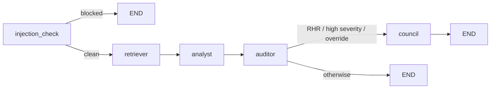
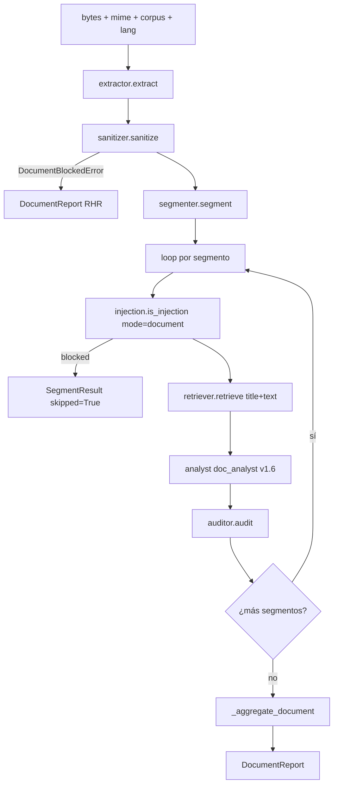

# 04. Arquitectura del sistema

## 4.1 Introducción y método de descripción

Esta sección describe la arquitectura de RegulAItor siguiendo el modelo C4 (Context, Container, Component) en tres niveles. La descripción se complementa con dos diagramas de secuencia que capturan los flujos operativos de las dos superficies funcionales del MVP: la pestaña *Pregunta* (chat E2E) y la pestaña *Analiza documento* (pipeline documental por segmentos). El estado canónico vivo de los diagramas reside en `docs/architecture.md` (rev. H10, MVP closure); esta sección reproduce los niveles esenciales y añade el comentario académico sobre las decisiones de diseño que distinguen al sistema. El stack técnico está fijado en `CLAUDE.md` §10 y todas las decisiones no triviales referenciadas aquí están en `docs/adr/` (ADR-0001..ADR-0035 a fecha de v0.1.32-h16-deploy).

## 4.2 C4 L1 — Contexto del sistema

El sistema vive entre cuatro actores externos: el usuario primario (responsable de calidad, compliance o DPO en PYME europea, `CLAUDE.md` §4), el corpus normativo oficial publicado por EUR-Lex (AI Act, RGPD, NIS2, DORA en formato HTML/PDF; ingestado vía `scripts/ingest.py` en H1), la API de Anthropic (Claude Sonnet 4.6 para producción y Haiku 4.5 como modelo juez de evaluación) y HuggingFace Hub (descarga única en caché local del modelo de embeddings BGE-M3 multilingüe y del reranker `bge-reranker-v2-m3`). La frontera de confianza del sistema separa el corpus oficial (autoritativo) del documento subido por el usuario (no confiable, sujeto a saneamiento e inyección). El tutor del TFM se modela como actor de solo lectura sobre el repositorio (memoria, ADRs, reportes de evaluación y red team). El sistema NO accede a sistemas internos del cliente; todo el flujo es síncrono, stateless por cliente y diseñado para despliegue público en Hugging Face Spaces (H16 cerrado en v0.1.32-h16-deploy con demo vivo).

## 4.3 C4 L2 — Containers

Dentro de la frontera del proceso `regulaitor` distingo cinco bloques estructurales que mapean uno a uno a directorios del repositorio bajo `src/regulaitor/`:

- **Surfaces** — entradas funcionales: Streamlit (`ui_streamlit/`, H6, dos pestañas), FastAPI (`api/`, H7, tres endpoints `/ask`, `/analyze`, `/health` con auth Bearer y rate limit), CLI (`scripts/`, ingesta, evals, red team) y servidor MCP propio (`mcp_server/`, H3, cinco tools versionadas con contrato de tests). Las cuatro superficies envuelven el mismo backend sin lógica de negocio duplicada (CLAUDE.md §22.10).
- **Orchestration** — dos grafos: `orchestration/graph.py:151` (chat E2E con LangGraph) y `orchestration/document_graph.py:220` (pipeline documental como bucle Python lineal por decisión explícita; no LangGraph porque el control flow es lineal y la auditabilidad línea-a-línea pesa más que la composabilidad, ver ADR-0007).
- **Agents** — tres agentes diferenciados (CLAUDE.md §8): `RetrieverAgent` (`agents/retriever.py`), `AnalystAgent` (`agents/analyst.py`, tool-use con Sonnet 4.6) y `AuditorAgent` (`agents/auditor.py`, agregador determinista pure-Python). Desde H13 se añade `CouncilAgent` (`agents/council.py`) como capa advisory de tres jueces independientes, con seam de binding activado en v0.1.19 en dirección monotónica conservadora (PASS → RHR solo unánime; nunca relaja BLOCK ni RHR; ADR-0025).
- **Defense in depth** — tres capas independientes y composables: sanitizer documental (`document/sanitizer.py`, 10 categorías de evento, critical-block para JavaScript embebido, attachments y URLs no allowlisted), regex de detección de inyección (`security/injection.py`, 25 patrones repartidos entre `_CHAT_PATTERNS` y `_DOCUMENT_PATTERNS`) y validador de citas (`citation/validator.py`, los tres checks article/apartado/text-normalized del §6).
- **Data layer** — corpus procesado (`corpus/processed/`, JSON por artículo bajo Git-LFS, 1569 chunks totales tras H14), LanceDB local (`corpus/indexes/regulaitor.lance/`, embeddings densos BGE-M3 1024-dim, índice IVF-PQ, sub-100 ms para top-10) y caché de juez para evaluación (`evals/cache/`, hash-keyed, fuera de Git).

A esto se añade un **router de modelos** (`models/router.py`) que es el punto único de salida hacia LLM externos: ningún agente llama directamente a un SDK (CLAUDE.md §22.13). Desde H12 el router opera con cinco modos (`low_cost`, `high_quality`, `eval`, `fallback`, `judge`) y traduce esquemas Anthropic↔OpenAI para que el código del Analyst sea portable entre proveedores; el modo de producción por defecto es Sonnet 4.6.

## 4.4 Flujo chat (LangGraph state graph)

El grafo chat es un autómata determinista de cinco nodos (`orchestration/graph.py:151-183`):

El nodo `injection_check` (`graph.py:62`) corta el flujo antes de cualquier llamada a LLM si el regex detecta un patrón conocido — defensa de coste y ataque. El `retriever` (`graph.py:98`) consulta LanceDB y aplica `bge-reranker-v2-m3` reduciendo de top-50 candidatos a top-5; desde v0.1.21.2 los defaults productivos incluyen `max_chunks_per_norma=2` y `top_k_auto=12` (ADR-0028, mejora cross-corpus 1/3 → 2/3 medida en v0.1.11). El `analyst` (`graph.py:103`) llama a Sonnet 4.6 vía router con tool-use estricto: la herramienta `emit_answer` define `findings[]` como array con `minItems: 1`, `additionalProperties: false` y validación recursiva en `$defs` (Capa A de la ADR-0027, fix recursivo de v0.1.22). El `auditor` (`graph.py:110`) ejecuta agregación determinista (sección 4.6). El `council` (`graph.py:117`) se dispara condicionalmente: cuando el Auditor devuelve `REQUIRES_HUMAN_REVIEW`, cuando algún Finding tiene severidad alta o cuando el cliente fuerza con `council=true` en la API; siempre advisory, solo escala PASS → RHR si los tres jueces unánimemente discrepan.

## 4.5 Flujo documental (bucle Python por segmento)

El pipeline documental NO es un grafo LangGraph: es un bucle Python lineal (`orchestration/document_graph.py:220-304`) porque el control flow es secuencial y el coste de auditabilidad supera al de composabilidad. Sus fases son:

La extracción combina `pypdfium2` (texto), `pdfplumber` (estructura) y `pikepdf` (objetos embebidos para detectar JavaScript y attachments). El sanitizador colapsa metadatos invisibles, normaliza texto y aplica critical-block ante JavaScript embebido (`document_graph.py:248-271`); cuando dispara, el reporte sale como `REQUIRES_HUMAN_REVIEW` con `segments=[]` y log parcial — comportamiento verificado en doc-004 y doc-010 de v0.1.28 (sanitizer correctamente bloquea documentos con JS antes de segmentar). El segmentador (`document/segmenter.py`, regex extendida en v0.1.14 para secciones numeradas españolas como "1. Introducción", ADR-0019) emite `Segment` con título opcional. El bucle por segmento aplica anti-inyección en modo documento (regex distinto del modo chat), retrieves con la query `f"{seg.title}\n{seg.text}"` (v0.1.28 T4-bis title-prepend en lado query; el experimento simétrico en lado corpus se revertió en v0.1.30 por sobre-citación, ADR-0035 con §REVERT), analiza con el rol `document_analyst` (prompt v1.6, Hard rule 4 prohíbe placeholder citations tipo `UNKNOWN`/`N/A`/`TBD`, capa (d) del §6 multi-capa, ADR-0033) y audita con el mismo `AuditorAgent` que el flujo chat. Finalmente `_aggregate_document` (`document_graph.py:72-132`) consolida el veredicto a nivel de documento.

## 4.6 §6 multi-capa en el Auditor

La regla "no citation, no answer" del §6 está implementada en cuatro capas defensivas (CLAUDE.md §6.1 multi-capa, evolución v0.1.24 → v0.1.29):

- **Capa (a) per-citation validator** — `citation/validator.py`, byte-equivalente desde H4. Tres checks fail-fast en orden estricto: artículo existe en corpus, apartado existe en artículo, texto coincide normalizado. En v0.1.24 (ADR-0031) se añadió el campo aditivo `AuditResult.failed_check: Literal[1,2,3] | None` como pura instrumentación que NO está en el decision path; preserva el contrato §6 con observabilidad enriquecida.
- **Capa (b) Finding-Lenient aggregation** — `auditor.py:64`. Un Finding pasa si al menos una de sus citations valida; byte-unchanged desde v0.1.21.
- **Capa (c) Turn-level aggregation** — `auditor.py:54-142`. Tres sub-rutas con políticas diferenciadas: all-pass + quorum n_invalid≥2 → RHR (Tier 1, ADR-0027 v0.1.21), partial-Findings → PASS si todas las invalid blocked tienen `failed_check==3` solo paráfrasis else RHR (ADR-0032 D2 v0.1.25, lift +0.33 medido en verdict_match) y all-blocked → PASS bajo la misma condición simétrica else BLOCK (ADR-0034 D Mirror v0.1.29, lift +0.08 medido).
- **Capa (d) prompt-level explicit forbid** — `agents/prompts/analyst/system.v1.5.md` (chat) y `agents/prompts/document_analyst/system.v1.6.md` (doc), ambas con Hard rule 4 inviolable y Rule 2 de Finding-based refusal cuando el contexto es insuficiente. ADR-0033 v0.1.28.

La garantía explícita del helper compartido `_all_blocked_findings_paraphrase_only` (`auditor.py:20-48`) es que cualquier Check 1 (article fabrication) o Check 2 (apartado fabrication) en cualquier citation devuelve False, preservando el enrutamiento original BLOCK/RHR. Por construcción, la fabricación nunca puede pasar como PASS — el §6 se mantiene en todas las capas.

## 4.7 Stack técnico (justificación de decisiones clave)

El stack completo está fijado en `CLAUDE.md` §10. Las elecciones que justifican defensa académica son:

- **Python 3.11 + `uv`** — Python por el ecosistema de RAG y agentes; `uv` por reproducibilidad determinista de resoluciones de dependencias en `uv.lock`.
- **Pydantic v2 con `frozen=True, extra="forbid"`** — schemas inmutables y estrictos: cualquier campo no documentado en `citation/schemas.py` rompe en runtime. Cierra la superficie de inyección por overpost.
- **LangGraph** (no LangChain agent loop, no AutoGen) — porque permite expresar el grafo chat como state machine determinista con conditional edges explícitas (`graph.py:169-181`), no como agent loop con prompting recursivo. La auditabilidad post-mortem se reduce a inspeccionar `ChatState` en cada nodo; tests unitarios pueden mock-ear nodos individualmente. Decisión ADR-0006.
- **LanceDB local** (no Pinecone, no Qdrant cloud) — porque elimina el cloud lock-in, las queries top-10 caen sub-100 ms en CPU consumer hardware, el formato columnar es Git-LFS-friendly (las 1569 rows del corpus viajan en el repositorio sin servidor externo) y el TFM puede defenderse con coste de infraestructura cero. ADR-0004.
- **BGE-M3 multilingüe + `bge-reranker-v2-m3`** — embeddings de 1024-dim con soporte ES/EN nativo (el corpus es bilingüe) y reranker que aumenta context_precision medible (sección de evaluación). ADR-0004.
- **FastAPI + Pydantic v2 + OpenAPI auto** — para que la superficie API sea contract-testeable con schemathesis (60 fuzz cases en H7) y la integración con cualquier cliente sea trivial.
- **Streamlit** para el MVP UI (H6) — UI mínima con dos pestañas, sin Next.js (CLAUDE.md §22.16 lo prohíbe antes de cerrar evals y red team).
- **Docker multi-stage + GitHub Actions** — despliegue reproducible y CI con cinco jobs (`lint`, `test`, `redteam-smoke`, `test-document-e2e`, `security`). Activos en H16 con `docker-compose.yml` que orquesta API + Streamlit (v0.1.26 deploy-prep).

## 4.8 Trazabilidad y observabilidad

Todo turn (chat o documento) emite una línea JSON estructurada (`graph.py:241-246` / `document_graph.py:176-194`) con `case_id`, `query_hash` (SHA-256 truncado a 12 chars; nunca texto crudo), corpus, language, verdict, contadores de findings y citations, latencia y categoría de error. Desde H11 el cliente LangFuse opcional (`observability/langfuse_client.py`) replica metadata en una traza distribuida con redacción allowlist en egress (CLAUDE.md §10.5 / §18.8); sin variables `LANGFUSE_*` el SDK ni se importa (no-op total). El acumulador de coste real process-level del router (H15) cierra el gap estimate-not-measured que se arrastraba desde H12/H13. La defensa frente al tutor/auditor externo se completa con `docs/technical_decisions_log.md` (5335+ líneas, espinazo de la memoria) y `docs/adr/` (35 ADRs a fecha v0.1.32, dos con sección §REVERT documentando refutaciones empíricas honestas).
